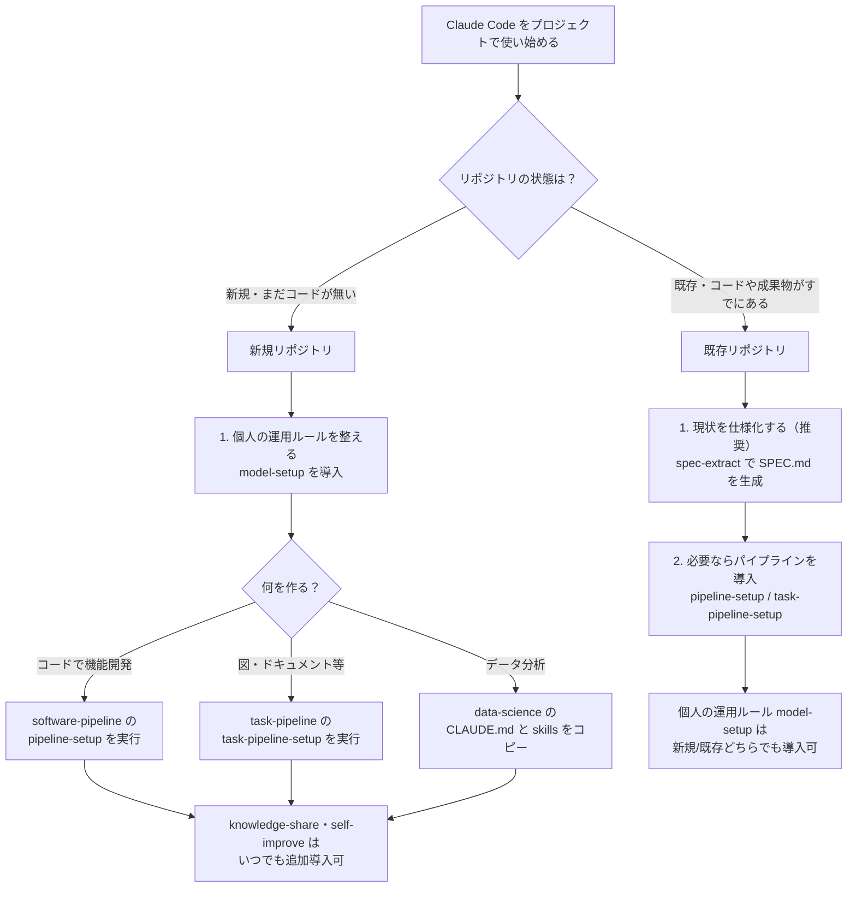
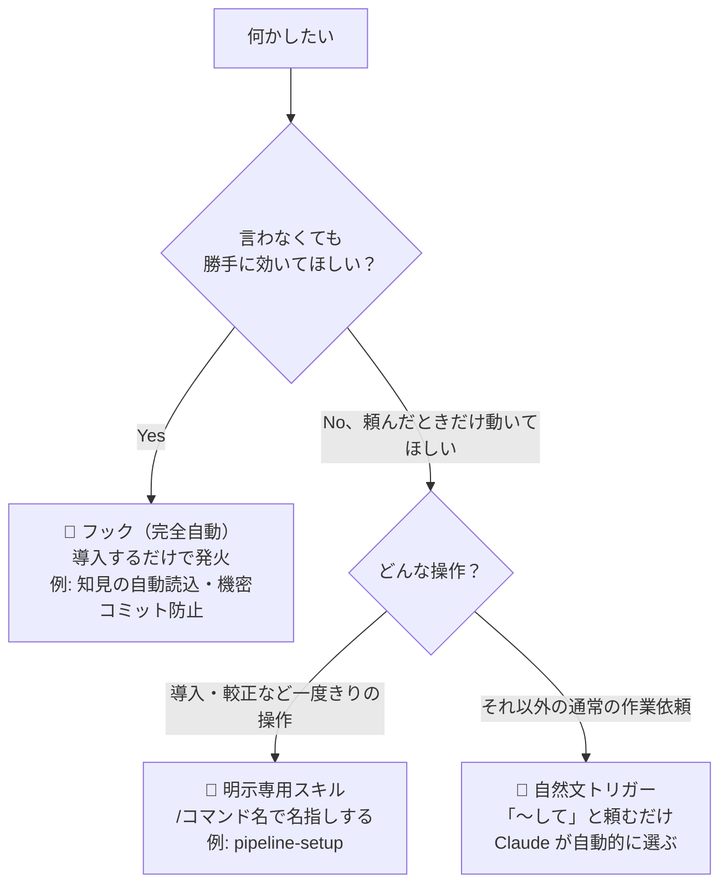

# claude-code-workbench-ja — Claude Code リソース・テンプレート集

Claude Code をより快適に使うためのスクリプト、テンプレート、ベストプラクティスをまとめたリポジトリです。

## はじめに: どこから始める？

対象プロジェクトが**新規**か**既存**かで、最初に入れるものが変わります。



### 新規リポジトリ（これから作るプロジェクト）

まだ守るべき既存の型が無いので、最初から良い型で始められます。

1. **個人の運用ルールを先に整える**（Claude Code のユーザー設定に一度入れれば全プロジェクトで効く）— `model-setup` を導入（9ルール＋プロファイル別追補＋`task-brief`／`backlog-loop`／`pr-merge`／`fan-out`／`long-run`／`verify-fresh`）。
2. **プロジェクトの土台を選ぶ**（対象リポジトリに導入。何を作るかで変わる）
   - コードで機能開発が中心 → `software-pipeline` の `pipeline-setup` を実行（エージェント7種・CLAUDE.md・フックを対象リポジトリに自動導入）
   - 図・ドキュメント・レポートが中心 → `task-pipeline` の `task-pipeline-setup` を実行
   - データ分析プロジェクト → `data-science` の CLAUDE.md とスキル一式をコピー
3. 知見の蓄積（`knowledge-share`）や自己改善ループ（`self-improve`）は、上記と独立して**いつ追加してもよい**。

### 既存リポジトリ（すでにコード・成果物がある）

いきなりパイプラインを回すと、既存の暗黙の規約と衝突しかねません。まず現状を仕様として固定してから入れるのがおすすめです。

1. **現状を仕様化する（推奨）** — `implementation-skills`（または各パイプライン連携版）の `spec-extract` で、既存コード・成果物から確度ラベル付きの `SPEC.md` を逆引き生成する。
2. **その後にパイプラインを導入する場合** — `pipeline-setup` / `task-pipeline-setup` を実行する。対象リポジトリのスタック・git の有無・OS を自動検出し、既存の CLAUDE.md や `.claude/settings.json` は上書きせずマージを提案する設計なので、すでに手を入れたリポジトリでも安全に走らせられる。
3. `model-setup` は個人設定なので、新規・既存を問わずいつ導入してもよい。

## 自動で動くもの／明示的に動かすもの

同じ「プラグインを入れる」でも、効果の出方は3種類あります。使い分けに迷ったら下の図と表を参照してください。



| 種別 | 動き方 | 呼び出し方 | 入れると何が嬉しいか | 代表例 |
|---|---|---|---|---|
| 🔁 フック（完全自動） | プラグイン導入直後から、SessionStart/SessionEnd/PreToolUse 等のイベントで**頼まなくても毎回発火**する | 不要（無効化しない限り常時ON） | 「言い忘れ」「やり忘れ」を構造的に防げる。導入するだけで効果が始まる | 知見の自動読込・回収、改善候補の検出・通知、機密コミット防止、仕様更新漏れの通知（下表） |
| 💬 スキル（自然文トリガー） | 自然文の依頼を Claude が判断し、**自動的に適切なスキルを選ぶ**（`/スキル名` での明示起動も可） | 「〜して」と頼む、または `/スキル名` | 手順や合言葉を覚えていなくても、思った通りに頼めば正しい型が起動する | `task-brief`・`backlog-loop`・`pr-merge`・`feature-pipeline`・`task-pipeline`・`clarify`・`notes`・`spec-extract`・`kb`・`peer`・`ask-claude`・`codex-review` など大半のスキル |
| 🎯 明示専用スキル | 自然文では発火せず、**`/スキル名` で名指ししたときだけ**動く（`disable-model-invocation: true`） | `/スキル名` のみ | 導入・較正など一度きり／影響の大きい操作を誤発動させない | `pipeline-setup`・`task-pipeline-setup`・`pipeline-improve`・`create-plan-calibrate` |

### 🔁 自動フック一覧（導入するだけで効果が始まるもの）

| プラグイン | フック | 発火タイミング | 効果 |
|---|---|---|---|
| knowledge-share | kb-session-start / kb-session-end | セッション開始／終了 | 知見インデックスの自動読込、未回収の知見の検出・通知 |
| self-improve | si-session-start / si-session-end | セッション開始／終了 | 改善候補の検出、未適用 backlog の通知（適用自体は `/improve-apply` で手動） |
| codex-bridge | gen-agents-md | セッション開始 | CLAUDE.md 等から AGENTS.md を自動生成・同期（Codex にも同じルールを効かせる） |
| software-pipeline | block-secrets-commit / guard-builder-writes / spec-sync-reminder | コミット前／Edit・Write 前／セッション開始・Stop | 機密のコミット防止、担当外ファイルへの書き込み防止、仕様更新漏れの通知 |
| task-pipeline | guard-deliverable-writes / spec-sync-reminder | Edit・Write 前／セッション開始・Stop | 出力先外への書き込み防止、仕様更新漏れの通知 |

> フックは一覧の5プラグインのみが持ちます。他のプラグイン（model-setup・ai-peer・agent-review-panel 等）はスキルのみで完結し、常駐フックはありません。

## 導入方法（クイックスタート）

### 方法1: プラグインで導入する（最も簡単）

Claude Code でそのまま実行します（clone 不要）。現在8つのプラグインを配信しています:

```
/plugin marketplace add mrkxlia/claude-code-workbench-ja
/plugin install software-pipeline@workbench-ja
/plugin install task-pipeline@workbench-ja
/plugin install knowledge-share@workbench-ja
/plugin install codex-bridge@workbench-ja
/plugin install ai-peer@workbench-ja
/plugin install agent-review-panel@workbench-ja
/plugin install self-improve@workbench-ja
/plugin install model-setup@workbench-ja
```

- **software-pipeline** — 新しいセッションで `/software-pipeline:pipeline-setup` を実行すると、
  対象リポジトリにパイプライン一式（エージェント7種・CLAUDE.md・フック）が導入されます。
  詳しくは [software-pipeline/README.md](software-pipeline/) を参照。
- **task-pipeline** — 新しいセッションで `/task-pipeline:task-pipeline-setup` を実行すると、
  コード以外の成果物（図・ドキュメント・レポート）向けのパイプライン一式（エージェント5種・
  CLAUDE.md・フック）が導入されます。詳しくは [task-pipeline/README.md](task-pipeline/) を参照。
- **knowledge-share** — 導入するだけで、`/knowledge-share:kb`・`/knowledge-share:kb-harvest`
  スキルと、知見の自動読み込み・回収を行う SessionStart/SessionEnd フックが全セッションで
  有効になります。詳しくは [knowledge-share/README.md](knowledge-share/) を参照。
- **codex-bridge** — 導入すると `/codex-review`・`/codex-implement`・`/codex-ask` で、
  コードレビュー・実装・相談を OpenAI Codex に依頼できます（ユーザーは Codex を直接操作せず、
  Claude Code が Codex CLI を非対話で駆動）。詳しくは [codex-bridge/README.md](codex-bridge/) を参照。
- **ai-peer** — 導入すると `/peer`（内部 Claude・**依存ゼロ**で実装前のプランレビュー・ブレスト・
  第二の視点）と `/ask-claude`（別の Claude を CLI で起動して独立見解）でピア相談ができます。
  詳しくは [ai-peer/README.md](ai-peer/) を参照。
- **agent-review-panel** — 導入すると `/review-panel` で、コード差分・実装計画・ドキュメントを
  複数ペルソナのサブエージェント（既定3名）に**ブラインド並列レビュー→相互批判→応答・譲歩→統合**
  の討論つきでレビューさせられます（基本は依存ゼロ）。`deep` で引用検証＋裁定者の最終評決、
  `codex` で外部パネリスト（OpenAI Codex・任意）を混成。詳しくは
  [agent-review-panel/README.md](agent-review-panel/) を参照。
- **self-improve** — 導入するだけで、`/improve-scan`（改善の種を発見）・`/improve-apply`（承認制で
  スキル・CLAUDE.md・rules・hook・エージェントを改善）と、改善候補を検出・通知する SessionStart/
  SessionEnd フックが有効になります（git 不要・ローカル完結）。詳しくは [self-improve/README.md](self-improve/) を参照。
- **model-setup**（旧名 sonnet-setup） — 導入すると `/task-brief`（着手前にタスク仕様を一括
  ブリーフ化）・`/backlog-loop`（backlog.md 駆動の定型ループ）・`/pr-merge`（PR作成〜マージ〜
  後片付け、git/gh 専用）・`/fan-out`（独立サブタスクの並列委譲＋検証マージ）・`/long-run`
  （長時間自律作業の完走プロトコル）・`/verify-fresh`（fresh context 検証）が使えます。
  サブエージェント3種（task-worker / fresh-verifier / bulk-scanner）・プロファイル別 CLAUDE 追補
  （Opus+Sonnet / Sonnet 単独）・モデル・effort 選定ガイド（MODEL-GUIDE.md・Fable 5 パリティ
  マップ付き）も同梱（エージェントと追補はファイルコピーで配置）。詳しくは
  [model-setup/README.md](model-setup/) を参照。

### 方法2: git clone してコピーする（全セクション共通）

clone を1回して、使いたいセクションだけコピーします:

```bash
git clone --depth 1 https://github.com/mrkxlia/claude-code-workbench-ja /tmp/workbench
```

```bash
# software-pipeline — pipeline-setup をパーソナルスキル化（以後どのリポジトリでも /pipeline-setup が使える）
mkdir -p ~/.claude/skills && cp -r /tmp/workbench/software-pipeline/.claude/skills/pipeline-setup ~/.claude/skills/

# task-pipeline — task-pipeline-setup をパーソナルスキル化
mkdir -p ~/.claude/skills && cp -r /tmp/workbench/task-pipeline/.claude/skills/task-pipeline-setup ~/.claude/skills/

# implementation-skills — notes / spec-extract をプロジェクト（または ~/.claude/skills/）へ
mkdir -p .claude/skills && cp -r /tmp/workbench/implementation-skills/.claude/skills/* .claude/skills/

# codex-bridge — Codex 依頼スキル3種＋エージェント3種をプロジェクトへ
mkdir -p .claude/skills .claude/agents && cp -r /tmp/workbench/codex-bridge/.claude/skills/* .claude/skills/ && cp -r /tmp/workbench/codex-bridge/.claude/agents/* .claude/agents/

# data-science — CLAUDE.md とスキル一式をプロジェクトへ
cp /tmp/workbench/data-science/CLAUDE.md ./CLAUDE.md && cp -r /tmp/workbench/data-science/.claude ./.claude

# GlobalClaudeMD-sample — グローバル CLAUDE.md として配置
cp /tmp/workbench/GlobalClaudeMD-sample/CLAUDE.md ~/.claude/CLAUDE.md

# model-setup — 運用ルール（共通9ルール＋プロファイル追補のどちらか一方）をグローバル CLAUDE.md に追記
#   私用PC(Opus+Sonnet)は CLAUDE.private.md、会社PC(Sonnet単独)は CLAUDE.company.md
cat /tmp/workbench/model-setup/CLAUDE.md /tmp/workbench/model-setup/CLAUDE.company.md >> ~/.claude/CLAUDE.md
# スキル（pr-merge は git 専用のため必要な環境のみ）とサブエージェント
cp -r /tmp/workbench/model-setup/.claude/skills/task-brief /tmp/workbench/model-setup/.claude/skills/backlog-loop \
      /tmp/workbench/model-setup/.claude/skills/fan-out /tmp/workbench/model-setup/.claude/skills/long-run \
      /tmp/workbench/model-setup/.claude/skills/verify-fresh ~/.claude/skills/
mkdir -p ~/.claude/agents && cp -r /tmp/workbench/model-setup/.claude/agents/* ~/.claude/agents/
```

各セクションのカスタマイズ方法は、それぞれの README を参照してください。私用PC・会社PCでそれぞれ
「何を入れるか」をまとめた導入プロファイルは [`skills-guide/README.md`](skills-guide/) を参照。

> このリポジトリ自身で作業するときは、ルート直下の `.claude/`（dogfooding 用）から `/create-plan` が使えます。

## どれをいつ使う？（スキル/プラグイン早見表）

| やりたいこと | 使うもの | ひとこと |
|--------------|----------|----------|
| 機能をコードで end-to-end 実装したい | **software-pipeline**（`/feature-pipeline`） | 7エージェント連鎖＋3つの人間承認チェックポイント |
| パイプラインを通すほどでない小さな実装＋テスト | software-pipeline の `/build-with-tests` | 既存パターン確認 → 実装とテスト並行 → 型チェック |
| 図・ドキュメント等コード以外の成果物を作りたい | **task-pipeline**（`/task-pipeline`） | 5エージェント連鎖。drawio 等のユーザー導入スキルも呼べる |
| 変更せず実行計画だけ立てたい（Plan/Ask 相当） | **plan-mode**（`/create-plan`） | 非プラグイン。`cp` 導入。コード以外の一般タスクにも使える |
| 別 AI（OpenAI Codex）にレビュー/実装/相談を委譲したい | **codex-bridge**（`/codex-review` ほか） | Claude が Codex CLI を非対話で駆動。ユーザーは Codex を触らない |
| 実装前のプランレビュー・壁打ち・第二の視点が欲しい | **ai-peer**（`/peer`・`/ask-claude`） | peer は依存ゼロ（git/CLI/ネット不要）。ask-claude は別 Claude を CLI で起動 |
| 重要な判断を複数の視点で敵対的にレビュー・討論させたい | **agent-review-panel**（`/review-panel`） | 既定3名がブラインド並列→相互批判→統合。deep で引用検証＋裁定者、codex で異種モデル混成 |
| 訂正・繰り返しからスキルや CLAUDE.md を継続改善したい | **self-improve**（`/improve-scan`・`/improve-apply`） | git 不要・承認制・ロールバック付き。kb と連携 |
| セッション/リポジトリ横断で知見を蓄積・再利用したい | **knowledge-share**（`/kb`・`/kb-harvest`） | @import ＋フックで知見の自動読み込み・記録・回収 |
| 要件・仕様を質問で詰めたい | **clarify**（software/task に同梱） | 単体利用も可（各プラグイン README の「単体利用」参照） |
| 既存コード/成果物から仕様書を逆引きしたい | **implementation-skills**（`/spec-extract`） | 確度ラベル付き SPEC.md を生成。`/notes` で実装の経緯も記録 |
| データ分析プロジェクトの土台がほしい | **data-science** | Polars・uv・Jupyter 前提の CLAUDE.md ＋スキル |
| Opus+Sonnet や Sonnet 単独で上位モデル（Fable 5 級）並みの振る舞いに近づけたい | **model-setup** | 9ルール＋プロファイル別追補を CLAUDE.md に常設化、並列委譲・fresh 検証・自律完走のスキル/エージェント、モデル/effortガイド |
| backlog.md 駆動で計画→実施→PR→マージまで定型ループで回したい | model-setup（`/backlog-loop`・`/pr-merge`） | Step承認ゲート付き。git なし環境は変更ファイル一覧提示で完了 |
| トークン/コストを可視化したい | **token-usage-tracker** | Claude Code 等のログを集計（独立 Python ツール） |
| CC 資産を Codex / Kiro でも使いたい | **multi-model-dist** | 原本を変えず生成（Track A）＋SPEC 再実装（Track B）。`/export` で書き出し |

> パイプラインのサブスキル（`clarify`・`build-with-tests` 等）は単体でも使えます。導入は各プラグイン README の
> 「単体で使う（個別利用）」小節を参照してください。

### 仕様駆動開発まわりの違い

仕様にまつわるスキルは守備範囲が重なって見えるので、方向と役割で整理します。

| ツール | 方向 | 入力 → 出力 | いつ使う／違い |
|--------|------|-------------|----------------|
| `spec-extract`（implementation-skills 原本／各パイプライン連携版） | **逆方向** | 既存コード・成果物 → `SPEC.md`（確度ラベル付） | 仕様書の無いレガシーを現状固定したいとき。パイプラインの**入口**。`[確定]/[推定]/[不明]` の物証主義と生きた SPEC 更新が特徴 |
| `feature-pipeline` / `spec-writer`（software-pipeline） | **順方向** | アイデア/ストーリー → 技術ブリーフ → コード | これから作る機能を仕様化して実装まで通す。spec-extract の逆引きと対をなす前進方向 |
| `task-pipeline` の spec-extract 連携版 | 逆方向（成果物） | 既存成果物・規約 → 成果物 SPEC | 図/ドキュメント版。コード前提語を成果物前提に読み替えた点が software 版との違い |
| `clarify`（software/task） | 詰める | 曖昧な要望 → 確定した要件 | 仕様を書く前に穴・前提を質問で潰す。spec-extract/spec-writer の前段。software 版＝コード要件、task 版＝成果物要件で語彙が違う（骨子は同一） |
| `create-plan`（plan-mode） | 計画 | ゴール → 実行計画ファイル（変更なし） | 仕様書ではなく**実行手順**を作る。コードに限らない一般タスク向け |
| `notes`（implementation-skills 原本／連携版） | 記録 | 実装中の判断・逸脱 → `implementation-notes.md` | あるべき姿（SPEC.md）ではなく**実装の経緯**を残す |

**他の仕様駆動開発（SDD）との関係。** spec-kit / Kiro / cc-sdd など一般的な SDD ツールは
`requirements → design → tasks` を前提にします。本リポジトリの対応物は次のとおりです。

| 一般的な SDD | 本リポジトリの相当物 |
|--------------|----------------------|
| requirements.md | feature-pipeline の `story.md`（受け入れ基準つきストーリー） |
| design.md | `brief.md` ＋ `api-contract.md`（技術ブリーフ／API 契約） |
| tasks.md | パイプラインの Phase 連鎖＋ `status.md`（進行管理） |
| PRD / living spec | `SPEC.md`（spec of record・Phase 7 で増分更新） |
| spec-tracker（更新漏れ警告） | `spec-sync-reminder` フック（SessionStart/Stop） |
| spec-validator（実装と仕様の突合） | `implementation-validator` エージェント＋ `test-verifier` |

本リポジトリは順方向（feature-pipeline）に加えて **`spec-extract` による逆方向（レガシー → 仕様）** を持つ点が
spec-kit / Kiro / cc-sdd との主な違いです。運用原則として **「1 Todo = 1 Commit = 1 Spec Update」**
（実装の区切りごとに仕様も更新して同期させる）を採り、これは既存の「Phase 7 での SPEC 増分更新」と
`spec-sync-reminder` フックがそのまま実装になっています。**いつ SDD を使うか**の目安は、本番機能（1日以上）・
チーム作業・厳格なアーキテクチャ・レガシー改善では採用（`feature-pipeline`）、1時間未満の修正・POC・hotfix・
UI 試作では避けて軽量な `build-with-tests` を使う、です（参考: 下記「ライセンス・出典」の SDD 記事）。

## 収録セクション

### [`skills-guide/`](skills-guide/)
おすすめSkillsガイド（2026年6月動作確認済み）。
72個紹介された記事から「今すぐ使えるもの」に絞り込み、優先度別・業務タイプ別に整理しています。

### [`data-science/`](data-science/)
データサイエンスプロジェクト用 CLAUDE.md テンプレート + Skills。
Polars・uv・Jupyter を前提にした CLAUDE.md と、分析業務向け10種のスキルファイルをそのままコピーして使えます。

### [`implementation-skills/`](implementation-skills/)
実装の文脈を残す・取り戻すスキル2種。
実装しながら判断・逸脱・ハマりどころを implementation-notes.md に記録する **notes** と、既存コードから確度ラベル付きの仕様書を逆引き生成する **spec-extract** を収録しています。このディレクトリは単体利用向けの原本で、**software-pipeline・task-pipeline の両パイプラインにパイプライン連携版が統合済み**です。spec-extract は対話時に `[不明]/[推定]` を clarify で詰める「読むだけで終わらせない」運用と、一度作った SPEC.md を増分更新する「生きた仕様」運用に対応します。

### [`plan-mode/`](plan-mode/)
変更を一切加えず「実行計画」だけを作るスキル2種（Claude/Cline の Plan モード・Codex の Ask モード相当）。
ゴールから事実を集めて別セッション/エージェントがそのまま実行できる粒度の計画ファイルを書き出す **create-plan**、
導入先の文脈に合わせて計画の調整ポイントを較正する **create-plan-calibrate** を収録しています。コーディングに
限らず一般タスクに使え、不変要件（INV）と調整ポイント（ADJ）を `SPEC.md` で定義しています。非プラグインのため
`cp` でプロジェクトや `~/.claude/skills/` に入れて使います（このリポジトリ自身ではルート `.claude/` から直接利用可）。

### [`GlobalClaudeMD-sample/`](GlobalClaudeMD-sample/)
グローバルスコープ用 CLAUDE.md サンプル（`~/.claude/CLAUDE.md`）。
Think Before Coding・Simplicity First・Surgical Changes など、すべてのプロジェクトに共通する行動原則を定義したファイルです。

### [`model-setup/`](model-setup/)
モデル運用テンプレート（旧名 sonnet-setup。Opus 4.8 + Sonnet 5 の私用PC / Sonnet 単独の会社PC
の2プロファイル）。完了条件の事前定義・検証つき完了報告・確信度の明示・スコープ厳守・網羅
レビューなど、上位モデル（Fable 5 級）の「振る舞い」を常設化する9つの行動ルールと、進捗の
証拠監査・自律完走・評価と実行の境界などを加えるプロファイル別追補（`CLAUDE.private.md` /
`CLAUDE.company.md`）に加え、**task-brief**（最初のターンでタスク仕様をブリーフ化）・
**backlog-loop**（backlog.md 駆動の定型ループ）・**pr-merge**（git/gh 専用）・**fan-out**
（独立サブタスクの並列委譲＋検証マージ）・**long-run**（長時間自律作業の完走プロトコル）・
**verify-fresh**（fresh context 検証）の6スキル、サブエージェント3種（task-worker /
fresh-verifier / bulk-scanner。sonnet/haiku をタスク別にルーティング）、モデル・effort 選定
ガイド（`MODEL-GUIDE.md`・Fable 5 パリティマップ付き）、settings サンプルを収録しています。
**プラグイン1コマンドで導入可能**（上の「導入方法」参照。エージェントと追補はファイルコピー）。
プロンプト側の型は既存 OSS（severity1/claude-code-prompt-improver）を README で紹介しています。

### [`software-pipeline/`](software-pipeline/)
7つの専門エージェントで機能開発を流れ作業化する「ソフトウェアパイプライン」テンプレート。
調査 → ストーリー → 技術ブリーフ → バックエンド → フロントエンド → 受け入れテスト → 最終検証を feature-pipeline スキルが連鎖実行し、3つの人間承認チェックポイントで停止します。**プラグイン2コマンドで導入可能**（上の「導入方法」参照）。対象リポジトリを解析してパイプライン一式を自動導入する **pipeline-setup** スキル、運用実績から定義を改善する **pipeline-improve** スキル（自己改善ループ）を含むスキル6種（implementation-skills 由来の notes / spec-extract パイプライン連携版を含む）・エージェント定義7種・機密コミットブロックフック・CLAUDE.md サンプルを収録しています。ビルダーが実装中の判断を `docs/pipeline/<slug>/implementation-notes.md` に記録し、レガシーコードには `/spec-extract` で仕様を固めてから導入できます。

### [`task-pipeline/`](task-pipeline/)
software-pipeline のパイプラインパターンをコード以外の成果物（drawio 図・ドキュメント・レポートなど）向けに汎用化した「タスクパイプライン」テンプレート。
調査 → 成果物要件 → 作業ブリーフ → 成果物作成 → レビューを task-pipeline スキルが連鎖実行し、3つの人間承認チェックポイントで停止します。ビルダーは drawio などユーザー導入スキルを呼び出せます。出力先・成果物の種類・利用可能スキルを検出して自動導入する **task-pipeline-setup** スキル、エージェント定義5種・出力ディレクトリ外への書き込みを確認するフック・CLAUDE.md サンプルを収録しています。implementation-skills 由来の **notes / spec-extract パイプライン連携版**（成果物仕様向けに読み替え）も同梱し、既存成果物・規約を SPEC.md に逆引きして整合性の土台にできます。**プラグイン1コマンドで導入可能**（上の「導入方法」参照）。

### [`codex-bridge/`](codex-bridge/)
コードレビュー・実装・相談を OpenAI Codex に依頼するスキル4種とサブエージェント3種。
ユーザー自身は Codex を操作せず、Claude Code が Codex CLI を**非対話モード（`codex exec`）**で
駆動します。`/codex-review`（差分/指定ファイルを Codex にレビューさせ重大度 P1–P4 で要約・read-only）、
`/codex-implement`（Codex にファイルを直接編集させ Claude が差分とテストを検証・workspace-write）、
`/codex-ask`（設計相談・セカンドオピニオンを Codex に答えさせ要約・read-only）を収録。実際の codex 実行は
サブエージェント（codex-reviewer / codex-implementer / codex-advisor）に委譲し、冗長な出力をメイン文脈から
隔離します。さらに **`/codex-agents`**（既存の Claude ルール CLAUDE.md 等を取り込んだ `AGENTS.md` を生成し、
Codex に同じルールを効かせる）と、**プラン承認で Codex 実装へ委譲する opt-in フック**を同梱。安全側を
既定にし（危険サンドボックスフラグ不使用）、git を使っていない環境でも動作します（フック/スクリプトは
bash 系のため Windows は Git Bash / WSL が必要・`jq` は不要）。**プラグイン1コマンドで導入可能**（上の「導入方法」参照）。

### [`ai-peer/`](ai-peer/)
セカンドオピニオン／ピア相談を依頼するスキル2種とサブエージェント2種。
**peer**（`/peer`）は内部 Claude サブエージェントで完結し、外部 CLI・git・ネットワークを一切使わずに
（依存ゼロ＝ロックダウン/オフライン/git なし環境でも動く）実装前のプランレビュー・ブレスト・汎用の
第二意見を返します。**ask-claude**（`/ask-claude`）は別の Claude を `claude` CLI で非対話・読み取り専用
（`--permission-mode plan`）に起動して独立見解を要約します。「相談相手」をエンジンで選べるよう、
依存の勾配（peer→ask-claude→〔Codex は codex-bridge〕）を明示しています。行レベルのコードレビューは
内蔵 `/code-review` や `/codex-review` に委譲し、peer は実装前と発想支援に軸足を置きます。**プラグイン
1コマンドで導入可能**（上の「導入方法」参照）。

### [`agent-review-panel/`](agent-review-panel/)
コード差分・実装計画・ドキュメントを、異なるペルソナの複数サブエージェント（既定3名）にレビューさせる
**敵対的パネルレビュー**のスキル1種とサブエージェント4種。**review-panel**（`/review-panel`）が
ファシリテーターとして、ブラインド並列回答 → 匿名化した相互批判（反例のない批判は破棄）→ 応答・譲歩 →
統合の4ラウンドを進行し、合意した指摘・未解決の対立・全員一致警告まで含めて返します（基本は依存ゼロ）。
`deep` 指定で引用検証（panel-verifier が file:line の実在を機械照合）と討論非関与の裁定者
（panel-judge）による最終評決＋レポート出力を追加、`codex` 指定で外部パネリスト（panel-codex 経由の
OpenAI Codex・未導入なら欠席扱い）を混成して同一モデルの相関バイアスを減らせます。1名で足りる相談は
`ai-peer` の `/peer` に、単独のコードレビューは内蔵 `/code-review`・`/codex-review` に任せる住み分けです。
**プラグイン1コマンドで導入可能**（上の「導入方法」参照）。

### [`self-improve/`](self-improve/)
普通の単発セッションの訂正・繰り返し・行き詰まりから、スキル・CLAUDE.md・`.claude/rules`・hook・
エージェントを継続改善する **git 不要の自己改善ループ**。**improve-scan**（`/improve-scan`）が
トランスクリプト（と、あれば `~/.claude/knowledge/`）から改善の種を発見してローカル backlog に貯め、
**improve-apply**（`/improve-apply`）が判定 → 品質ゲート（self-review／任意で peer・ask-claude／公式
スキルガイド検証／サニタイズ）→ **1件ずつ承認** → 適用（`.bak`・差分ロールバック）→ kb へ記録、まで
通します。GitHub Issue/PR は使わずローカル完結し、改善候補を検出・通知する SessionStart/SessionEnd
フックも同梱（「検出/通知は自動・本体は手動」）。`pipeline-improve`（パイプライン前提）・`kb-harvest`
（メモを貯めるだけ）との住み分けを README で明示しています。**プラグイン1コマンドで導入可能**。

### [`knowledge-share/`](knowledge-share/)
セッション/リポジトリ横断のナレッジ共有テンプレート。
複数セッション・複数リポジトリで解決した知見（エラー対処・ハマりどころ）が揮発する問題を、Claude Code の公式機能だけで解決します。ユーザーメモリ＋ **@import** で知見インデックスを全セッションに自動読み込みし、ユーザーレベルスキル **kb**（記録・検索・昇格）・**kb-harvest**（過去トランスクリプトからの採掘）、SessionEnd / SessionStart フックによる回収キューと未回収通知を組み合わせます。構造は公式の自動メモリ（インデックス＋トピック分割・200行/25KB 予算）に揃えた「リポジトリ横断版」です。**プラグイン1コマンドで導入可能**（上の「導入方法」参照）なほか、`@import` ベースで入れたい場合は冪等な `install.sh` も使えます。他セクションに依存せず単体で完結します（フック・スクリプトは bash 系のため Windows は Git Bash / WSL が必要）。

### [`multi-model-dist/`](multi-model-dist/)
このリポジトリの Claude Code 資産を **Codex / Kiro でも使えるようにする**配布ジェネレータ＆再実装パッケージ。
**原本（`*/.claude/**`・`CLAUDE.md`）は一切変えず**、tool-agnostic な資産は単一ソースから生成（**Track A**：単一パイプライン
`generators/bin/export.sh` → Codex `.agents/skills`・`.codex/agents/*.toml`／Kiro `.kiro/skills`・`.kiro/agents/*.json`・steering）、
パイプラインやフック依存など生成では再現できないものは SPEC を共有源に各ツールへネイティブ再実装（**Track B**：`reimpl/`）します。
構造化変換は bash でなく `lib/convert.py`＋シリアライザに委譲し、センチネル・冪等・本文用語写像（`/cmd`→`$mention`/`#name`）・
ゴールデン/往復検証を備えます。移植容易度のティア監査・配置パス・フィールド/本文写像は [`MAPPING.md`](multi-model-dist/MAPPING.md) を正本とします。
実装方法論は [obra/superpowers](https://github.com/obra/superpowers)（subagent-driven development）を参考にしています。

### [`token-usage-tracker/`](token-usage-tracker/)
AIコーディングエージェントのトークン消費トラッカー（独立 Python ツール）。
Claude Code・Codex・Cline がローカルに残すログを解析し、**リポジトリ／タスク／モデル／ツール別**にトークン・コストを集計・可視化します。Azure AI Foundry 経由でも追加連携なしで集計でき、CLI 集計表とローカル Web ダッシュボード（Streamlit）を提供します。パッケージ管理は uv、開発は TDD。現状 Claude Code に対応済み（Codex / Cline は今後）。設計の参考に ccusage / tokscale を参照しています（コードのコピーはなし）。

### [`power-automate-azure-foundry/`](power-automate-azure-foundry/)
Power Automate のクラウドフローから Azure AI Foundry（Azure OpenAI）の GPT を呼び出すサンプル一式。
**テキストのみ**と**画像＋テキスト（Vision）**の2パターンのフロー定義、インポート用の**レガシーパッケージ zip** と **Dataverse ソリューション zip**、**カスタムコネクタ**定義を収録し、最終形として「PowerApps でカメラ撮影 → Automate 経由で GPT に送って OCR」まで通せます。認証は API Key。鍵を安全に扱う3方式（HTTP ヘッダー直書き／カスタムコネクタ／環境変数）の比較、DLP ポリシー下で開けるべきコネクタ、Secure Inputs/Outputs などのセキュリティ解説付き。

## ライセンス・出典

このリポジトリは [MIT License](LICENSE) で公開しています。

一部のセクションは外部の成果物を参考にしており、それぞれ以下のとおり権利関係を明記しています。

| セクション | 参考元 | ライセンス・扱い |
|-----------|--------|----------------|
| [`GlobalClaudeMD-sample/`](GlobalClaudeMD-sample/) | [multica-ai/andrej-karpathy-skills](https://github.com/multica-ai/andrej-karpathy-skills) | MIT License — 由来部分の帰属と MIT 全文をファイル内に記載 |
| [`GlobalClaudeMD-sample/`](GlobalClaudeMD-sample/) | [Qiita 記事（4q_sano 氏）](https://qiita.com/4q_sano/items/f313eed59628273b8026) | 著作権は 4q_sano 氏に帰属 — 著作権法第32条に基づく引用・要約 |
| [`model-setup/`](model-setup/) | X 記事「Sonnet 5をFable 5にする方法」（[@armadillo_ai 氏](https://x.com/armadillo_ai)） | 記事の7原則を参照・要約・翻案した独自整形（コピーではない）— 帰属を README とファイル内に記載 |
| [`data-science/`](data-science/) | [Zenn 記事](https://zenn.dev/green_tea/articles/d310e5cf809190)・[atsushi-green/ds-ai-coding-skills](https://github.com/atsushi-green/ds-ai-coding-skills) | 記事のコンセプトに基づく独自実装（コピーではない）— 帰属を README に記載 |
| [`skills-guide/`](skills-guide/) | [anthropics/skills](https://github.com/anthropics/skills)・[obra/superpowers](https://github.com/obra/superpowers)・[mattpocock/skills](https://github.com/mattpocock/skills) | リンクと独自解説のみ収録。各スキル本体は各リポジトリのライセンス（anthropics/skills は Apache 2.0 + 一部 source-available）に従う |
| [`software-pipeline/`](software-pipeline/) | [How to Build a Software Factory with Claude Code（@sairahul1 氏）](https://x.com/sairahul1/status/2058832033628241931) | 記事のコンセプトに基づく独自実装（コピーではない）— 帰属を README に記載 |
| [`task-pipeline/`](task-pipeline/) | [How to Build a Software Factory with Claude Code（@sairahul1 氏）](https://x.com/sairahul1/status/2058832033628241931) | 記事のコンセプトをコード以外の成果物向けに汎用化した独自実装（コピーではない）— 帰属を README に記載 |
| [`token-usage-tracker/`](token-usage-tracker/) | [ryoppippi/ccusage](https://github.com/ryoppippi/ccusage)・[junhoyeo/tokscale](https://github.com/junhoyeo/tokscale) | いずれも MIT License — 設計（JSONL パース・コスト計算・集計軸）のみ参考にした独自実装（コードのコピーではない） |
| [`codex-bridge/`](codex-bridge/) | [eddiearc/codex-delegator](https://github.com/eddiearc/codex-delegator)・[hamelsmu/claude-review-loop](https://github.com/hamelsmu/claude-review-loop)・[OpenAI Codex CLI ドキュメント](https://developers.openai.com/codex/) | 構成・プロンプト型のコンセプトを参考にした独自実装（コードのコピーではない） |
| [`ai-peer/`](ai-peer/) | [hiroro-work/claude-plugins](https://github.com/hiroro-work/claude-plugins) | `peer`（内部サブエージェント完結）・`ask-*`（他 AI に第二意見を聞く）のコンセプトを参考にした独自実装（コードのコピーではない） |
| [`agent-review-panel/`](agent-review-panel/) | [wan-huiyan/agent-review-panel](https://github.com/wan-huiyan/agent-review-panel)・[makinux/adversarial-panel](https://github.com/makinux/adversarial-panel) | 多フェーズ・パネル構成（並列独立レビュー→討論→検証→裁定）／4ラウンド敵対プロトコル（ブラインド回答→相互批判→譲歩→統合）のコンセプトを参考にした独自実装（コードのコピーではない）— 帰属を README に記載 |
| [`self-improve/`](self-improve/) | [TerenceBristol/claude-improve](https://github.com/TerenceBristol/claude-improve)・[accidentalrebel/claude-skill-session-retrospective](https://github.com/accidentalrebel/claude-skill-session-retrospective)・[takiko 氏 Zenn 記事](https://zenn.dev/takiko/articles/claude-code-skill-from-logs)・[toarusyakaijin 氏 Qiita 記事](https://qiita.com/toarusyakaijin/items/60cc81bcced532963e6a) | 記事/スキルのコンセプト（シグナル検出・ログからのスキル化6フェーズ・skills-evolve/learn 等）を参考にした独自実装（コードのコピーではない） |
| 仕様駆動開発まわりの解説（本 README の早見表） | [「1 Todo=1 Commit=1 Spec Update」（Zenn / Luup Developers）](https://zenn.dev/luup_developers/articles/server-jang-20251215)・[「SPEC駆動開発ツール比較」（Qiita / kanagawa41 氏）](https://qiita.com/kanagawa41/items/ef134490b61b41675e01) | 記事のコンセプト・比較観点を参考にした独自解説（コードのコピーではない）— 帰属を本表に記載 |
