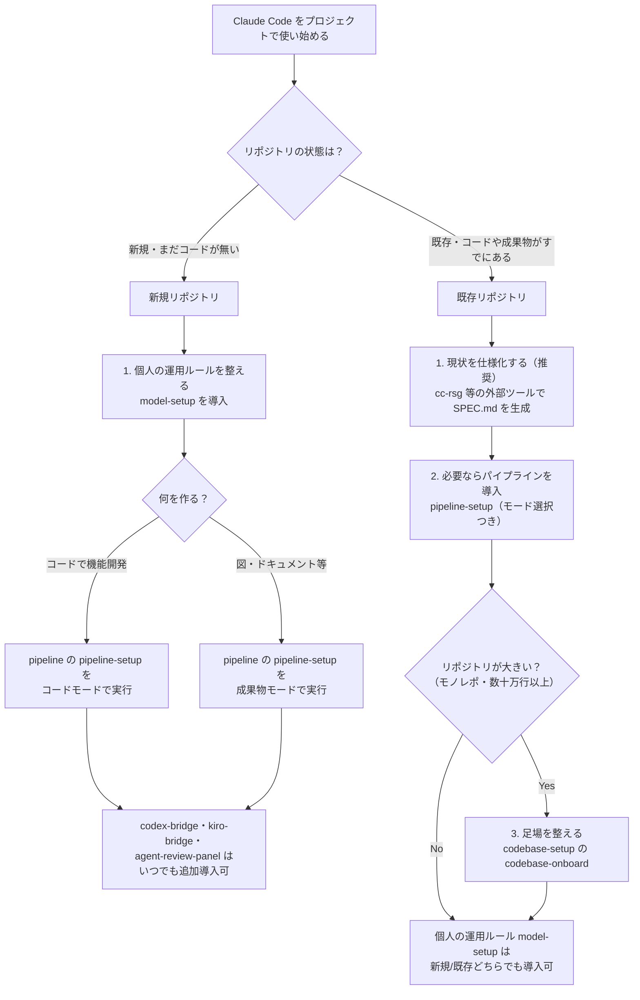
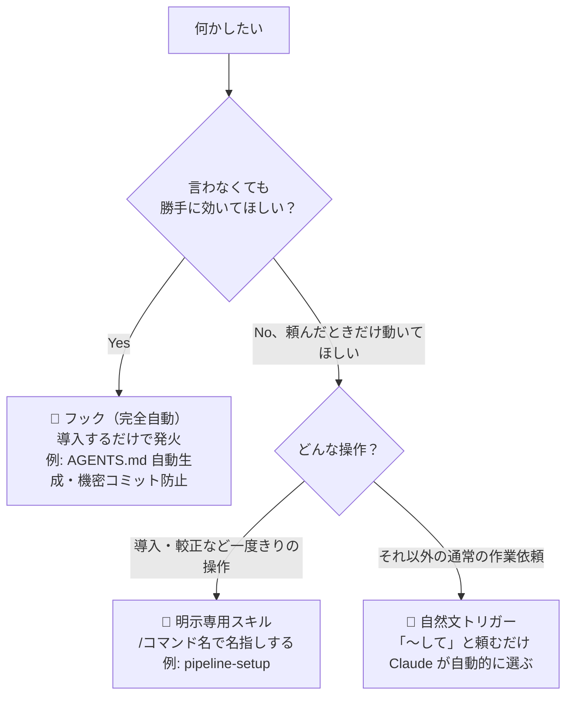

# claude-code-workbench-ja — Claude Code リソース・テンプレート集

Claude Code をより快適に使うためのスクリプト、テンプレート、ベストプラクティスをまとめたリポジトリです。

## はじめに: どこから始める？

対象プロジェクトが**新規**か**既存**かで、最初に入れるものが変わります。


```mermaid
flowchart TD
    Start["Claude Code をプロジェクトで使い始める"] --> Q{"リポジトリの状態は？"}
    Q -->|"新規・まだコードが無い"| New["新規リポジトリ"]
    Q -->|"既存・コードや成果物がすでにある"| Existing["既存リポジトリ"]

    New --> N1["1. 個人の運用ルールを整える<br/>model-setup を導入"]
    N1 --> N2{"何を作る？"}
    N2 -->|"コードで機能開発"| N3["pipeline の pipeline-setup を<br/>コードモードで実行"]
    N2 -->|"図・ドキュメント等"| N4["pipeline の pipeline-setup を<br/>成果物モードで実行"]
    N3 --> N6["codex-bridge・kiro-bridge・<br/>agent-review-panel は<br/>いつでも追加導入可"]
    N4 --> N6

    Existing --> E1["1. 現状を仕様化する（推奨）<br/>cc-rsg 等の外部ツールで SPEC.md を生成"]
    E1 --> E2["2. 必要ならパイプラインを導入<br/>pipeline-setup（モード選択つき）"]
    E2 --> E2b{"リポジトリが大きい？<br/>（モノレポ・数十万行以上）"}
    E2b -->|"Yes"| E2c["3. 足場を整える<br/>codebase-setup の codebase-onboard"]
    E2b -->|"No"| E3
    E2c --> E3["個人の運用ルール model-setup は<br/>新規/既存どちらでも導入可"]
```

### 新規リポジトリ（これから作るプロジェクト）

まだ守るべき既存の型が無いので、最初から良い型で始められます。

1. **個人の運用ルールを先に整える**（Claude Code のユーザー設定に一度入れれば全プロジェクトで効く）— `model-setup` を導入（9ルール＋プロファイル別追補＋`task-brief`／`backlog-loop`／`pr-merge`／`fan-out`／`long-run`／`verify-fresh`）。
2. **プロジェクトの土台を選ぶ**（対象リポジトリに導入。何を作るかで変わる）
   - `pipeline` の `pipeline-setup` を実行（コード/成果物のモード選択つき。エージェント・CLAUDE.md・フックを対象リポジトリに自動導入）
3. 別 AI へのレビュー委譲（`codex-bridge`・`kiro-bridge`）や多視点レビュー（`agent-review-panel`）は、上記と独立して**いつ追加してもよい**。

### 既存リポジトリ（すでにコード・成果物がある）

いきなりパイプラインを回すと、既存の暗黙の規約と衝突しかねません。まず現状を仕様として固定してから入れるのがおすすめです。

1. **現状を仕様化する（推奨）** — [daishir0/cc-rsg](https://github.com/daishir0/cc-rsg) 等の外部ツールで、既存コード・成果物から確度ラベル付きの `SPEC.md` を逆引き生成する（本リポジトリはこの機能を持たず外部ツールへ委譲する）。
2. **その後にパイプラインを導入する場合** — `pipeline-setup` を実行する。対象リポジトリのスタック・git の有無・OS を自動検出し、既存の CLAUDE.md や `.claude/settings.json` は上書きせずマージを提案する設計なので、すでに手を入れたリポジトリでも安全に走らせられる。
3. **リポジトリが大きい場合（数十万行以上・モノレポ・トップレベルが数十以上）は、先に足場を整える** — `codebase-setup` の `/codebase-onboard` を実行する。CLAUDE.md の階層化・生成物を読ませない設定・LSP プラグインなど、そのリポジトリで実際に効くものだけを実測に基づいて入れる（小さいリポジトリには不要）。
4. `model-setup` は個人設定なので、新規・既存を問わずいつ導入してもよい。

## 自動で動くもの／明示的に動かすもの

同じ「プラグインを入れる」でも、効果の出方は3種類あります。使い分けに迷ったら下の図と表を参照してください。


```mermaid
flowchart TD
    A["何かしたい"] --> B{"言わなくても<br/>勝手に効いてほしい？"}
    B -->|"Yes"| C["🔁 フック（完全自動）<br/>導入するだけで発火<br/>例: AGENTS.md 自動生成・機密コミット防止"]
    B -->|"No、頼んだときだけ動いてほしい"| D{"どんな操作？"}
    D -->|"導入・較正など一度きりの操作"| E["🎯 明示専用スキル<br/>/コマンド名で名指しする<br/>例: pipeline-setup"]
    D -->|"それ以外の通常の作業依頼"| F["💬 自然文トリガー<br/>「〜して」と頼むだけ<br/>Claude が自動的に選ぶ"]
```

| 種別 | 動き方 | 呼び出し方 | 入れると何が嬉しいか | 代表例 |
|---|---|---|---|---|
| 🔁 フック（完全自動） | プラグイン導入直後から、SessionStart/SessionEnd/PreToolUse 等のイベントで**頼まなくても毎回発火**する | 不要（無効化しない限り常時ON） | 「言い忘れ」「やり忘れ」を構造的に防げる。導入するだけで効果が始まる | AGENTS.md の自動生成・同期、機密コミット防止、担当外/出力先外書き込みガード、仕様更新漏れの通知（下表） |
| 💬 スキル（自然文トリガー） | 自然文の依頼を Claude が判断し、**自動的に適切なスキルを選ぶ**（`/スキル名` での明示起動も可） | 「〜して」と頼む、または `/スキル名` | 手順や合言葉を覚えていなくても、思った通りに頼めば正しい型が起動する | `task-brief`・`backlog-loop`・`pr-merge`・`feature-pipeline`・`task-pipeline`・`clarify`・`notes`・`codex-review` など大半のスキル |
| 🎯 明示専用スキル | 自然文では発火せず、**`/スキル名` で名指ししたときだけ**動く（`disable-model-invocation: true`） | `/スキル名` のみ | 導入・較正など一度きり／影響の大きい操作を誤発動させない | `pipeline-setup`・`pipeline-improve` |

### 🔁 自動フック一覧（導入するだけで効果が始まるもの）

| プラグイン | フック | 発火タイミング | 効果 |
|---|---|---|---|
| codex-bridge | gen-agents-md | セッション開始 | CLAUDE.md 等から AGENTS.md を自動生成・同期（Codex にも同じルールを効かせる） |
| pipeline | block-secrets-commit / guard-builder-writes / guard-deliverable-writes / guard-builder-paths / inject-spec-summary / spec-sync-reminder | コミット前／Edit・Write 前／セッション開始・サブエージェント開始・Stop | 機密のコミット防止、担当外・出力先外への書き込み防止（`guard-builder-paths` はビルダーの越境を exit 2 で拒否）、SPEC.md の確定要件の注入、仕様更新漏れの通知（guard はモードに応じて setup が配線） |

> 上の表は「導入するだけで常時発火する」フックの一覧です。**model-setup にもフックが1つありますが、
> `/long-run` を起動したときだけ登録される opt-in**（圧縮後にブリーフを文脈へ戻す）なのでここには載せていません。
> kiro-bridge・agent-review-panel・codebase-setup はスキルのみで完結し、フックを持ちません。

## 導入方法（クイックスタート）

### 方法1: プラグインで導入する（最も簡単）

Claude Code でそのまま実行します（clone 不要）。現在6つのプラグインを配信しています:

```
/plugin marketplace add mrkxlia/claude-code-workbench-ja
/plugin install pipeline@workbench-ja
/plugin install codex-bridge@workbench-ja
/plugin install kiro-bridge@workbench-ja
/plugin install agent-review-panel@workbench-ja
/plugin install model-setup@workbench-ja
/plugin install codebase-setup@workbench-ja
```

- **pipeline** — 新しいセッションで `/pipeline:pipeline-setup` を実行すると、モード選択
  （コード開発 `/feature-pipeline` ／コード以外の成果物 `/task-pipeline`）つきで対象リポジトリに
  パイプライン一式（エージェント・CLAUDE.md・フック）が導入されます。旧 software-pipeline /
  task-pipeline の統合後継です。詳しくは [pipeline/README.md](plugins/pipeline/) を参照。
- **codex-bridge** — 導入すると `/codex-review`・`/codex-implement`・`/codex-ask` で、
  コードレビュー・実装・相談を OpenAI Codex に依頼できます（ユーザーは Codex を直接操作せず、
  Claude Code が Codex CLI を非対話で駆動）。詳しくは [codex-bridge/README.md](plugins/codex-bridge/) を参照。
- **kiro-bridge** — 導入すると `/kiro-review`・`/kiro-ask` で、コードレビュー・相談を Kiro に
  依頼できます（ユーザーは Kiro を直接操作せず、Claude Code が kiro-cli を非対話・read-only
  で駆動。実装委譲スキルは持ちません）。詳しくは [kiro-bridge/README.md](plugins/kiro-bridge/) を参照。
- **agent-review-panel** — 導入すると `/review-panel` で、コード差分・実装計画・ドキュメントを
  複数ペルソナのサブエージェント（既定3名）に**ブラインド並列レビュー→相互批判→応答・譲歩→統合**
  の討論つきでレビューさせられます（基本は依存ゼロ）。`deep` で引用検証＋裁定者の最終評決、
  `codex`・`kiro` で外部パネリスト（OpenAI Codex／Kiro・任意・同時指定も可）を混成。詳しくは
  [agent-review-panel/README.md](plugins/agent-review-panel/) を参照。
- **model-setup**（旧名 sonnet-setup） — 導入すると `/task-brief`（着手前にタスク仕様を一括
  ブリーフ化）・`/backlog-loop`（backlog.md 駆動の定型ループ）・`/pr-merge`（PR作成〜マージ〜
  後片付け、git/gh 専用）・`/fan-out`（独立サブタスクの並列委譲＋検証マージ）・`/long-run`
  （長時間自律作業の完走プロトコル）・`/verify-fresh`（fresh context 検証）が使えます。
  サブエージェント3種（task-worker / fresh-verifier / bulk-scanner。プラグイン導入で自動配信）・
  プロファイル別 CLAUDE 追補（Opus+Sonnet / Sonnet 単独）・モデル・effort 選定ガイド
  （MODEL-GUIDE.md・Fable 5.1 パリティマップ付き）も同梱（プロファイル追補のみファイルコピーが必要）。
  詳しくは [model-setup/README.md](plugins/model-setup/) を参照。
- **codebase-setup** — 導入すると `/codebase-onboard`（大規模リポジトリを実測して CLAUDE.md の
  階層化・生成物を読ませない `permissions.deny`・コードインテリジェンス（LSP）プラグイン・
  ディレクトリ別スキルのうち**効くものだけ**を承認ゲート付きで導入）・`/codebase-map`
  （1行説明つきの目次を `docs/codebase-map.md` に作成）・`/context-audit`（常時ロードされる
  指示を5分類で棚卸しし、陳腐化・矛盾・導出可能・過剰ロードを削除／移設）が使えます。
  読み取り専用サブエージェント2種（subtree-surveyor / instruction-auditor）に並列委譲するため、
  大量のファイル読み込みでメインの文脈が埋まりません。詳しくは
  [codebase-setup/README.md](plugins/codebase-setup/) を参照。

### 方法2: git clone してコピーする（全セクション共通）

clone を1回して、使いたいセクションだけコピーします:

```bash
git clone --depth 1 https://github.com/mrkxlia/claude-code-workbench-ja /tmp/workbench
```

```bash
# pipeline — pipeline-setup をパーソナルスキル化（以後どのリポジトリでも /pipeline-setup が使える）
mkdir -p ~/.claude/skills && cp -r /tmp/workbench/plugins/pipeline/skills/pipeline-setup ~/.claude/skills/

# codex-bridge — Codex 依頼スキル4種＋エージェント3種をプロジェクトへ
mkdir -p .claude/skills .claude/agents && cp -r /tmp/workbench/plugins/codex-bridge/skills/* .claude/skills/ && cp -r /tmp/workbench/plugins/codex-bridge/agents/* .claude/agents/

# kiro-bridge — Kiro 依頼スキル2種＋エージェント2種をプロジェクトへ
mkdir -p .claude/skills .claude/agents && cp -r /tmp/workbench/plugins/kiro-bridge/skills/* .claude/skills/ && cp -r /tmp/workbench/plugins/kiro-bridge/agents/* .claude/agents/

# model-setup — 運用ルール（共通9ルール＋プロファイル追補のどちらか一方）をグローバル CLAUDE.md に追記
#   私用PC(Opus+Sonnet)は CLAUDE.private.md、会社PC(Sonnet単独)は CLAUDE.company.md
cat /tmp/workbench/plugins/model-setup/CLAUDE.md /tmp/workbench/plugins/model-setup/CLAUDE.company.md >> ~/.claude/CLAUDE.md
# スキル（pr-merge は git 専用のため必要な環境のみ）とサブエージェント
cp -r /tmp/workbench/plugins/model-setup/skills/task-brief /tmp/workbench/plugins/model-setup/skills/backlog-loop \
      /tmp/workbench/plugins/model-setup/skills/fan-out /tmp/workbench/plugins/model-setup/skills/long-run \
      /tmp/workbench/plugins/model-setup/skills/verify-fresh ~/.claude/skills/
mkdir -p ~/.claude/agents && cp -r /tmp/workbench/plugins/model-setup/agents/* ~/.claude/agents/
```

各セクションのカスタマイズ方法は、それぞれの README を参照してください。私用PC・会社PCでそれぞれ
「何を入れるか」をまとめた導入プロファイルは [`docs/skills-guide/README.md`](docs/skills-guide/) を参照。

## どれをいつ使う？（スキル/プラグイン早見表）

| やりたいこと | 使うもの | ひとこと |
|--------------|----------|----------|
| 機能をコードで end-to-end 実装したい | **pipeline**（`/feature-pipeline`） | 7エージェント連鎖＋3つの人間承認チェックポイント |
| パイプラインを通すほどでない小さな実装＋テスト | pipeline の `/build-with-tests` | 既存パターン確認 → 実装とテスト並行 → 型チェック |
| 図・ドキュメント等コード以外の成果物を作りたい | **pipeline**（`/task-pipeline`） | 5エージェント連鎖。drawio 等のユーザー導入スキルも呼べる |
| 別 AI（OpenAI Codex）にレビュー/実装/相談を委譲したい | **codex-bridge**（`/codex-review` ほか） | Claude が Codex CLI を非対話で駆動。ユーザーは Codex を触らない |
| 別 AI（Kiro）にレビュー/相談を委譲したい | **kiro-bridge**（`/kiro-review`・`/kiro-ask`） | Claude が kiro-cli を非対話・read-only で駆動。実装委譲はしない |
| 重要な判断を複数の視点で敵対的にレビュー・討論させたい | **agent-review-panel**（`/review-panel`） | 既定3名がブラインド並列→相互批判→統合。deep で引用検証＋裁定者、codex・kiro で異種モデル混成（同時指定も可） |
| 要件・仕様を質問で詰めたい | **clarify**（pipeline に同梱） | 単体利用も可（各プラグイン README の「単体利用」参照） |
| 実装中の判断・逸脱を記録したい | **notes**（pipeline に同梱） | 単体利用も可。物証（file:line・テスト名）つきで記録 |
| 既存コード/成果物から仕様書を逆引きしたい | 外部ツール（[cc-rsg](https://github.com/daishir0/cc-rsg) 等） | 本リポジトリは持たず外部ツールへ委譲。生成後は pipeline の researcher が一次資料として読む |
| Opus 5+Sonnet 5 や Sonnet 単独で上位モデル（Fable 5.1 級）並みの振る舞いに近づけたい | **model-setup** | 9ルール＋プロファイル別追補を CLAUDE.md に常設化、並列委譲・fresh 検証・自律完走のスキル/エージェント、モデル/effortガイド |
| backlog.md 駆動で計画→実施→PR→マージまで定型ループで回したい | model-setup（`/backlog-loop`・`/pr-merge`） | Step承認ゲート付き。git なし環境は変更ファイル一覧提示で完了 |
| 巨大なリポジトリで Claude が的外れなファイルを読む／CLAUDE.md が長すぎる | **codebase-setup**（`/codebase-onboard`） | 実測して効く設定だけ入れる。ルート CLAUDE.md の生成自体は本体 `/init` に委譲 |
| どこに何があるか分からないリポジトリの地図が欲しい | codebase-setup（`/codebase-map`） | 1行説明つきの目次。地図が要らないリポジトリには「作らない」と答える |
| モデルを更新したので古い指示を整理したい | codebase-setup（`/context-audit`） | 「正しいか」でなく「毎回載せる価値があるか」で5分類。承認前に変更しない |

> パイプラインのサブスキル（`clarify`・`build-with-tests` 等）は単体でも使えます。導入は各プラグイン README の
> 「単体で使う（個別利用）」小節を参照してください。

### 仕様駆動開発まわりの違い

仕様にまつわるスキルは守備範囲が重なって見えるので、方向と役割で整理します。

| ツール | 方向 | 入力 → 出力 | いつ使う／違い |
|--------|------|-------------|----------------|
| `feature-pipeline` / `brief-writer`（pipeline） | **順方向** | アイデア/ストーリー → 技術ブリーフ → コード | これから作る機能を仕様化して実装まで通す |
| `task-pipeline`（成果物モード） | 順方向（成果物） | 依頼 → 成果物要件 → 作業ブリーフ → 成果物 | 図/ドキュメント版。コード前提語を成果物前提に読み替えた点がコードモードとの違い |
| `clarify`（pipeline） | 詰める | 曖昧な要望 → 確定した要件 | 仕様を書く前に穴・前提を質問で潰す。brief-writer の前段。モード自動判定の統合版 |
| `notes`（pipeline） | 記録 | 実装中の判断・逸脱 → `implementation-notes.md` | あるべき姿（SPEC.md）ではなく**実装の経緯**を残す |
| 仕様逆引き（外部ツール） | **逆方向** | 既存コード・成果物 → `SPEC.md`（確度ラベル付） | 本リポジトリは持たない。cc-rsg 等を使い、生成後は researcher が一次資料として読む |

**他の仕様駆動開発（SDD）との関係。** GitHub [spec-kit](https://github.com/github/spec-kit)
（`/speckit.specify` → `/speckit.plan` → `/speckit.tasks` → `/speckit.implement`、既存コードとの
乖離を検出する `/speckit.converge` も追加済み）・Kiro・cc-sdd など一般的な SDD ツールは
`requirements → design → tasks` を前提にします。本リポジトリの対応物は次のとおりです。

| 一般的な SDD | 本リポジトリの相当物 |
|--------------|----------------------|
| requirements.md | feature-pipeline の `story.md`（受け入れ基準つきストーリー） |
| design.md | `brief.md` ＋ `api-contract.md`（技術ブリーフ／API 契約） |
| tasks.md | パイプラインの Phase 連鎖＋ `status.md`（進行管理） |
| PRD / living spec | `SPEC.md`（spec of record・Phase 7 で増分更新） |
| spec-tracker（更新漏れ警告） | `spec-sync-reminder` フック（SessionStart/Stop） |
| spec-validator（実装と仕様の突合） | `final-reviewer` エージェント＋ `test-verifier` |

本リポジトリと spec-kit / Kiro / cc-sdd との主な違いは、(1) **`task-pipeline` によるコード以外の
成果物**（図・ドキュメント・レポート）への同型パイプライン適用、(2) 各工程を**独立したサブエージェント**
（クリーンなコンテキスト・ツール制限）に分離する実行方式、(3) `notes` の実装ノートと `SPEC.md` を
連動させる**生きた仕様の運用**（`spec-sync-reminder` フックが更新漏れを通知）、の3点です。
レガシーコードからの仕様逆引き生成は対象外とし、cc-rsg 等の外部ツールへ委譲します（spec-kit の
`/speckit.converge` は既存 spec との乖離検出であり、仕様書が無い状態からの逆引き生成とは異なる点に
注意）。運用原則として **「1 Todo = 1 Commit = 1 Spec Update」**
（実装の区切りごとに仕様も更新して同期させる）を採り、これは既存の「Phase 7 での SPEC 増分更新」と
`spec-sync-reminder` フックがそのまま実装になっています。**いつ SDD を使うか**の目安は、本番機能（1日以上）・
チーム作業・厳格なアーキテクチャ・レガシー改善では採用（`feature-pipeline`）、1時間未満の修正・POC・hotfix・
UI 試作では避けて軽量な `build-with-tests` を使う、です（参考: 下記「ライセンス・出典」の SDD 記事）。

## 収録セクション

トップレベルは **plugins/**（プラグイン導入可能）・**docs/**（リポジトリ内ドキュメント）の2分類です
（コピーして使うテンプレートや独立ツールが増えたら `templates/`・`tools/` を追加する規約になっています。
詳細なディレクトリ構成は [`CLAUDE.md`](CLAUDE.md) 参照）。

### plugins/ — プラグイン導入可能な6セクション

#### [`plugins/model-setup/`](plugins/model-setup/)
モデル運用テンプレート（旧名 sonnet-setup。Opus 5 + Sonnet 5 の私用PC / Sonnet 単独の会社PC
の2プロファイル）。完了条件の事前定義・検証つき完了報告・確信度の明示・スコープ厳守・網羅
レビューなど、上位モデル（Fable 5.1 級）の「振る舞い」を常設化する9つの行動ルールと、進捗の
証拠監査・自律完走・評価と実行の境界などを加えるプロファイル別追補（`CLAUDE.private.md` /
`CLAUDE.company.md`）に加え、**task-brief**（最初のターンでタスク仕様をブリーフ化）・
**backlog-loop**（backlog.md 駆動の定型ループ）・**pr-merge**（git/gh 専用）・**fan-out**
（独立サブタスクの並列委譲＋検証マージ）・**long-run**（長時間自律作業の完走プロトコル）・
**verify-fresh**（fresh context 検証）の6スキル、サブエージェント3種（task-worker /
fresh-verifier / bulk-scanner。sonnet/haiku をタスク別にルーティング）、モデル・effort 選定
ガイド（`MODEL-GUIDE.md`・Fable 5.1 パリティマップ付き）、settings サンプルを収録しています。
**プラグイン1コマンドで導入可能**（上の「導入方法」参照。スキル・エージェントは自動配信、
プロファイル追補のみファイルコピーが必要）。
プロンプト側の型は既存 OSS（severity1/claude-code-prompt-improver）を README で紹介しています。

#### [`plugins/pipeline/`](plugins/pipeline/)
コード開発とコード以外の成果物作成を1つに統合したパイプラインテンプレート（旧 software-pipeline / task-pipeline の後継）。
**コードモード**は `/feature-pipeline` が 調査 → ストーリー → 技術ブリーフ → バックエンド → フロントエンド → 受け入れテスト → 最終検証 の7工程を、**成果物モード**は `/task-pipeline` が 調査 → 成果物要件 → 作業ブリーフ → 作成 → レビュー の5工程を連鎖実行し、いずれも3つの人間承認チェックポイントで停止します（成果物モードのビルダーは drawio などユーザー導入スキルを呼び出せます）。対象リポジトリを解析してモード選択つきで一式を自動導入する **pipeline-setup**、運用実績から定義を改善する **pipeline-improve**（自己改善ループ）を含むスキル7種と、モード自動判定の共有エージェント4種（researcher / requirements-writer / brief-writer / final-reviewer）+専用ビルダー等4種の計8エージェント、フック4種（機密コミットブロック・担当外/出力先外書き込みガード・仕様更新漏れ通知）・CLAUDE.md サンプル2種（コード用 / 成果物用）を収録しています。ビルダーが実装中の判断を `docs/pipeline/<slug>/implementation-notes.md` に記録し、レガシーコードには [cc-rsg](https://github.com/daishir0/cc-rsg) 等の外部ツールで仕様を固めてから導入できます。**プラグイン2コマンドで導入可能**（上の「導入方法」参照）。

#### [`plugins/codex-bridge/`](plugins/codex-bridge/)
コードレビュー・実装・相談を OpenAI Codex に依頼するスキル4種とサブエージェント3種。
ユーザー自身は Codex を操作せず、Claude Code が Codex CLI を**非対話モード（`codex exec`）**で
駆動します。`/codex-review`（差分/指定ファイルを Codex にレビューさせ重大度 P1–P4 で要約・read-only）、
`/codex-implement`（Codex にファイルを直接編集させ Claude が差分とテストを検証・workspace-write）、
`/codex-ask`（設計相談・セカンドオピニオンを Codex に答えさせ要約・read-only）を収録。実際の codex 実行は
サブエージェント（codex-reviewer / codex-implementer / codex-advisor）に委譲し、冗長な出力をメイン文脈から
隔離します。さらに **`/codex-agents`**（既存の Claude ルール CLAUDE.md 等を取り込んだ `AGENTS.md` を生成し、
Codex に同じルールを効かせる）と、**プラン承認で Codex 実装へ委譲する opt-in フック**を同梱。安全側を
既定にし（危険サンドボックスフラグ不使用）、git を使っていない環境でも動作します（フック/スクリプトは
bash 系のため Windows は Git Bash / WSL が必要・`jq` は不要）。**プラグイン1コマンドで導入可能**（上の「導入方法」参照）。

#### [`plugins/kiro-bridge/`](plugins/kiro-bridge/)
コードレビュー・相談を Kiro に依頼するスキル2種とサブエージェント2種。
ユーザー自身は Kiro を操作せず、Claude Code が `kiro-cli` を**非対話モード
（`kiro-cli chat --no-interactive`）**で駆動します。`/kiro-review`（差分/指定ファイルを Kiro に
レビューさせ重大度 P1–P4 で要約）、`/kiro-ask`（設計相談・セカンドオピニオンを Kiro に答えさせ要約）
を収録し、いずれも `--trust-tools=read` 固定の read-only です。実際の kiro-cli 実行はサブエージェント
（kiro-reviewer / kiro-advisor）に委譲し、冗長な出力をメイン文脈から隔離します。kiro-cli には Codex の
`--sandbox workspace-write` に相当する OS レベル隔離が無いため、**実装を委譲するスキルは持ちません**
（理由は README の「なぜこの構成か」参照）。**プラグイン1コマンドで導入可能**（上の「導入方法」参照）。

#### [`plugins/agent-review-panel/`](plugins/agent-review-panel/)
コード差分・実装計画・ドキュメントを、異なるペルソナの複数サブエージェント（既定3名）にレビューさせる
**敵対的パネルレビュー**のスキル1種とサブエージェント5種。**review-panel**（`/review-panel`）が
ファシリテーターとして、ブラインド並列回答 → 匿名化した相互批判（反例のない批判は破棄）→ 応答・譲歩 →
統合の4ラウンドを進行し、合意した指摘・未解決の対立・全員一致警告まで含めて返します（基本は依存ゼロ）。
`deep` 指定で引用検証（panel-verifier が file:line の実在を機械照合）と討論非関与の裁定者
（panel-judge）による最終評決＋レポート出力を追加、`codex`・`kiro` 指定で外部パネリスト
（panel-codex 経由の OpenAI Codex／panel-kiro 経由の Kiro・いずれも未導入なら欠席扱い・**同時指定も可**）
を混成して同一モデルの相関バイアスを減らせます。1名で足りる相談は内蔵の Task サブエージェントに、単独の
コードレビューは内蔵 `/code-review`・`/codex-review`・`/kiro-review` に任せる住み分けです。
**プラグイン1コマンドで導入可能**（上の「導入方法」参照）。

#### [`plugins/codebase-setup/`](plugins/codebase-setup/)
大規模リポジトリ（数十万行以上・モノレポ・トップレベルが数十以上）を Claude Code から
**読みやすく（legible）する足場**を作るスキル3種と読み取り専用サブエージェント2種。
Claude Code はコードベースを事前インデックス化せず人間と同じようにファイルを辿って読むため、
出力の質は「関連する文脈にたどり着けるか」に効きます。**codebase-onboard**（`/codebase-onboard`）が
リポジトリを実測（規模・言語構成・チェックインされた生成物・既存の CLAUDE.md）したうえで、
CLAUDE.md の階層化・`permissions.deny` による生成物の遮断・LSP プラグイン・ディレクトリ別スキル・
`claudeMdExcludes`・`worktree.sparsePaths` のうち**そのリポジトリで効くものだけ**を2つの承認
チェックポイント付きで導入し、最後に**設定の所有者と次回棚卸し時期**を決めます。
**codebase-map** は1行説明つきの目次を、**context-audit** は常時ロードされる指示の棚卸し
（陳腐化・矛盾・導出可能・過剰ロードの5分類）を担当します。ルート CLAUDE.md の生成は本体の
`/init`、1ファイルの機械的な短縮は本体の `/doctor`、定義ジャンプは公式 LSP プラグインに委譲し、
**再実装していません**（設計の経緯は
[`docs/decisions/2026-09-05-large-codebase-harness.md`](docs/decisions/2026-09-05-large-codebase-harness.md)）。
**プラグイン1コマンドで導入可能**（上の「導入方法」参照）。

### docs/ — リポジトリ内ドキュメント

#### [`docs/skills-guide/`](docs/skills-guide/)
おすすめSkillsガイド（2026-09-04 に配布元を再検証済み）。
72個紹介された記事から「今すぐ使えるもの」に絞り込み、優先度別・業務タイプ別に整理しています。

#### [`docs/decisions/`](docs/decisions/)
日付つきの決定記録・監査記録。2026-09-03 に Fable 5.1（model-setup の再現対象モデル本人）が
model-setup を監査した記録と、「完全には埋まらない」とされてきた序盤制約の保持・SPEC.md 必須ロードを
Claude Code のフック仕様で構造化する決定記録を収録。実装待ちの項目は
[`docs/backlog-2026-09.md`](docs/backlog-2026-09.md) にブリーフとして置いてある。

#### [`docs/pipeline-spec-alignment-proposal.html`](docs/pipeline-spec-alignment-proposal.html)
旧 software-pipeline・task-pipeline（現 pipeline に統合）と、当時存在した仕様抽出スキル（spec-extract）の
実装合致性を強制化するための設計提案資料（案A/案B比較・推奨・改修リスト、2026-06 時点）。ブラウザで開いて
読む単一 HTML ファイルです。**2026-08 の OSS 差別化レビューで、案A の柱だった `spec-extract` は
[cc-rsg](https://github.com/daishir0/cc-rsg) 等の外部ツールへの委譲に変更されました**（歴史的決定記録として残置）。

## 別リポジトリに分割したもの

Claude Code のテーマから外れる独立ツール・サンプルは、このリポジトリではなく専用リポジトリで管理しています。

### [power-automate-azure-foundry](https://github.com/mrkxlia/power-automate-azure-foundry)
Power Automate のクラウドフローから Azure AI Foundry（Azure OpenAI）の GPT を呼び出すサンプル一式。
**テキストのみ**と**画像＋テキスト（Vision）**の2パターンのフロー定義、インポート用の**レガシーパッケージ zip** と **Dataverse ソリューション zip**、**カスタムコネクタ**定義を収録し、最終形として「PowerApps でカメラ撮影 → Automate 経由で GPT に送って OCR」まで通せます。認証は API Key。鍵を安全に扱う3方式（HTTP ヘッダー直書き／カスタムコネクタ／環境変数）の比較、DLP ポリシー下で開けるべきコネクタ、Secure Inputs/Outputs などのセキュリティ解説付き。

## ライセンス・出典

このリポジトリは [MIT License](LICENSE) で公開しています。

一部のセクションは外部の成果物を参考にしており、それぞれ以下のとおり権利関係を明記しています。

| セクション | 参考元 | ライセンス・扱い |
|-----------|--------|----------------|
| [`plugins/model-setup/`](plugins/model-setup/) | X 記事「Sonnet 5をFable 5にする方法」（[@armadillo_ai 氏](https://x.com/armadillo_ai)） | 記事の7原則を参照・要約・翻案した独自整形（コピーではない）— 帰属を README とファイル内に記載 |
| [`docs/skills-guide/`](docs/skills-guide/) | [anthropics/skills](https://github.com/anthropics/skills)・[obra/superpowers](https://github.com/obra/superpowers)・[mattpocock/skills](https://github.com/mattpocock/skills) | リンクと独自解説のみ収録。各スキル本体は各リポジトリのライセンス（anthropics/skills は Apache 2.0 + 一部 source-available）に従う |
| [`plugins/pipeline/`](plugins/pipeline/) | [How to Build a Software Factory with Claude Code（@sairahul1 氏）](https://x.com/sairahul1/status/2058832033628241931) | 記事のコンセプト（コードモード）とそのコード以外の成果物への汎用化（成果物モード）に基づく独自実装（コピーではない）— 帰属を README に記載 |
| [`plugins/codex-bridge/`](plugins/codex-bridge/) | [eddiearc/codex-delegator](https://github.com/eddiearc/codex-delegator)・[hamelsmu/claude-review-loop](https://github.com/hamelsmu/claude-review-loop)・[OpenAI Codex CLI ドキュメント](https://developers.openai.com/codex/) | 構成・プロンプト型のコンセプトを参考にした独自実装（コードのコピーではない） |
| [`plugins/agent-review-panel/`](plugins/agent-review-panel/) | [wan-huiyan/agent-review-panel](https://github.com/wan-huiyan/agent-review-panel)・[makinux/adversarial-panel](https://github.com/makinux/adversarial-panel) | 多フェーズ・パネル構成（並列独立レビュー→討論→検証→裁定）／4ラウンド敵対プロトコル（ブラインド回答→相互批判→譲歩→統合）のコンセプトを参考にした独自実装（コードのコピーではない）— 帰属を README に記載 |
| [`plugins/codebase-setup/`](plugins/codebase-setup/) | [How Claude Code works in large codebases: best practices and where to start](https://claude.com/blog/how-claude-code-works-in-large-codebases-best-practices-and-where-to-start)（Anthropic 公式ブログ・2026-09-05 取得）＋公式ドキュメント [Monorepos and large repos](https://code.claude.com/docs/en/large-codebases) ほか | 記事の設計原則（harness の7拡張点・3つの設定パターン・導入ロードマップ・所有と棚卸し）を参考にした独自実装（文章のコピーではない）。設定キー名・LSP プラグイン名などの事実は公式ドキュメントを一次情報とした — 帰属を README・決定記録に記載 |
| 仕様駆動開発まわりの解説（本 README の早見表） | [「1 Todo=1 Commit=1 Spec Update」（Zenn / Luup Developers）](https://zenn.dev/luup_developers/articles/server-jang-20251215)・[「SPEC駆動開発ツール比較」（Qiita / kanagawa41 氏）](https://qiita.com/kanagawa41/items/ef134490b61b41675e01) | 記事のコンセプト・比較観点を参考にした独自解説（コードのコピーではない）— 帰属を本表に記載 |
