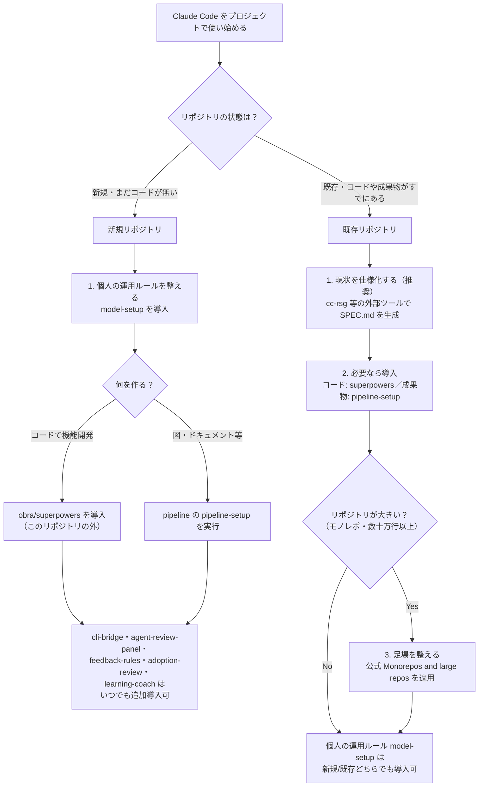
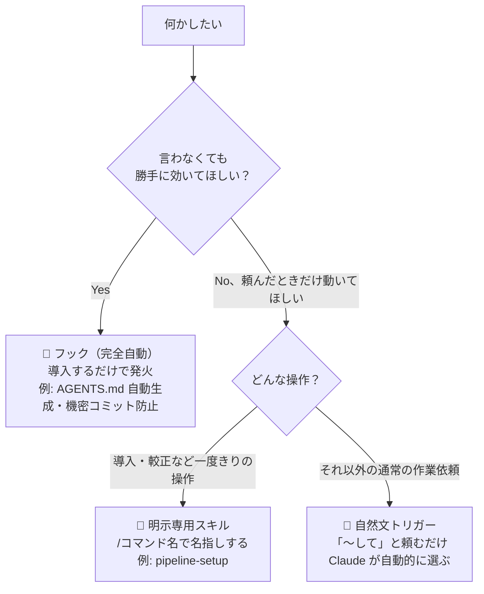

# claude-code-workbench-ja — Claude Code リソース・テンプレート集

Claude Code をより快適に使うためのスクリプト、テンプレート、ベストプラクティスをまとめたリポジトリです。

## はじめに: どこから始める？

対象プロジェクトが**新規**か**既存**かで、最初に入れるものが変わります。


```mermaid
flowchart TD
    Start["Claude Code をプロジェクトで使い始める"] --> Q{"リポジトリの状態は？"}
    Q -->|"新規・まだコードが無い"| New["新規リポジトリ"]
    Q -->|"既存・コードや成果物がすでにある"| Existing["既存リポジトリ"]

    New --> N1["1. 個人の運用ルールを整える<br/>model-setup を導入"]
    N1 --> N2{"何を作る？"}
    N2 -->|"コードで機能開発"| N3["obra/superpowers を導入<br/>（このリポジトリの外）"]
    N2 -->|"図・ドキュメント等"| N4["pipeline の pipeline-setup を実行"]
    N3 --> N6["cli-bridge・agent-review-panel・<br/>feedback-rules・adoption-review・<br/>learning-coach は<br/>いつでも追加導入可"]
    N4 --> N6

    Existing --> E1["1. 現状を仕様化する（推奨）<br/>cc-rsg 等の外部ツールで SPEC.md を生成"]
    E1 --> E2["2. 必要なら導入<br/>コード: superpowers／成果物: pipeline-setup"]
    E2 --> E2b{"リポジトリが大きい？<br/>（モノレポ・数十万行以上）"}
    E2b -->|"Yes"| E2c["3. 足場を整える<br/>公式 Monorepos and large repos を適用"]
    E2b -->|"No"| E3
    E2c --> E3["個人の運用ルール model-setup は<br/>新規/既存どちらでも導入可"]
```

### 新規リポジトリ（これから作るプロジェクト）

まだ守るべき既存の型が無いので、最初から良い型で始められます。

1. **個人の運用ルールを先に整える**（Claude Code のユーザー設定に一度入れれば全プロジェクトで効く）— `model-setup` を導入（4ルール＋プロファイル別追補＋`verify-fresh`）。
2. **プロジェクトの土台を選ぶ**（対象リポジトリに導入。何を作るかで変わる）
   - コードで機能開発する → [obra/superpowers](https://github.com/obra/superpowers) を導入（このリポジトリには同等品を置かない）
   - 図・ドキュメント・レポート・設計書を作る → `pipeline` の `pipeline-setup` を実行（エージェント・CLAUDE.md・フックを対象リポジトリに自動導入）
3. 別 AI への相談・レビュー委譲（`cli-bridge`）、多視点レビュー（`agent-review-panel`）、指摘の永続化と段階的強制（`feedback-rules`）、外部技術の採用可否レビュー（`adoption-review`）、変更内容を自分が理解するための学習コーチ（`learning-coach`）は、上記と独立して**いつ追加してもよい**。

### 既存リポジトリ（すでにコード・成果物がある）

いきなりパイプラインを回すと、既存の暗黙の規約と衝突しかねません。まず現状を仕様として固定してから入れるのがおすすめです。

1. **現状を仕様化する（推奨）** — [daishir0/cc-rsg](https://github.com/daishir0/cc-rsg) 等の外部ツールで、既存コード・成果物から確度ラベル付きの `SPEC.md` を逆引き生成する（本リポジトリはこの機能を持たず外部ツールへ委譲する）。
2. **その後にパイプラインを導入する場合** — コード開発なら superpowers、成果物作成なら `pipeline-setup` を実行する。対象リポジトリのスタック・git の有無・OS を自動検出し、既存の CLAUDE.md や `.claude/settings.json` は上書きせずマージを提案する設計なので、すでに手を入れたリポジトリでも安全に走らせられる。
3. **リポジトリが大きい場合（数十万行以上・モノレポ・トップレベルが数十以上）は、先に足場を整える** — 公式ドキュメント [Monorepos and large repos](https://code.claude.com/docs/en/large-codebases) に沿って、CLAUDE.md の階層化・生成物を読ませない設定・LSP プラグインなどを入れる（小さいリポジトリには不要）。
4. `model-setup` は個人設定なので、新規・既存を問わずいつ導入してもよい。

## 自動で動くもの／明示的に動かすもの

同じ「プラグインを入れる」でも、効果の出方は3種類あります。使い分けに迷ったら下の図と表を参照してください。


```mermaid
flowchart TD
    A["何かしたい"] --> B{"言わなくても<br/>勝手に効いてほしい？"}
    B -->|"Yes"| C["🔁 フック（完全自動）<br/>導入するだけで発火<br/>例: AGENTS.md 自動生成・機密コミット防止"]
    B -->|"No、頼んだときだけ動いてほしい"| D{"どんな操作？"}
    D -->|"導入・較正など一度きりの操作"| E["🎯 明示専用スキル<br/>/コマンド名で名指しする<br/>例: pipeline-setup"]
    D -->|"それ以外の通常の作業依頼"| F["💬 自然文トリガー<br/>「〜して」と頼むだけ<br/>Claude が自動的に選ぶ"]
```

| 種別 | 動き方 | 呼び出し方 | 入れると何が嬉しいか | 代表例 |
|---|---|---|---|---|
| 🔁 フック（完全自動） | プラグイン導入直後から、SessionStart/SessionEnd/PreToolUse 等のイベントで**頼まなくても毎回発火**する | 不要（無効化しない限り常時ON） | 「言い忘れ」「やり忘れ」を構造的に防げる。導入するだけで効果が始まる | 機密コミット防止、担当外/出力先外書き込みガード、仕様更新漏れの通知（下表） |
| 💬 スキル（自然文トリガー） | 自然文の依頼を Claude が判断し、**自動的に適切なスキルを選ぶ**（`/スキル名` での明示起動も可） | 「〜して」と頼む、または `/スキル名` | 手順や合言葉を覚えていなくても、思った通りに頼めば正しい型が起動する | `verify-fresh`・`task-pipeline`・`grilling`・`notes`・`codex-ask`・`deep-understand` など大半のスキル |
| 🎯 明示専用スキル | 自然文では発火せず、**`/スキル名` で名指ししたときだけ**動く（`disable-model-invocation: true`） | `/スキル名` のみ | 導入・較正など一度きり／影響の大きい操作を誤発動させない | `pipeline-setup`・`pipeline-improve` |

### 🔁 自動フック一覧（導入するだけで効果が始まるもの）

| プラグイン | フック | 発火タイミング | 効果 |
|---|---|---|---|
| pipeline | block-secrets-commit / guard-deliverable-writes / guard-builder-paths / inject-spec-summary / spec-sync-reminder | コミット前／Edit・Write 前／セッション開始・サブエージェント開始・Stop | 機密のコミット防止、担当外・出力先外への書き込み防止（`guard-builder-paths` はビルダーの越境を exit 2 で拒否）、SPEC.md の確定要件の注入、仕様更新漏れの通知 |
| feedback-rules | feedback-hook（inject / guard / stop-check の3モード） | プロンプト送信時／Bash・Edit・Write 前／Stop | 繰り返し指摘された確定ルール（count 3 以上）を毎ターン注入し、違反しそうなツール実行を count に応じて ask / deny で止め、直すまでターンを終わらせない。**ルールが1件も無い間は素通り**する |

> 上の表は「導入するだけで常時発火する」フックの一覧です。cli-bridge の `plan-review-codex` は手動配線の opt-in なので
> ここには載せていません。model-setup・agent-review-panel・adoption-review・learning-coach はスキルのみで完結し、フックを持ちません。

## 導入方法（クイックスタート）

### 方法1: プラグインで導入する（最も簡単）

Claude Code でそのまま実行します（clone 不要）。現在7つのプラグインを配信しています:

```
/plugin marketplace add mrkxlia/claude-code-workbench-ja
/plugin install pipeline@workbench-ja
/plugin install cli-bridge@workbench-ja
/plugin install agent-review-panel@workbench-ja
/plugin install adoption-review@workbench-ja
/plugin install model-setup@workbench-ja
/plugin install feedback-rules@workbench-ja
/plugin install learning-coach@workbench-ja
```

- **pipeline** — 新しいセッションで `/pipeline:pipeline-setup` を実行すると、コード以外の成果物
  （図・ドキュメント・レポート・設計書）を作る `/task-pipeline` 一式（エージェント・CLAUDE.md・フック）が
  対象リポジトリに導入されます。**コードの機能開発は [obra/superpowers](https://github.com/obra/superpowers)
  を使ってください**（旧コードモード `/feature-pipeline` は 2026-10-06 に削除）。詳しくは [pipeline/README.md](plugins/pipeline/) を参照。
- **cli-bridge** — 導入すると `/kiro-review`・`/kiro-ask`・`/codex-ask` で、
  外部の AI コーディング CLI（Kiro・OpenAI Codex）に相談・レビューを委譲できます（ユーザーは
  外部 CLI を直接操作せず、Claude Code が非対話・read-only で駆動）。**Codex へのレビュー・実装の
  委譲は公式プラグイン [openai/codex-plugin-cc](https://github.com/openai/codex-plugin-cc) を
  使ってください**（旧 codex-bridge は 2026-09-19 に廃止）。詳しくは
  [cli-bridge/README.md](plugins/cli-bridge/) を参照。
- **agent-review-panel** — 導入すると `/review-panel` で、コード差分・実装計画・ドキュメントを
  複数ペルソナのサブエージェント（既定3名）に**ブラインド並列レビュー→相互批判→応答・譲歩→統合**
  の討論つきでレビューさせられます（基本は依存ゼロ）。`deep` で引用検証＋裁定者の最終評決、
  `codex`・`kiro` で Claude 以外のモデル（OpenAI Codex／Kiro・任意・同時指定も可）を混成し、
  相互批判と見落とし探しにも参加させます。「高」の指摘には反証テストを付けます。詳しくは
  [agent-review-panel/README.md](plugins/agent-review-panel/) を参照。
- **adoption-review** — 導入すると `/adoption-review`（URL・GitHub リポジトリ・X ポスト・スライド・
  論文・SaaS・ツール名を渡すと、Web の一次情報を集めてから「実務で採用する価値があるか」を敵対的に
  判定）が使えます。**良い点より先に「採用しない理由」を探し**、代替手段（既存 OSS・本体機能・
  何もしない）と導入/運用/学習/撤退コストまで見たうえで、結論・採用判断・検証手順・スコアを返します。
  証拠収集は本体同梱の `/deep-research` workflow（並列調査・照合・主張ごとの投票）に任せ、結論の向きで
  検証を分岐します（肯定寄りなら `adoption-challenger` に「採用しない論拠」だけを作らせ、
  否定寄りなら「確認できなかったことを減点に使っていないか」を自己点検）。確認できなかった
  ことは推測で埋めません。詳しくは [adoption-review/README.md](plugins/adoption-review/) を参照。
- **model-setup**（旧名 sonnet-setup） — 導入すると `/verify-fresh`（fresh context の検証役に完了条件と
  突き合わせさせる）が使えます。
  公式ガイドに無い4ルールの CLAUDE.md テンプレート・プロファイル別追補（Opus+Sonnet / Sonnet 単独）・
  プロファイル設計メモ（MODEL-GUIDE.md）も同梱（テンプレートと追補はファイルコピーが必要）。
  詳しくは [model-setup/README.md](plugins/model-setup/) を参照。
- **feedback-rules** — 導入すると `/feedback-rule`（人間の指摘を `~/.claude/feedback/` の1ファイルにして
  count を1つ上げ、機械的に検知できる形に翻訳）・`/feedback-audit`（違反ログを集計して形骸化ルール・
  誤検知・昇格候補を棚卸し）・`/feedback-setup`（導入）が使えます。**同じ指摘の回数（count）が
  そのまま強制力**になり、1〜2回目は warn、3回目から ask / block、5回目で deny に自動で上がります
  （count を上げられるのは人間だけで、フックは違反をログに記録するだけ）。フック3種はプラグイン
  導入で自動配線され、**ルールが1件も無い間は素通り**します。詳しくは
  [feedback-rules/README.md](plugins/feedback-rules/) を参照。
- **learning-coach** — 導入すると `/deep-understand` で、Claude が**教師役**になり、ある変更・
  コード・設計判断を**あなた自身が人に説明できる状態**になるまで段階的に教えます（問題／解決／
  広い文脈の3層チェックリストを維持し、先にあなたの現在の理解を述べさせてギャップを埋め、
  クイズで実証してから次へ進む。ELI5 / ELI14 / ELII の粒度指定に対応）。他プラグインが
  「Claude に良い仕事をさせる」ためのものであるのに対し、これは**人間の側の理解を作る**
  ためのものです。詳しくは [learning-coach/README.md](plugins/learning-coach/) を参照。

### 方法2: git clone してコピーする（全セクション共通）

clone を1回して、使いたいセクションだけコピーします:

```bash
git clone --depth 1 https://github.com/mrkxlia/claude-code-workbench-ja /tmp/workbench
```

```bash
# pipeline — pipeline-setup をパーソナルスキル化（以後どのリポジトリでも /pipeline-setup が使える）
mkdir -p ~/.claude/skills && cp -r /tmp/workbench/plugins/pipeline/skills/pipeline-setup ~/.claude/skills/

# cli-bridge — 外部 CLI 委譲スキル3種＋エージェント2種をプロジェクトへ
mkdir -p .claude/skills .claude/agents && cp -r /tmp/workbench/plugins/cli-bridge/skills/* .claude/skills/ && cp -r /tmp/workbench/plugins/cli-bridge/agents/* .claude/agents/

# adoption-review — 採用可否レビューのスキル1種＋エージェント2種（どのリポジトリでも使うならグローバルへ）
mkdir -p ~/.claude/skills ~/.claude/agents && cp -r /tmp/workbench/plugins/adoption-review/skills/* ~/.claude/skills/ && cp -r /tmp/workbench/plugins/adoption-review/agents/* ~/.claude/agents/

# model-setup — 運用ルール（共通4ルール＋プロファイル追補のどちらか一方）をグローバル CLAUDE.md に追記
#   私用PC(Opus+Sonnet)は CLAUDE.private.md、会社PC(Sonnet単独)は CLAUDE.company.md
cat /tmp/workbench/plugins/model-setup/CLAUDE.md /tmp/workbench/plugins/model-setup/CLAUDE.company.md >> ~/.claude/CLAUDE.md
# スキルとサブエージェント
cp -r /tmp/workbench/plugins/model-setup/skills/verify-fresh ~/.claude/skills/
mkdir -p ~/.claude/agents && cp -r /tmp/workbench/plugins/model-setup/agents/* ~/.claude/agents/

# feedback-rules — 指摘の永続化と段階的強制のスキル3種＋エージェント1種＋フックをプロジェクトへ
mkdir -p .claude/skills .claude/agents .claude/hooks
cp -r /tmp/workbench/plugins/feedback-rules/skills/* .claude/skills/
cp -r /tmp/workbench/plugins/feedback-rules/agents/* .claude/agents/
cp /tmp/workbench/plugins/feedback-rules/hooks/feedback-hook.sh \
   /tmp/workbench/plugins/feedback-rules/hooks/feedback_rules.py .claude/hooks/
chmod +x .claude/hooks/feedback-hook.sh
#   フック配線は setup/settings.json を .claude/settings.json へマージ（既存の hooks は上書きしない）
#   導入後は /feedback-setup で置き場所を決め、/feedback-rule で最初のルールを作る
# learning-coach — 学習コーチのスキル1種をパーソナルスキル化（どのリポジトリでも /deep-understand が使える）
mkdir -p ~/.claude/skills && cp -r /tmp/workbench/plugins/learning-coach/skills/* ~/.claude/skills/
```

各セクションのカスタマイズ方法は、それぞれの README を参照してください。私用PC・会社PCでそれぞれ
「何を入れるか」をまとめた導入プロファイルは [`docs/skills-guide/README.md`](docs/skills-guide/) を参照。

## どれをいつ使う？（スキル/プラグイン早見表）

導入済みのスキルは本体の `/skills` で一覧できます。どれを使うか迷ったら、自然文で「○○したい、どのスキルを使えばいい？」と
Claude に聞くのが一番早い方法です（導入済みスキルの説明は Claude の文脈に載ります。ただしスキルが多すぎると説明の一部が省かれるので、入れるプラグインは必要なものに絞ってください）。下の表は導入前に「何を入れるか」を決めるためのものです。

| やりたいこと | 使うもの | ひとこと |
|--------------|----------|----------|
| 機能をコードで end-to-end 実装したい | [obra/superpowers](https://github.com/obra/superpowers) | 本リポジトリは持たない（旧 `feature-pipeline` は 2026-10-06 に削除） |
| 図・ドキュメント等コード以外の成果物を作りたい | **pipeline**（`/task-pipeline`） | 5エージェント連鎖。drawio 等のユーザー導入スキルも呼べる |
| 要件定義書・基本設計書・詳細設計書・DB設計書を毎回同じ型で書きたい | **pipeline**（`/design-docs`） | フェーズ別の章立てテンプレート＋フェーズ間整合を検査する design-doc-checker |
| 運用手順書・作業マニュアルを事故らない型で書きたい・直したい | **pipeline**（`/ops-manual`） | シナリオ（分岐）・タスク（事前条件と完了条件）・I/O の3層に分け、論理的・合目的的・伝承的の3レベルで検査。改訂・自動化済み作業の手動版も扱う。手順は実行しない |
| 別 AI（OpenAI Codex）にレビュー/実装を委譲したい | 公式プラグイン [openai/codex-plugin-cc](https://github.com/openai/codex-plugin-cc) | 本リポジトリでは扱わない（2026-09-19 に委譲） |
| 別 AI（Codex / Kiro）に**相談**したい | **cli-bridge**（`/codex-ask`・`/kiro-ask`・`/kiro-review`） | Claude が各 CLI を非対話・read-only で駆動。ユーザーは外部 CLI を触らない |
| 重要な判断を複数の視点で敵対的にレビュー・討論させたい | **agent-review-panel**（`/review-panel`） | 既定3名がブラインド並列→相互批判→統合。deep で網羅監査・引用検証・裁定者、codex・kiro で Claude 以外のモデルを混成（相互批判にも参加・同時指定も可） |
| 流れてきたツール・OSS・論文・X ポストを採用すべきか判断したい | **adoption-review**（`/adoption-review`） | Web の一次情報を集め、良い点より先に採用しない理由を探す。話題性・スター数は採用理由にしない |
| 要件・仕様を質問で詰めたい | [mattpocock/skills](https://github.com/mattpocock/skills) の `grilling`（pipeline にも無改変で同梱） | 単体で使うなら上流を入れる |
| 実装中の判断・逸脱を記録したい | **notes**（pipeline に同梱） | 単体利用も可。物証（file:line・テスト名）つきで記録 |
| 既存コード/成果物から仕様書を逆引きしたい | 外部ツール（[cc-rsg](https://github.com/daishir0/cc-rsg) 等） | 本リポジトリは持たず外部ツールへ委譲。生成後は pipeline の researcher が一次資料として読む |
| Opus+Sonnet や Sonnet 単独の運用ルールを整えたい | **model-setup** | 公式ガイドに無い4ルール＋プロファイル別追補、fresh context 検証（`/verify-fresh`）。公式スニペットは原文で貼る |
| 完了条件を満たすまで自律で回したい | 本体の `/goal` | 本リポジトリは持たない（旧 `long-run` は 2026-10-06 に削除） |
| PR 作成から CI 確認・マージ・後片付けまで一気に | 頼むだけでよい（「CI を確認してからマージして」）。PR 作成は公式 `commit-commands`、CI の修正は本体の `/autofix-pr` | 本リポジトリは持たない（旧 `pr-merge` は 2026-10-06 に削除） |
| 巨大なリポジトリで Claude が的外れなファイルを読む／CLAUDE.md が長すぎる | 公式ドキュメント [Monorepos and large repos](https://code.claude.com/docs/en/large-codebases)・本体の `/doctor` | 本リポジトリは持たない（旧 `codebase-onboard` は 2026-10-06 に削除） |
| モデルを更新したので古い指示を整理したい | 本体の `/doctor prompt-audit`（横断の陳腐化・矛盾）と `/doctor`（常時ロードの削減） | どちらも提案だけで、承認前に変更しない |
| 作る→検査→直す→再検査を人間が毎回指示せずに回したい | [sdsrss/loop_eng](https://github.com/sdsrss/loop_eng)（検査役を分けた反復）・本体の `/goal`（完了条件まで自律） | 本リポジトリは持たない（旧 `self-correct` は 2026-10-06 に削除） |
| 同じ指摘を何度もしている／CLAUDE.md に書いても守られない | **feedback-rules**（`/feedback-rule`） | 指摘をファイル化し、指摘回数に応じて warn → ask → deny と強制力が上がる。count を上げるのは人間だけ |
| ルールが増えすぎた／どのルールが効いているか分からない | feedback-rules（`/feedback-audit`） | 発火ログを集計して形骸化・誤検知・昇格候補を仕分け。削除より無効化を優先し記録を残す |
| Claude に書かせた変更を、自分でも説明できるようになりたい | **learning-coach**（`/deep-understand`） | 教師役が3層チェックリストで段階指導。先に自分の理解を述べさせ、クイズで実証するまで次へ進まない |

> パイプラインのサブスキル（`notes`）は単体でも使えます。導入は各プラグイン README の
> 「単体で使う（個別利用）」小節を参照してください。

### 仕様駆動開発まわりの違い

仕様にまつわるスキルは守備範囲が重なって見えるので、方向と役割で整理します。

| ツール | 方向 | 入力 → 出力 | いつ使う／違い |
|--------|------|-------------|----------------|
| superpowers（外部・[obra/superpowers](https://github.com/obra/superpowers)） | **順方向**（コード） | アイデア → 設計 → 計画 → TDD で実装 | コードの機能開発。本リポジトリは持たない |
| `task-pipeline` / `brief-writer`（pipeline） | 順方向（成果物） | 依頼 → 成果物要件 → 作業ブリーフ → 成果物 | 図・ドキュメント・レポート・設計書を仕様化して作り切る |
| `grilling`（pipeline に同梱・上流は mattpocock/skills） | 詰める | 曖昧な要望 → 確定した要件 | 仕様を書く前に穴・前提を質問で潰す。brief-writer の前段 |
| `notes`（pipeline） | 記録 | 作成中の判断・逸脱 → `implementation-notes.md` | あるべき姿（SPEC.md）ではなく**実装の経緯**を残す |
| 仕様逆引き（外部ツール） | **逆方向** | 既存コード・成果物 → `SPEC.md`（確度ラベル付） | 本リポジトリは持たない。cc-rsg 等を使い、生成後は researcher が一次資料として読む |

**他の仕様駆動開発（SDD）との関係。** GitHub [spec-kit](https://github.com/github/spec-kit)
（`/speckit.specify` → `/speckit.plan` → `/speckit.tasks` → `/speckit.implement`、既存コードとの
乖離を検出する `/speckit.converge` も追加済み）・Kiro・cc-sdd など一般的な SDD ツールは
`requirements → design → tasks` を前提にします。本リポジトリの対応物は次のとおりです。

| 一般的な SDD | 本リポジトリの相当物 |
|--------------|----------------------|
| requirements.md | task-pipeline の `requirements.md`（受け入れ基準つき成果物要件） |
| design.md | `brief.md`（作業ブリーフ） |
| tasks.md | パイプラインの Phase 連鎖＋ `status.md`（進行管理） |
| PRD / living spec | `SPEC.md`（spec of record・完了時に増分更新） |
| spec-tracker（更新漏れ警告） | `spec-sync-reminder` フック（SessionStart/Stop） |
| spec-validator（成果物と仕様の突合） | `final-reviewer` エージェント |

本リポジトリと spec-kit / Kiro / cc-sdd との主な違いは、(1) **コード以外の成果物**
（図・ドキュメント・レポート・設計書）に対象を絞ったこと（コードは superpowers や上記ツールに任せる）、(2) 各工程を**独立したサブエージェント**
（クリーンなコンテキスト・ツール制限）に分離する実行方式、(3) `notes` の実装ノートと `SPEC.md` を
連動させる**生きた仕様の運用**（`spec-sync-reminder` フックが更新漏れを通知）、の3点です。
レガシーコードからの仕様逆引き生成は対象外とし、cc-rsg 等の外部ツールへ委譲します（spec-kit の
`/speckit.converge` は既存 spec との乖離検出であり、仕様書が無い状態からの逆引き生成とは異なる点に
注意）。運用原則として **「1 Todo = 1 Commit = 1 Spec Update」**
（作業の区切りごとに仕様も更新して同期させる）を採り、これは task-pipeline 完了時の SPEC 増分更新と
`spec-sync-reminder` フックがそのまま実装になっています。コードで SDD を使うかの目安は、本番機能（1日以上）・
チーム作業・厳格なアーキテクチャ・レガシー改善では採用（spec-kit・superpowers の計画工程など）、1時間未満の修正・POC・hotfix・
UI 試作では避けて軽量な TDD スキル（superpowers の `test-driven-development` 等）を使う、です（参考: 下記「ライセンス・出典」の SDD 記事）。

## 収録セクション

トップレベルは **plugins/**（プラグイン導入可能）・**tools/**（独立ツール）・**docs/**（リポジトリ内ドキュメント）の3分類です
（コピーして使うテンプレートが増えたら `templates/` を追加する規約になっています。
詳細なディレクトリ構成は [`CLAUDE.md`](CLAUDE.md) 参照）。

### plugins/ — プラグイン導入可能な7セクション

#### [`plugins/model-setup/`](plugins/model-setup/)
モデル運用テンプレート（旧名 sonnet-setup。Opus+Sonnet の私用PC / Sonnet 単独の会社PC の2プロファイル）。
公式プロンプトガイドに無い4つの行動ルール（完了条件の事前定義・同エラー2回まで・初見レビュー・確信度と3点報告）と、
評価と実行の境界・Plan モード起点の自動ルーティングを加えるプロファイル別追補、**verify-fresh**（fresh context 検証）スキルと
fresh-verifier エージェント、プロファイル設計メモ（`MODEL-GUIDE.md`）を収録しています。
公式ガイドのスニペットは翻訳せず原文で貼る方針です（2026-10-06 に翻訳部分と、本体機能・既存 OSS と重なる
スキル4種を削除）。**プラグイン1コマンドで導入可能**（テンプレートと追補はファイルコピーが必要）。

#### [`plugins/pipeline/`](plugins/pipeline/)
コード以外の成果物（図・ドキュメント・レポート・設計書）を作るパイプラインテンプレート（旧 software-pipeline / task-pipeline の後継）。
`/task-pipeline` が 調査 → 成果物要件 → 作業ブリーフ → 作成 → レビュー の5工程を連鎖実行し、3つの人間承認チェックポイントで停止します（ビルダーは drawio などユーザー導入スキルを呼び出せます）。対象リポジトリを解析して一式を自動導入する **pipeline-setup**、運用実績から定義を改善する **pipeline-improve**、設計書の章立てを5フェーズで固定する **design-docs**、運用手順書を3層の型で書く **ops-manual** を含むスキル7種と、エージェント6種（researcher / requirements-writer / brief-writer / final-reviewer / deliverable-builder / design-doc-checker）、フック5種（機密コミットブロック・出力先外書き込みガード・SPEC 要約の注入・仕様更新漏れ通知）・CLAUDE.md サンプルを収録しています。ビルダーが作成中の判断を `docs/task-pipeline/<slug>/implementation-notes.md` に記録し、既存資料には [cc-rsg](https://github.com/daishir0/cc-rsg) 等の外部ツールで仕様を固めてから導入できます。**コードの機能開発は [obra/superpowers](https://github.com/obra/superpowers) に任せます**（旧コードモード `/feature-pipeline` は 2026-10-06 に削除）。**プラグイン2コマンドで導入可能**（上の「導入方法」参照）。

#### [`plugins/cli-bridge/`](plugins/cli-bridge/)
外部の AI コーディング CLI（**OpenAI Codex**・**Kiro**）に相談・レビューを委譲するスキル3種と
サブエージェント2種。ユーザー自身は外部 CLI を操作せず、Kiro は Claude Code が**非対話・read-only**で
駆動し、Codex は公式プラグインに実行を任せて、要約だけを返します。`/codex-ask`（設計相談を、公式
codex-plugin-cc の `codex:codex-rescue` に read-only 指定で答えさせ要約）、`/kiro-review`（差分/指定ファイルを Kiro にレビュー
させ重大度 P1–P4 で要約）、`/kiro-ask`（同じく相談）を収録。さらに **プラン提示前に Codex レビューを挟む opt-in フック**を
同梱します（AGENTS.md の生成は 2026-10-06 に削除。正本を AGENTS.md にして CLAUDE.md から `@AGENTS.md` で読む）。

> **Codex へのレビュー・実装の委譲は公式プラグイン
> [openai/codex-plugin-cc](https://github.com/openai/codex-plugin-cc) を使ってください。**
> 同じ用途を公式がより広くカバーする（敵対的レビュー・バックグラウンドジョブ管理つき）ため、
> 2026-09-19 に旧 `codex-bridge` の `/codex-review`・`/codex-implement` を廃止し、
> 残る2スキルを旧 `kiro-bridge` と統合して `cli-bridge` に改名しました。経緯は
> [`docs/decisions/2026-09-19-retire-codex-bridge-and-cli-bridge.md`](docs/decisions/2026-09-19-retire-codex-bridge-and-cli-bridge.md)。

kiro-cli には Codex の `--sandbox workspace-write` に相当する OS レベル隔離が無いため、
**Kiro に実装を委譲するスキルは持ちません**（理由は README の「なぜこの構成か」参照）。
安全側を既定にし（危険サンドボックスフラグ不使用）、git を使っていない環境でも動作します
（フック/スクリプトは bash 系のため Windows は Git Bash / WSL が必要・`jq` は不要）。
**プラグイン1コマンドで導入可能**（上の「導入方法」参照）。

#### [`plugins/agent-review-panel/`](plugins/agent-review-panel/)
コード差分・実装計画・ドキュメントを、異なるペルソナの複数サブエージェント（既定3名）にレビューさせる
**敵対的パネルレビュー**のスキル1種とサブエージェント5種。**review-panel**（`/review-panel`）が
ファシリテーターとして、ブラインド並列回答 → 匿名化した相互批判（反例のない批判は破棄）→ 応答・譲歩 →
統合の4ラウンドを進行し、合意した指摘・未解決の対立・全員一致警告まで含めて返します（基本は依存ゼロ）。
`deep` 指定で引用検証（panel-verifier が file:line の実在を機械照合）と討論非関与の裁定者
（panel-judge）による最終評決＋レポート出力を追加、`codex`・`kiro` 指定で外部パネリスト
（panel-codex 経由の OpenAI Codex／panel-kiro 経由の Kiro・いずれも未導入なら欠席扱い・**同時指定も可**）
を混成して同一モデルの相関バイアスを減らせます。外部パネリストは相互批判（R2）にも参加し、deep では
パネル全体の見落とし探しも担います。2026-10-07 に wan-huiyan/agent-review-panel から反証テスト・
同一箇所の一致は1件と数える規則・外部知識の Web 確認などを取り込みました。1名で足りる相談は内蔵の Task サブエージェントに、単独の
コードレビューは内蔵 `/code-review`・`/kiro-review`・公式 Codex プラグインに任せる住み分けです。
**プラグイン1コマンドで導入可能**（上の「導入方法」参照）。

#### [`plugins/adoption-review/`](plugins/adoption-review/)
外部の技術（OSS・AI ツール・SaaS・開発手法・論文・スライド・X ポスト・記事）を **Web の一次情報から
敵対的にレビュー**し、「実務で採用する価値があるか」だけを判定するスキル1種とサブエージェント1種。
**adoption-review**（`/adoption-review [対象]`）が、対象の種別を判定して想定用途を固定し、
本体の `/deep-research` workflow に一次情報／運用情報（Releases・License・Pricing・
Security）／**外部評価**（Hacker News・Reddit・実運用事例）の裏取りを任せ（`/adoption-review` か名指しで頼めば確認なしで起動）、
集めた事実を「明示的な主張／暗黙の主張／確認できた効果／証拠が弱い効果」に分けたうえで批判します。
評価の順序が逆（良い点より先に**採用しない理由**を探す）で、**話題性・スター数・フォロワー数・
紹介者・肩書きは採用理由にしません**。代替手段（既存 OSS・ツール本体の機能・小さい自作スクリプト・
**何もしない**）と導入/運用/学習/**撤退**コストを必ず突き合わせます。検証は**結論の向きで分岐**し、
肯定寄りなら `adoption-challenger`（結論を渡されない fresh context で「採用しない論拠」だけを構築
する敵対役）を1回だけ当てて反論に耐えた根拠だけを残し、否定寄りなら「否定の根拠が『確認できなかった』
だけになっていないか」を自己点検します。**確認できなかったことは推測で埋めず「確認できなかった」と
明記**し、**減点の根拠にもしません**（取得できない X ポスト・画像のみの PDF など）。出力は結論7択・採用判断6択・検証手順・
8観点スコアの固定型。自分のコード差分・計画・ドキュメントのレビューは agent-review-panel・本体の
`/code-review` に譲ります。**プラグイン1コマンドで導入可能**（上の「導入方法」参照。設計の経緯と
先行事例の調査は
[`docs/decisions/2026-09-06-adoption-review.md`](docs/decisions/2026-09-06-adoption-review.md)）。

#### [`plugins/feedback-rules/`](plugins/feedback-rules/)
人間からの**指摘そのものをファイルとして永続化**し、同じ指摘を受けた回数（`count`）に応じて
フックの強制力を段階的に上げる基盤。スキル3種・サブエージェント1種・フック3種。
CLAUDE.md に書いたルールはセッションが長くなると効き目が薄れ、そもそも「何回言ったか」が
どこにも残りません。そこで 1指摘 = 1ファイル（`~/.claude/feedback/[topic].md`）で記録し、
frontmatter の `count` から severity を自動決定します（**1〜2回目は warn＝記録するが縛らない、
3〜4回目は ask / block、5回目以降は deny**）。フックは3段構えで、`inject`（UserPromptSubmit）が
確定ルールを count 降順・3000字予算で注入して**読ませ**、`guard`（PreToolUse）が Bash・
ファイル編集を**やらせず**、`stop-check`（Stop）が変更ファイルを検査して**直させます**。
**違反を検知しても count は自動で上がりません**（`.violations.jsonl` に記録するだけ）。
「Claude がルールを破ろうとした」ことと「人間がもう一度指摘した」ことは別であり、ルールの
重み付けの権限は人間側に残すためです。誤検知の逃がし道として `unless`・`severity` 明示・
`enabled: false`・`expires` を用意し、`stats` が発火ゼロの形骸化ルールと昇格候補を提案します。
確定ルールは `sync-rules` で本体ネイティブの `.claude/rules/`（`paths` frontmatter で対象
ファイルに触るときだけ読まれる）へ書き出せます。**プラグイン1コマンドで導入可能**（上の
「導入方法」参照。設計の経緯と先行事例の調査は
[`docs/decisions/2026-09-05-feedback-rules.md`](docs/decisions/2026-09-05-feedback-rules.md)）。
#### [`plugins/learning-coach/`](plugins/learning-coach/)
**人間の側の理解を作る**学習コーチ。スキル1種（**`/deep-understand`**）。エージェント・フックは
持ちません。Claude を教師役に固定し、ある変更・コード・設計判断を、あなた自身が人に説明できる
状態になるまで段階的に教えます。核は4点で、いずれも「説明を出力して終わり」を防ぐためのものです:
(1) **診断が先、講義は後** — まずあなたに現在の理解を述べさせ、その差分だけを埋める、
(2) **3層チェックリスト**（①問題＝なぜ起きたか・取りえた別解 ②解決＝なぜその方法か・設計判断・
エッジケース ③広い文脈＝なぜ重要か・何に影響するか。**①の理解を最優先**）を毎ターン更新して提示、
(3) **クイズで実証** — `AskUserQuestion` で出題し、**全問の回答が返るまで答えを明かさない**・
**正解の位置は毎回変える**、(4) **全項目が実証されるまでセッションを終えない**（「わかりました」は
実証ではなく、再説明・転移・エッジケースの予測の3点で判定）。`ELI5` / `ELI14` / `ELII` の粒度指定に
対応します。本体の `/goal` は再実装せず、外側の完了ゲートとして併用します（設計の経緯は
[`docs/decisions/2026-09-05-learning-prompt-as-skill.md`](docs/decisions/2026-09-05-learning-prompt-as-skill.md)）。
**プラグイン1コマンドで導入可能**（上の「導入方法」参照）。

### tools/ — 独立ツール

#### [`tools/progress/`](tools/progress/)

pipeline（task-pipeline）が残す状態ファイルを読み、「いまどこまで進み、何があなたの判断を待っているか」を
Claude Code のステータスライン1行と `.dashboard/index.html` 1枚に出します。LLM を使わない Python スクリプトなので費用は0。
判断待ちは表示するだけで、作業を勝手に進めません。

### docs/ — リポジトリ内ドキュメント

#### [`docs/skills-guide/`](docs/skills-guide/)
おすすめSkillsガイド（2026-09-04 に配布元を再検証済み）。
72個紹介された記事から「今すぐ使えるもの」に絞り込み、優先度別・業務タイプ別に整理しています。

#### [`docs/decisions/`](docs/decisions/)
日付つきの決定記録・監査記録。現行コードの「なぜこうなっているか」を引ける記録だけを残している
（2026-10-06 の整理で、取り込みがほぼ無かった外部記事の採否レビュー8件・完了済みバックログ・旧提案資料は削除。
git 履歴から参照できる）。一覧は [`docs/README.md`](docs/README.md)。

## 別リポジトリに分割したもの

Claude Code のテーマから外れる独立ツール・サンプルは、このリポジトリではなく専用リポジトリで管理しています。

### [power-automate-azure-foundry](https://github.com/mrkxlia/power-automate-azure-foundry)
Power Automate のクラウドフローから Azure AI Foundry（Azure OpenAI）の GPT を呼び出すサンプル一式。
**テキストのみ**と**画像＋テキスト（Vision）**の2パターンのフロー定義、インポート用の**レガシーパッケージ zip** と **Dataverse ソリューション zip**、**カスタムコネクタ**定義を収録し、最終形として「PowerApps でカメラ撮影 → Automate 経由で GPT に送って OCR」まで通せます。認証は API Key。鍵を安全に扱う3方式（HTTP ヘッダー直書き／カスタムコネクタ／環境変数）の比較、DLP ポリシー下で開けるべきコネクタ、Secure Inputs/Outputs などのセキュリティ解説付き。

## ライセンス・出典

このリポジトリは [MIT License](LICENSE) で公開しています。

一部のセクションは外部の成果物を参考にしており、それぞれ以下のとおり権利関係を明記しています。

| セクション | 参考元 | ライセンス・扱い |
|-----------|--------|----------------|
| [`plugins/model-setup/`](plugins/model-setup/) | X 記事「Sonnet 5をFable 5にする方法」（[@armadillo_ai 氏](https://x.com/armadillo_ai)） | 記事の7原則を参照・要約・翻案した独自整形（コピーではない）— 帰属を README とファイル内に記載 |
| [`docs/skills-guide/`](docs/skills-guide/) | [anthropics/skills](https://github.com/anthropics/skills)・[obra/superpowers](https://github.com/obra/superpowers)・[mattpocock/skills](https://github.com/mattpocock/skills) | リンクと独自解説のみ収録。各スキル本体は各リポジトリのライセンス（anthropics/skills は Apache 2.0 + 一部 source-available）に従う |
| [`plugins/pipeline/`](plugins/pipeline/) | [How to Build a Software Factory with Claude Code（@sairahul1 氏）](https://x.com/sairahul1/status/2058832033628241931) | 記事のコンセプトをコード以外の成果物へ汎用化した独自実装（記事が主題とするコード開発の部分は 2026-10-06 に削除）（コピーではない）— 帰属を README に記載 |
| [`plugins/cli-bridge/`](plugins/cli-bridge/) | [eddiearc/codex-delegator](https://github.com/eddiearc/codex-delegator)・[hamelsmu/claude-review-loop](https://github.com/hamelsmu/claude-review-loop)・[OpenAI Codex CLI ドキュメント](https://developers.openai.com/codex/) | 構成・プロンプト型のコンセプトを参考にした独自実装（コードのコピーではない） |
| [`plugins/agent-review-panel/`](plugins/agent-review-panel/) | [wan-huiyan/agent-review-panel](https://github.com/wan-huiyan/agent-review-panel)・[makinux/adversarial-panel](https://github.com/makinux/adversarial-panel) | 多フェーズ・パネル構成（並列独立レビュー→討論→検証→裁定）／4ラウンド敵対プロトコル（ブラインド回答→相互批判→譲歩→統合）のコンセプトを参考にした独自実装（コードのコピーではない）— 帰属を README に記載 |
| [`plugins/learning-coach/`](plugins/learning-coach/) | 2026-08-11 に共有された Anthropic メンバーの「仕事の学習用プロンプト」（日本語訳） | プロンプトの規範（診断が先・3層・クイズで実証・全項目が済むまで終えない）を本リポジトリのスキル規約に載せ替えた独自実装（コピーではない）— 帰属を README・決定記録に記載 |
| 仕様駆動開発まわりの解説（本 README の早見表） | [「1 Todo=1 Commit=1 Spec Update」（Zenn / Luup Developers）](https://zenn.dev/luup_developers/articles/server-jang-20251215)・[「SPEC駆動開発ツール比較」（Qiita / kanagawa41 氏）](https://qiita.com/kanagawa41/items/ef134490b61b41675e01) | 記事のコンセプト・比較観点を参考にした独自解説（コードのコピーではない）— 帰属を本表に記載 |
