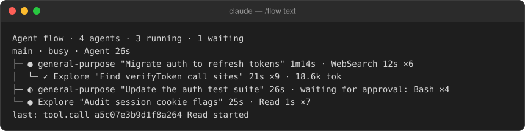

#  agent-flow

A live tree of the session's subagents beside the transcript, as a Claude Code mod.

> [!NOTE]
> I'm still a student, so I may not be able to respond to issues or ship updates right away. I'll keep maintaining this plugin in my spare time as best I can.

The agent flow pane as a plugin: `/flow` opens a live tree of the session's
subagents and in-process teammates beside the transcript, and closes it
again. Each row is one agent: status, type, name, description, elapsed time,
what it is doing right now (a tool call and how long it has run, or a wait
for the person's approval), its call count, and its tokens once it finished.
A `[+]` on a row expands its details: model, prompt excerpt, the last lines
the agent wrote, recent tool calls, tokens. Agents waiting for approval are
highlighted; a tool call over 30 seconds and a running agent silent for two
minutes are marked too. A wait for approval stays shown until the approved
tool call ends, since no engine event carries the person's answer.

The tree comes from engine events (`agent.spawn`, `tool.call`,
`turn.complete`, the classic permission events) and is reconciled with
`$.agent.list()` every two seconds while anything runs. Loops the engine
never listed (a Workflow tool's agents, the engine's own forks) appear under
a collapsed "unlisted loops" group so they never vanish silently.

Where the surface cannot draw a pane (a `-p` run, the VS Code extension as
of 2.1.270) `/flow` prints the same tree as text; `/flow text` always prints
it. When the surface seats the pane inline above the prompt (narrow
terminals) it shows only the rows that need attention. The first spawn of a
session opens the pane by itself on a terminal of 144 columns or more (110
when you kept it open before), unless you closed it.

Hooks modules are early access and load only where function hooks are
enabled; see `mods/README.md`.

## What it hooks

| event | what the hook does |
| --- | --- |
| `session.start` | Binds the engine, registers `/flow` (stands down when another `/flow` is listed), reads the open preference, reconciles once. |
| `ui.render` of `PromptHint` | Reads the terminal's width for the auto-open decision. |
| `ui.render` of `Pane` | Draws the pane: header, root, tree, unlisted group, last event; the inline summary when seated above the prompt. |
| `command.run` of `flow` | Toggles the pane, printing the text tree where no surface draws it; `text` prints it outright. |
| `command.run` of `clear`, `resume` | Forgets the tree; the pane's state is kept. |
| `ui.close` | Forgets an open pane the person closed, and remembers not to auto-open again. |
| `agent.spawn` | Adds the new agent under its parent; opens the pane on the session's first spawn. |
| `turn.step` | Keeps the tail of a subagent's streamed text for its `[+]` details; the stream passes through unchanged. |
| `tool.call` | Marks the loop busy in the tool, then counts the call and its duration. |
| `turn.start`, `turn.complete` | The root's busy state; a subagent's end status, duration and tokens. |
| `classic.PermissionRequest`, `classic.Notification` | Marks the loop waiting for approval. |

## What it calls on `$`

`agent.list`, `clock.after`, `clock.every`, `clock.now`, `clock.sleep`,
`command.register`, `store.get`, `store.set`, `ui.close`, `ui.invalidate`,
`ui.log`, `ui.open`, `ui.resolve`, `ui.status`.

## Install

From the standalone repository (Charlie0113-T/claude-agent-flow):

    claude plugin marketplace add Charlie0113-T/claude-agent-flow
    claude plugin install agent-flow@claude-agent-flow

or, for one session from a checkout:

    claude --plugin-dir /path/to/agent-flow

then `/flow`, and ask Claude to use the Agent tool. In the VS Code extension
`/flow` prints the tree as text; the extension has its own agent map since
2.1.269, this mod is the terminal's counterpart.

## Listed on

**Directories:**
[claude-mods.com](https://claude-mods.com/agent-flow/),
[claudemod.com](https://www.claudemod.com/mods/agent-flow),
[claudemods.ai](https://claudemods.ai/mods/agent-flow),
[claudemods.chat](https://claudemods.chat/#agent-flow),
[claudemods.dev](https://claudemods.dev/en/builds/agent-flow-fc840b),
[claudepluginhub.com](https://www.claudepluginhub.com/plugins/charlie0113-t-agent-flow),
[mods.aidojo.si](https://mods.aidojo.si/#Charlie0113-T--claude-agent-flow--agent-flow),
[mods.guide](https://mods.guide/en/mods/picks/),
[shrwnsan.github.io/claude-marketplace-registry](https://shrwnsan.github.io/claude-marketplace-registry/plugins/1370403780-agent-flow),
[slopshopper.com](https://www.slopshopper.com/mods/charlie0113-t-claude-agent-flow/).

**Articles:**
[Best Claude Code Mods and Where to Find Them](https://capitalandcompute.net/blog/best-claude-code-mods/) (capitalandcompute.net),
[Best Claude Code Mods to Try First (October 2026)](https://stashbase.ai/blog/best-claude-code-mods/) (stashbase.ai).

**Lists on GitHub:**
[26medias/awesome-ai-repos](https://github.com/26medias/awesome-ai-repos/blob/main/types/plugin-extension.md),
[ianwieds/awesome-claude-code](https://github.com/ianwieds/awesome-claude-code),
[karanb192/awesome-claude-code-mods](https://github.com/karanb192/awesome-claude-code-mods),
[lycfyi/awesome-claude-code-mods](https://github.com/lycfyi/awesome-claude-code-mods),
[saksham10arora-dotcom/awesome-claude-mods](https://github.com/saksham10arora-dotcom/awesome-claude-mods),
[shuizhengqi1/cc-mod-hub](https://github.com/shuizhengqi1/cc-mod-hub).

## Tests

    cd mods/agent-flow && bun test          # unit tests over the pure model and views
    bunx tsc -p mods/tsconfig.json          # types, with the rest of the mods
    claude plugin validate mods/agent-flow  # the engine's static checks
    mods/agent-flow/scripts/smoke.sh        # interactive smoke test, costs API calls

`tests/register.kit.ts` is written for `claude plugin test`; rename it to
`register.test.ts` once that command ships.

## Development

The mod is developed as `mods/agent-flow` in the fork
Charlie0113-T/ARRS-claude-code, next to the built-in mods, and mirrored to
the standalone repository with `scripts/sync-standalone.sh` (a `git subtree
push` of this folder). `vendor/claude-code.d.ts` is a copy of the engine's
declarations so the standalone checkout typechecks on its own; the sync
script refreshes it from `mods/types`, and `/plugin-types` writes a current
one into `.claude/types` in any Claude Code session.

## License

Apache License 2.0, see `LICENSE`. Copyright 2026 Charles Tao.
