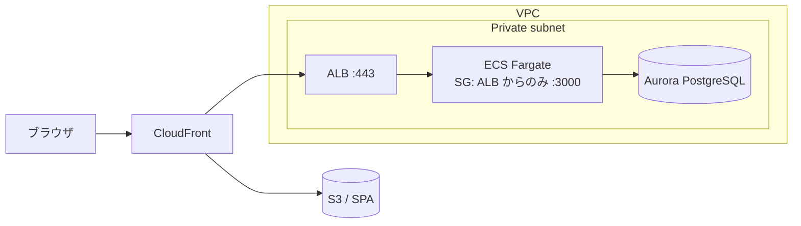
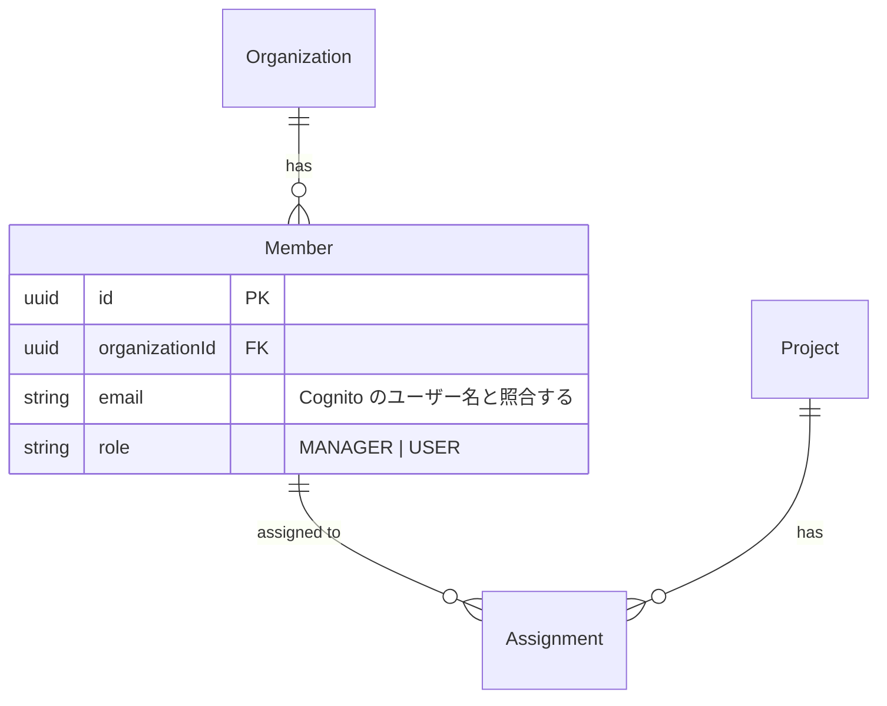

# project-catchup — 案件キャッチアップのレポートをつくる

新しく参画したプロジェクトで「このリポジトリを読んでアーキテクチャをまとめて」と頼むと、
**それらしいが次の作業に進めないレポート**が返ってくる。

> ECS でバックエンドを動かしています。

これは手を抜いた結果ではない。**どのレベルの具体性で書くかを誰も指定していない**だけである。
「まとめて」という指示だけなら、上の1文も「ALB → ECS → Aurora の流れで、セキュリティグループが〜」も、
同じくらい「まとめ」として正解になってしまう。

このスキルは、その判断をモデルに委ねない。**具体度の下限を実例で縛り、形式（図）を指定する。**

## ゴール — 具体度はこの1文で判定する

> **このレポートを読み終えた人が、あたかも自分がそのプロジェクトの実装者であるかのように
> 振る舞えるレベルの理解を提供すること。**

書きながら迷ったら、抽象／具体のどちらを選ぶかではなく、**この1文に届くか**で決める。
「読んだ気にはなるが、次の作業に進めない」文は、届いていない。

## 使いどころ／住み分け

| やりたいこと | 担当 |
|---|---|
| 参画した案件を、実装者として動ける水準まで理解する | **このスキル** |
| どこに何があるかの1行目次・地図が欲しい | `codebase-map` |
| Claude 向けの設定（CLAUDE.md 階層化・生成物の遮断・LSP）を導入する | `codebase-onboard` |
| 常時ロードされる指示を棚卸しして削る | `context-audit` |
| 「この機能はどこに実装されている？」の単発探索 | 内蔵の Explore / Task サブエージェント |
| 自分の作業の中断・再開メモ | `notes`（pipeline） |
| これから作るものの設計書 | `design-docs`（pipeline） |

対象は**自分が書いていないコードベース**。自分が育ててきたリポジトリには使わない。

## 中核ルール

1. **具体度の下限は「悪い例／良い例」で決まっている。** 各章に置いた良い例に届かない文は、
   出す前に書き直す。「もっと具体的に」という自己指示では足りない — **悪い例の側に似ていないか**で見る
2. **流れ・関係・分岐は、図でしか出力を認めない。** 3章・4章・5章は文章での代替を認めない。
   「文章でも図でもよい」と考えた時点で楽な方（文章）に倒れる。mermaid か ASCII で描く
3. **根拠のない記述を書かない。** 断定する文には根拠（`ファイル:行`・IaC ファイル・
   マイグレーション・CI 定義）を添える。ディレクトリ名やクラス名からの推測で埋めない
4. **分からないことは9章「未確認」に落とす。** それらしく埋めた1行は、読者を間違った実装に導く。
   空欄のまま残す方が安い

## ワークフロー

### Step 0 — 対象・読者・出力先を確認する

- **対象**: リポジトリ全体か、担当するサブディレクトリか
- **読者**: 自分だけか、後から入る人にも渡すか（渡すなら固有名詞と根拠をより厚くする）
- **出力先**: 既定は `docs/project-catchup.md`

🛑 **参画先のリポジトリに、断りなくファイルを作らない。** 出力先（コミットするのか、
`.gitignore` 済みの場所に置くのか、チャットに出すだけか）を確認してから書き始める。

**レポート冒頭に鮮度のヘッダを置く。** このレポートは書いた本人以外が、後日、
このスキルを起動していない状態で開く。だから再確認の手順を**レポート自身に書く**
（スキル本文に書いても読まれない）。生成時点のコミットは `git rev-parse --short HEAD` で採る。

````markdown
<!-- project-catchup で生成。更新日: YYYY-MM-DD / 生成時点: abc1234 -->

## このレポートの鮮度（読む前に）

```bash
git diff --name-status abc1234..HEAD -- .   # 生成時点からの変更をパス単位で見る
```

変更のあったパスに対応する章だけを読み直す（3章=IaC・4章=ルーティングとサービス層・
5章=マイグレーション／スキーマ が対応する）。**コミット一覧を見ただけの状態を
「確認済み」と書かない。** `abc1234` を解決できないとき（shallow clone・ブランチ削除・
`git fetch` 未実施）は**鮮度不明**として扱う。
````

### Step 1 — スタックを特定する

`package.json`・`go.mod`・`Gemfile`・`pom.xml`・`requirements.txt`、IaC ディレクトリ、
`.github/workflows/` を見て何のスタックかを判定し、
[`references/stack-probes.md`](references/stack-probes.md) の**該当する節だけ**を読む。
「構成の根拠がどのファイルにあるか」の逆引きが載っている。

### Step 2 — 面を調べる（並列委譲）

サブツリーごとに `subtree-surveyor` サブエージェントを起動する（3つ以上あるなら並列）。
返ってくるのは1サブツリーの**広さ** — 要約・主要ディレクトリ・入口・テスト/ビルドコマンド。

### Step 3 — 線を調べる（並列委譲）

`flow-tracer` サブエージェントに、**経路を1本ずつ**割り当てて起動する。
返ってくるのは1経路の**深さ** — 順序つきの通過点表と、各点の根拠・分岐条件。3章〜5章の図の材料になる。

最低限この3本は追う:

| 経路 | 入口 | 出口 |
|---|---|---|
| HTTP リクエスト1本（代表的な認証必須エンドポイント） | ルーティング定義 | DB アクセス |
| デプロイ1本 | CI のトリガー | 本番で動く実体（コンテナ・関数・静的ホスティング） |
| 主要データ1本（例: ユーザー・注文） | 作成する API | 保存先テーブルと参照している画面 |

依頼文の型:

```
担当経路: 「POST /api/orders のリクエストが、入口から DB 書き込みまでに何を通るか」
出力書式どおりに、順序つきの通過点表だけを返してください。図は描かないこと。
根拠が取れない通過点は「推測」と明記し、勝手に足さないこと。
```

### Step 4 — 章ごとに書く

下記「章の仕様」に従い、1章ずつ書く。**各章を書く直前に、その章の悪い例と良い例を読み直す。**

### Step 5 — 出す前の自己検査

下記「出す前の自己検査」の表を全章に当てる。1つでも NG なら、**その章を書き直してから**出す。
検査を通さずに出さない。

### Step 6 — 未確認を人に聞く

9章「未確認」が埋まっているなら、[`references/interview.md`](references/interview.md) を読み、
既存メンバーに聞く質問に変換する。聞ける相手がいない場合はこの Step を飛ばす。

## 章の仕様

各章は「**必須の出力形式 → 悪い例 → 良い例**」の3点で縛る。良い例は文体の見本ではなく、
**具体度の下限**である。

### 1. サマリ

**必須**: 3〜5行の全体像 ＋「このレポートで答えられること」の箇条書き。

- **悪い例**: 「Web アプリケーションです。フロントエンドとバックエンドがあります。」
- **良い例**: 「社内向けの勤怠管理 SaaS。組織単位でメンバーを管理し、打刻・申請・承認の3機能を持つ。
  React SPA（S3 + CloudFront）から REST API（ECS Fargate）を叩き、Aurora PostgreSQL に永続化する。
  認証は Cognito。マルチテナントで、テナント分離はアプリ層の `organizationId` 絞り込みで行っている
  （DB は共有・行レベルセキュリティは使っていない）。」

### 2. プロダクトと用語

**必須**: ドメイン用語表（用語・意味・**コード上の名前**の3列）。日本語の業務用語と、
コードの英語識別子が対応していないことが多い。ここが埋まらないと以降の章が読めない。

- **悪い例**: 「タスクを管理するアプリです。」
- **良い例**: 用語表に「案件 = 顧客との1契約単位 = `Project`」「担当者 = 案件に紐づく社内メンバー
  = `Assignment`（`Member` ではない）」のように、**紛らわしい対応を明示して**並べる。

### 3. インフラ構成

**必須**: リクエストが通る順に並べた **mermaid flowchart**。VPC・サブネット・セキュリティグループの
境界は `subgraph` で表す。**文章での代替は不可。**

- **悪い例**: 「ECS でバックエンドを動かしています」
- **良い例**: 「ECS Fargate でバックエンドのコンテナを動かしている。ALB（ロードバランサー）→
  ECS（コンテナ）→ Aurora（DB）という流れでリクエストが流れ、ECS のセキュリティグループは
  ALB からの通信しか受け付けない（`infra/lib/network-stack.ts:88`）ため、ECS に直接アクセスする
  ことはできない。Aurora はプライベートサブネットにあり、踏み台（`bastion`）経由でしか繋がらない。」

図の型:

````markdown

````

「何が」「何経由で」「何に」繋がり、**何が繋がれないか**（SG・NACL・IAM で閉じている経路）まで書く。

### 4. リクエストの通り道

**必須**: 入口から出口までの **ASCII 縦フロー図**。ミドルウェア・ガード・インターセプタを
**通過順に**並べ、各段が何をするかを括弧で添える。**文章での代替は不可。**

- **悪い例**: 「認証にはガードを使っています。」
- **良い例**: 下の図に加えて、「`JwtAuthGuard` は `@Public()` が付いたハンドラを素通りさせる
  （`src/auth/jwt-auth.guard.ts:24`）ため、公開エンドポイントはここで分岐する。
  `PermissionValidationGuard` は `request.member.role` を見るので、**`JwtAuthGuard` より後ろに
  登録されていないと必ず落ちる**」のように、**順序に意味がある理由**まで書く。

図の型:

```
HTTP リクエスト
    │
    ▼
[Guard: JwtAuthGuard]（JWT検証 → member を取得して request にセット）
    │
    ▼
[Guard: PermissionValidationGuard]（権限チェック）
    │
    ▼
[Controller] → [Service]（ビジネスロジック・DBアクセス）
    │
    ▼
HTTP レスポンス
```

分岐（未認証・権限不足・例外フィルタ）がある場合は、分岐先も図に出す。

### 5. データモデル

**必須**: **mermaid erDiagram** ＋ 主要テーブルの**1件ずつ**の説明。テーブル一覧の羅列では
足りない。関連（1対多・多対多）と、区分値の意味を書く。

- **悪い例**: 「`Member` テーブルはメンバー情報を管理します」
- **良い例**: 「`Member` テーブルは組織に所属するユーザー1人を表し、`role` カラムで MANAGER/USER を
  区別する。MANAGER は組織のメンバー招待・削除ができ、USER は閲覧・操作のみ
  （`src/members/members.service.ts:112`）。ログインは Cognito が担当しており、Cognito の
  ユーザー名と `Member.email` を照合してプロフィールを引いてくる設計のため、
  **`Member` にパスワードは持っていない**。」

図の型:

````markdown

````

区分値（enum・ステータス）は**取りうる値を全部**並べ、それぞれで何が変わるかを書く。

### 6. コードの歩き方

**必須**: 層・パス・入口ファイルの表 ＋「**機能を1つ足すときに触るファイルの順番**」。

- **悪い例**: 「`src/` の下にモジュールごとのディレクトリがあります。」
- **良い例**: 「エンドポイントを1本足すときは、①`src/orders/orders.controller.ts` にハンドラ、
  ②`src/orders/dto/` に DTO（`class-validator` のデコレータで検証。ここを忘れると素通りする）、
  ③`src/orders/orders.service.ts` に処理、④`prisma/schema.prisma` を変更したら
  `npx prisma migrate dev` でマイグレーションを生成、⑤`test/orders.e2e-spec.ts` にテスト、の順に触る。
  `orders.module.ts` への `providers` 追加を忘れると DI で落ちる。」

### 7. 動かし方・デプロイ・環境

**必須**: 環境・URL・デプロイ契機・シークレットの所在の表。**コマンドは実ファイルから採ったものだけ**
載せる（README にあっても、動かないコマンドが放置されていることがある。`package.json` や
Makefile と突き合わせる）。

- **悪い例**: 「`npm run dev` で起動します。」
- **良い例**: 「ローカルは `docker compose up -d`（Postgres と LocalStack が上がる）→
  `npm run migrate:dev` → `npm run start:dev`（:3000）。`.env` は `.env.example` から作るが、
  `COGNITO_USER_POOL_ID` だけは共有の開発用プールの値を人から貰う必要がある。
  ステージングは `develop` への push で GitHub Actions（`.github/workflows/deploy-stg.yml`）が
  自動デプロイ、本番は `main` へのマージ後に**手動承認**が要る。」

### 8. 落とし穴

**必須**: 根拠 `ファイル:行` つきの箇条書き。「知らないと踏む」ものだけを書く。
命名と実体がずれている箇所、暗黙の前提、動くが正しくない書き方、消してはいけないもの。

- **悪い例**: 「テストを書きましょう。」（一般論はここに書かない）
- **良い例**: 「`utils/date.ts` の `formatDate()` は JST 固定（`src/utils/date.ts:14`）。
  UTC で来る `createdAt` をそのまま渡すと9時間ずれる。新しいコードは `formatDateTz()` を使う。」

### 9. 未確認

**必須**: 推測で埋めなかったものと、**誰に聞けば分かるか**。日付を入れる。
ここが空のレポートは、たいてい推測で埋まっている。

## 出す前の自己検査

全章に当てる。1つでも NG なら、その章を書き直してから出す。

| 検査 | NG のときにすること |
|---|---|
| 3・4・5章に図があるか | 図を描くまで出さない（文章での代替は認めない） |
| 各章が良い例の具体度に届いているか | 悪い例に近い文を特定し、固有名と条件を足して書き直す |
| 断定した記述に根拠があるか | 根拠を足すか、9章「未確認」へ移す |
| 固有名（テーブル名・クラス名・環境名・カラム名）が実物か | 実ファイルと突き合わせて直す |
| 「〜を管理します」「〜を行います」「〜が可能です」で終わる文が残っていないか | 何をどう区別／制限しているかまで書く |
| コマンドを実ファイルから採ったか | `package.json`・Makefile・CI 定義と突き合わせる |
| 9章が空になっていないか | 空なら推測で埋めた疑いがある。断定した箇所を洗い直す |
| 冒頭に更新日と生成時点のコミットがあるか | Step 0 のヘッダを付ける（無いレポートは鮮度を判定できない） |

## やらないこと

- 図を「文章で代替してよい」と判断すること（3・4・5章では認めない）
- ディレクトリ名・クラス名からの推測で章を埋めること
- 「ベストプラクティスとしては〜」という一般論を書くこと（このリポジトリの事実だけを書く）
- 参画先のリポジトリに、断りなくファイルを作ること
- コードの修正・リファクタリングの提案（読み解きに徹する。改善提案は別の依頼で受ける）
- Claude 向けの設定（CLAUDE.md・permissions.deny）を書くこと → `codebase-onboard`

## 連携

| 相手 | 関係 |
|---|---|
| `codebase-map` | 「どこに何があるか」の1行目次。地図が既にあるなら Step 2 の入力に使える |
| `codebase-onboard` | このレポートで分かった構成を、Claude 向けの設定に落とす（人間向け → Claude 向け） |
| `subtree-surveyor` | 面の調査役。1サブツリーの広さを返す |
| `flow-tracer` | 線の調査役。1経路の深さを返す。3〜5章の図の材料 |
| `review-panel`（agent-review-panel） | 出来たレポートを敵対的にレビューさせたいとき |
| `deep-understand`（learning-coach） | レポートは「読んだ」を作るが「分かった」は作らない。**調べる作業を肩代わりした分、線でつながる理解は人間の側で別途作る**必要がある |
