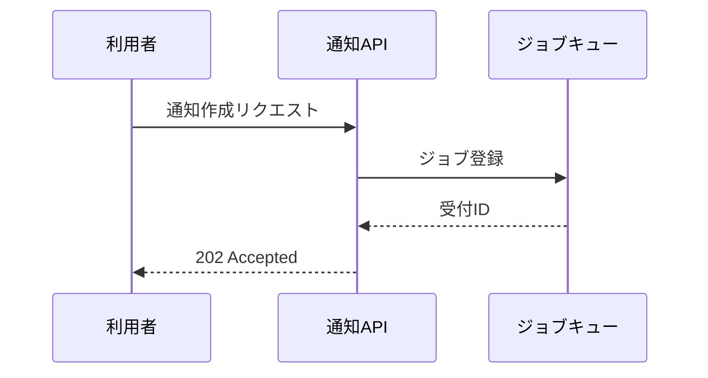

# フェーズ別テンプレート

該当フェーズの節だけを読む。章の順序・見出し・表の列はそのまま使う（勝手に足さない・省かない）。
プロジェクト固有の章が要る場合は、テンプレートの章を残したうえで末尾に追加する。

共通ルール:

- 冒頭に必ずヘッダブロックを置く（下記）
- 決まっていないことは `【要確認】確認先: 〜 / 現在の仮定: 〜` で残す。仮置きしない
- 用語は導入先 CLAUDE.md の「用語集」に従う。設計書側で用語を再定義しない
- 日付は `YYYY-MM-DD`。図は Mermaid（`.drawio` が要る場合は drawio スキルへ）

```
| 項目 | 値 |
|---|---|
| 文書種別 | 詳細設計書 |
| 対象 | 通知バッチ |
| 版 | 0.1（ドラフト） |
| 作成日 | 2026-09-05 |
| 前段文書 | docs/design/basic-design-notification.md |
| 【要確認】残件 | 3件 |
```

---

## 1. 要件定義書（読者: 発注者・PM）

1. **背景・目的** — なぜ今これをやるのか。1〜3段落
2. **対象ユーザーと業務課題** — 誰の・どの業務が・どう困っているか。現行フローの問題点
3. **機能要件** — 一覧表（`ID` は `F-NN`）

   | ID | 機能名 | 概要 | 優先度 |
   |---|---|---|---|

4. **非機能要件** — 性能・可用性・セキュリティ・運用保守・法令/社内規程。**測れる値**で書く
   （「速いこと」ではなく「一覧表示 2秒以内（95パーセンタイル）」）
5. **スコープ外** — 今回作らないもの。「言及が無い＝スコープ外」にしない
6. **【要確認】一覧** — 本文のタグを集約した表（確認先・期限つき）

実現手段（構成・技術選定・画面レイアウト）には踏み込まない。それは基本設計の領分。

---

## 2. 基本設計書（読者: PM・リードエンジニア）

1. **本書の位置づけ** — 前段（要件定義書）のパスと、本書が確定させる範囲
2. **システム構成** — 構成図（Mermaid `flowchart`）＋ ミドルウェア・外部連携の一覧表

   | 要素 | 種別 | 用途 | 備考（バージョン・SLA など） |
   |---|---|---|---|

3. **機能一覧** — 要件定義の `F-NN` と対応づける（トレーサビリティ）

   | ID | 機能名 | 概要 | 対応する要件 ID |
   |---|---|---|---|

4. **画面遷移の概要** — 遷移図（Mermaid `flowchart`）＋ 画面一覧（画面ID・名称・主な役割）
5. **データの流れ** — 主要データがどこで発生し、どこに保存され、誰が読むか
6. **外部インターフェース概要** — 連携先・方式・頻度・失敗時の方針
7. **前提・制約** — 既存システム・移行・運用時間帯など
8. **スコープ外**
9. **【要確認】一覧**

クラス名・関数名・SQL・具体的なパラメータ名には踏み込まない。それは詳細設計の領分。

---

## 3. 詳細設計書（読者: 実装担当エンジニア）

**書く前に実コードを読む**（Grep/Glob）。既存実装と矛盾する内容は書かない。

1. **本書の位置づけ** — 前段（基本設計書）のパスと対象機能 `F-NN`
2. **処理フロー** — 機能ごとにステップ単位で番号を振る。分岐・例外・リトライを明記

   ```
   1. リクエスト受信（POST /api/notifications）
   2. テナントIDでスコープして対象ユーザーを取得
   3. 対象が0件なら 200 で空配列を返して終了
   ...
   ```

3. **クラス・メソッド設計** — 実在するパス付きで書く

   | クラス/モジュール | ファイル | 責務 | 主なメソッド |
   |---|---|---|---|

4. **入出力仕様** — パラメータごとに型・必須/任意・制約・既定値

   | 名前 | 型 | 必須 | 制約 | 説明 |
   |---|---|---|---|---|

5. **エラー処理** — 発生条件・返却コード・ログ出力・利用者への見え方
6. **既存コードとの関係** — 流用する既存ヘルパー・影響する呼び出し元（`ファイル:行` で示す）
7. **テスト観点** — 正常系・失敗系・境界値（実装者がテストを書ける粒度で）
8. **【要確認】一覧**

---

## 4. DB設計書（読者: 実装担当エンジニア）

**マイグレーション／スキーマ定義から逆算する**。想像で書かない。

1. **本書の位置づけ** — 読み込んだマイグレーション／スキーマのパス一覧
2. **ER図** — Mermaid `erDiagram`。関連の多重度と依存方向を明記

   ```mermaid
   erDiagram
       ORGANIZATION ||--o{ USER : has
       USER ||--o{ NOTIFICATION : receives
   ```

3. **テーブル定義** — 1テーブル1表

   | カラム名 | 型 | NULL | 既定値 | キー/制約 | 説明 |
   |---|---|---|---|---|---|

4. **インデックス** — 名称・対象カラム・種別・想定クエリ
5. **主要クエリと想定件数** — 性能上の勘所（フルスキャンになる箇所は明記）
6. **命名規則の一貫性** — 既存テーブルとずれている命名・型・制約を**指摘する**
   （直さない。指摘して人に判断させる）
7. **マイグレーション方針** — 追加/変更/削除の順序、後方互換、ロールバック可否
8. **【要確認】一覧**

---

## 5. 図表（読者: 全員）

**1つの図に全処理を入れない。機能単位・シナリオ単位で分ける。**

- 登場人物のやり取りが主題 → `sequenceDiagram`
- 条件分岐・処理順が主題 → `flowchart`
- データ構造の関連が主題 → `erDiagram`
- 状態の遷移が主題 → `stateDiagram-v2`

各図に付ける情報:

1. 図のタイトル（何のどのシナリオか）
2. 図のコード本体（Mermaid）
3. 補足は3行以内。図で伝わることを散文で繰り返さない



ノードのラベルが長くなるときは `<br/>` で折り返す。1図あたりノード15個を超えたら分割を検討する。
