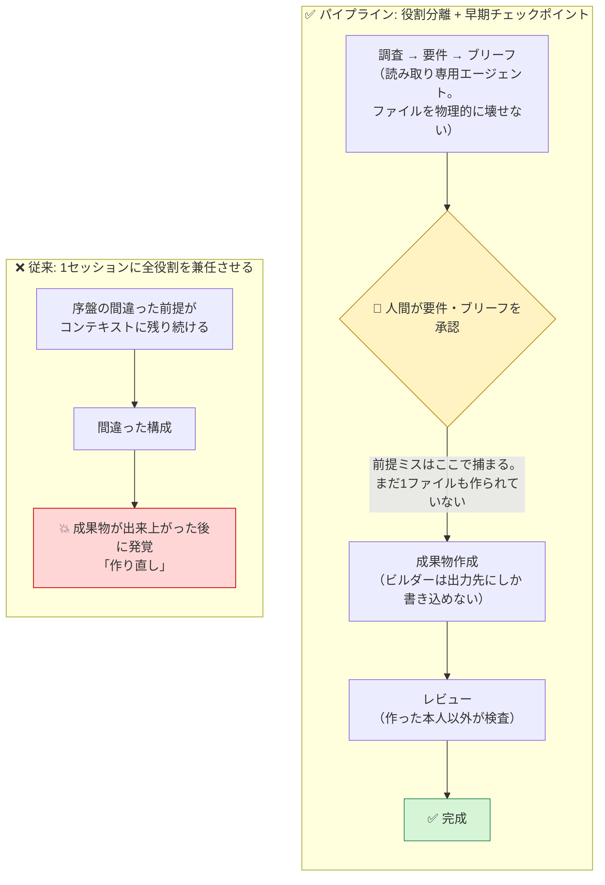
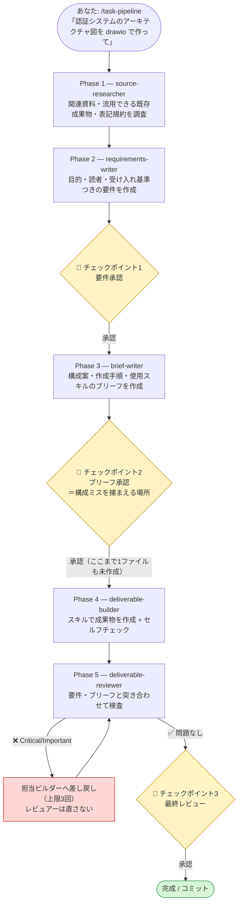
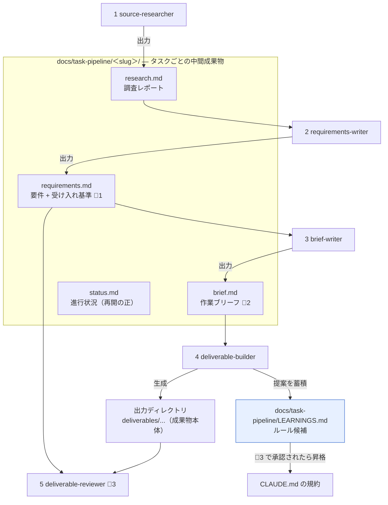

# task-pipeline — 5人の専門エージェントで成果物を作成する「タスクパイプライン」テンプレート

[`software-pipeline/`](../software-pipeline/) のパイプラインパターンを、**コード以外のあらゆる成果物**に
使えるよう汎用化したテンプレートです。drawio の図・設計ドキュメント・手順書・調査レポート・
スライド構成案などの作成を

**調査 → 成果物要件 → 作業ブリーフ → 成果物作成 → レビュー**

の流れ作業に変えます。人間が判断するのは3つの承認チェックポイントだけで、
その間の工程は5つの専門エージェントが自走します。

> 本セクションは @sairahul1 氏の記事
> [How to Build a Software Factory with Claude Code That Ships Features While You Sleep](https://x.com/sairahul1/status/2058832033628241931)
> のコンセプト（専門エージェントの連鎖・人間承認チェックポイント）を、
> コード以外の成果物向けに汎用化した独自実装です（記事のコピーではありません）。

**30秒でわかる task-pipeline:**
`/task-pipeline <作りたい成果物>` と打つと、5つの専門エージェントが順番に起動し、
調査 → 要件 → ブリーフ → 成果物作成 → レビューまで自走します。
あなたの仕事は途中3回の「承認」だけ。途中経過は `docs/task-pipeline/<slug>/` にファイルとして
残るので、セッションが切れても `/task-pipeline 再開 <slug>` で続きから再開できます。

---

## software-pipeline との使い分け

| | software-pipeline | task-pipeline |
|---|---|---|
| 対象 | コードの機能開発 | 図・ドキュメント・レポートなどコード以外の成果物 |
| エージェント数 | 7（バックエンド/フロントエンド/テストに分業） | 5（ビルダー1人に集約） |
| 合格条件 | テスト緑・型チェック通過 | 受け入れ基準のセルフチェック + レビュアーの突き合わせ |
| 起動コマンド | `/feature-pipeline` | `/task-pipeline` |
| チェックポイント | 3つ（ストーリー・ブリーフ・最終） | 3つ（要件・ブリーフ・最終） |

迷ったら: **コード変更が必要なら（実装・修正・実装ノート・仕様逆引きを含む）→ software-pipeline、
コード以外の成果物（図・ドキュメント・レポート）→ task-pipeline**。
[`implementation-skills/`](../../templates/implementation-skills/) の notes / spec-extract スキルは、**software-pipeline・
task-pipeline の両方にパイプライン連携版が同梱**されています（task 版は「成果物仕様」向けに読み替え）。
単体利用したい場合は implementation-skills/ の原本を直接コピーしてください。

2つのパイプラインは**同じプロジェクトに併存できます**。エージェント名・スキル名・中間成果物の
保存先（`docs/pipeline/` と `docs/task-pipeline/`）が重ならないように設計してあります。
task-pipeline は出力ディレクトリ外への書き込みを確認するフック
（[`guard-deliverable-writes.sh`](.claude/hooks/guard-deliverable-writes.sh)）を同梱しています。
コードリポジトリに導入する場合は、software-pipeline の機密コミット防止フック
（[`block-secrets-commit.sh`](../software-pipeline/hooks/block-secrets-commit.sh)）を
併用するのがおすすめです。

---

## なぜ「パイプライン」にするのか

1つのセッションに「この図を描いて」と頼むと、そのセッションは調査係・要件定義係・
構成設計係・作成係・レビュアーの全役割を、**同じ散らかった1本の会話**の中で兼任することに
なります。序盤の間違った前提（誰のための図か、何を載せるべきか）がコンテキストに残り続け、
間違った構成 → 間違った成果物へと増幅されていく。



パイプラインはこれを構造で解決します。

- **役割ごとにクリーンなコンテキスト** — 各エージェントは自分の仕事に必要な中間成果物だけを受け取るため、間違いが他工程に漏れない
- **権限の最小化** — 各エージェント定義の `tools` で使えるツール自体を制限。調査・執筆系のエージェントは Read/Grep/Glob しか持たないので、**物理的に**ファイルを壊せない
- **早い段階の人間チェックポイント** — 間違った前提は「要件承認」「ブリーフ承認」で捕まえる。成果物が出来上がった後ではなく

---

## 5人の専門エージェント 早見表

| # | エージェント | 役割 | 許可ツール | モデル | 書き込み範囲 | 主な成果物 |
|---|-------------|------|-----------|--------|-------------|-----------|
| 1 | `source-researcher` | 作る前に素材・規約をマッピングする | Read, Grep, Glob | sonnet | なし | 調査レポート（research.md） |
| 2 | `requirements-writer` | 依頼を受け入れ基準つき要件にする | Read | sonnet | なし | 成果物要件（requirements.md）🛑承認1 |
| 3 | `brief-writer` | 要件を作業ブリーフにする | Read, Grep, Glob | opus | なし | 作業ブリーフ（brief.md）🛑承認2 |
| 4 | `deliverable-builder` | 成果物の作成（スキル利用可） | Read, Grep, Glob, Edit, Write, Bash, Skill | inherit | 出力ディレクトリのみ | 成果物 + セルフチェックつきサマリー |
| 5 | `deliverable-reviewer` | 成果物と要件/ブリーフのギャップ報告 | Read, Grep, Glob | sonnet | なし | Critical/Important/Minor レポート 🛑承認3 |

モデルは工程ごとにコストと品質のバランスで階層化しています。
構成ミスが最も高くつく `brief-writer` には opus、作成系はメインセッションと同じモデル（inherit）、
調査・検証系は sonnet が既定です。各エージェント定義の frontmatter の `model:` を書き換えれば変更できます
（opus を使わない環境では `brief-writer` を `inherit` に）。

> **注意**: `task-pipeline-setup` は導入時に opus の可用性を確認し、使えない環境では
> `brief-writer.md` の `model: opus` を自動的に `inherit` に書き換える。手動でパイプライン
> ファイルだけをコピーした場合は、この書き換えは行われないため自分で変更すること。

## フェーズの流れ — 5工程と3つのチェックポイント



人間のチェックポイントは3つだけ。あとは全部、自走します。
進行状況は `docs/task-pipeline/<slug>/status.md` に永続化されるため、
セッションが中断してもコンテキストが圧縮されても、`/task-pipeline 再開 <slug>` で続きから再開できます。

## データの流れ — `docs/task-pipeline/<slug>/` を中心に

各エージェントは前工程の**ファイル**だけを入力に動きます（会話履歴は受け渡さない）。



---

## drawio スキルとの連携例

1. drawio スキルを導入する（`~/.claude/skills/` または対象プロジェクトの `.claude/skills/`）
2. CLAUDE.md の「利用可能なスキル」表に drawio を載せる（`/task-pipeline-setup` なら自動検出される）
3. 依頼を流す:

```
/task-pipeline 認証システムのアーキテクチャ図を drawio で作って
```

すると、brief-writer が「描く要素・関係・凡例」と「drawio スキルを使う」ことをブリーフに明記し、
あなたの承認後に deliverable-builder が drawio スキルを呼び出して `.drawio` ファイルを
出力ディレクトリに生成します。最後に deliverable-reviewer が「要件の受け入れ基準
（例: トークン失効時の分岐が図に含まれている）」を満たしているかを検査します。

drawio に限らず、スライド・ドキュメント系など**成果物を作るスキルなら同じ仕組みで使えます**。
ビルダーが使ってよいスキルは CLAUDE.md の表で管理し、表にないスキルは勝手に使わない
ルールになっています。

---

## 並列実行と要件ヒアリングの強化

software-pipeline と同じ思想で、次の2つを取り入れています。

- **要件ヒアリングの徹底質問（`clarify` スキル）** — Phase 2（要件）・Phase 3（ブリーフ）で、
  writer を起動する前にオーケストレーターが `clarify` で要件・構成を**一問ずつ**（各問に推奨回答つき）詰めます。
  受け身の承認待ちではなく、能動的に穴・曖昧さ・隠れた前提を潰してから作成に入ります。
  外部スキル [dig](https://github.com/ryonakae/dotfiles/tree/master/config/.agents/skills/dig)（ryonakae）と
  [grill-me / grilling](https://github.com/mattpocock/skills)（mattpocock）の設計を参考にしています。
- **並列実行グループ** — brief の「並列実行プラン」が独立した成果物グループ（出力パスが交わらず
  共有ファイルを書かない）を宣言したときだけ、Phase 4 を「共有先行逐次 → 独立グループ並列 → 依存逐次」で
  実行します。複数の独立した図・レポートを同時に作れます。グループ境界の越境はオーケストレーターが守ります
  （フックは出力ディレクトリ外のみ確認）。

逐次パイプラインと「並列ループエージェント」方式の使い分けは、
[software-pipeline のコラム](../software-pipeline/README.md#コラム-逐次パイプラインと並列ループエージェントの使い分け)に
まとめてあります（同じ考え方が task-pipeline にも当てはまります）。

---

## ファイル構成

```
task-pipeline/
├── README.md                                # このファイル
├── CLAUDE.md                                # コピーして使う CLAUDE.md のサンプル
├── .claude-plugin/plugin.json               # プラグインマニフェスト（skills / agents を配信）
├── agents/                                  # 5人の専門エージェントの定義
│   ├── source-researcher.md
│   ├── requirements-writer.md
│   ├── brief-writer.md
│   ├── deliverable-builder.md
│   └── deliverable-reviewer.md
├── skills/
│   ├── task-pipeline/SKILL.md            # 5エージェントを連鎖させるオーケストレーター
│   ├── clarify/SKILL.md                 # 要件・構成を一問ずつ詰める徹底質問スキル（dig/grill 由来）
│   ├── task-pipeline-setup/SKILL.md      # パイプライン一式を対象プロジェクトへ自動導入するスキル
│   ├── notes/SKILL.md                    # 実装ノート記録（implementation-skills 原本の連携版）
│   └── spec-extract/SKILL.md             # 既存成果物から成果物仕様を逆引き（implementation-skills 原本の連携版）
├── hooks/
│   ├── guard-deliverable-writes.sh      # 出力ディレクトリ外への書き込みを確認するフック
│   ├── guard-deliverable-writes.ps1     #   （Windows / PowerShell 版）
│   ├── spec-sync-reminder.sh            # SessionStart/Stop で SPEC.md の未同期を知らせる通知フック
│   └── spec-sync-reminder.ps1           #   （Windows / PowerShell 版）
└── setup/
    └── settings.json                        # 上記フックを配線する設定サンプル（コピー導入用）
```

---

## セットアップ

### 最も簡単: プラグインで導入する

Claude Code でそのまま実行します（clone 不要）:

```
/plugin marketplace add mrkxlia/claude-code-workbench-ja
/plugin install task-pipeline@workbench-ja
```

導入後、新しいセッションで `/task-pipeline:task-pipeline-setup` を実行すると、対象プロジェクトを
解析・ヒアリングして CLAUDE.md・フックを自動導入します（下の自動セットアップと同じ）。
プラグインは5スキル（`task-pipeline` / `task-pipeline-setup` / `clarify` / `notes` / `spec-extract`）と
エージェント5種を自動配信します。

### 推奨: `/task-pipeline-setup` で自動セットアップ（2ステップ）

**ステップ1**: `task-pipeline-setup` スキルをパーソナルスキルとして1回だけインストールします
（以後どのプロジェクトでも使えます）:

```bash
mkdir -p ~/.claude/skills
cp -r <このリポジトリ>/plugins/task-pipeline/skills/task-pipeline-setup ~/.claude/skills/
```

**ステップ2**: 導入したいプロジェクトで Claude Code を開き、実行します:

```
/task-pipeline-setup
```

スキルが成果物の出力ディレクトリを既存構成から推定し、主な成果物の種類をヒアリングし、
`~/.claude/skills/` と `.claude/skills/` から利用可能なスキル（drawio 等）を検出して、
CLAUDE.md・エージェント5種（ビルダーの「担当範囲」も自動差し替え）・スキル・フック・
settings.json をまとめて導入します。
**CLAUDE.md の出力先・ビルダーの担当範囲・フックの許可リストを同じ検出結果から生成する**ため、
三者の不一致が構造的に起きません。

パイプライン本体と同じ思想で、書き込む前に**解析結果の承認**を求めて停止します。検出ミスはそこで直せます。
既存の CLAUDE.md は上書きせず、マージを提案します。git 管理されていないプロジェクトにも
対応します（`git init` の提案、または非gitモードでの導入）。
導入後は新しいセッションを開始してから（エージェント定義はセッション開始時に読み込まれるため）、
下の「試運転」へ進んでください。

<details>
<summary><b>フォールバック: 手動セットアップ（4ステップ）</b> — オフライン環境や、仕組みを理解しながら導入したい場合</summary>

#### 1. CLAUDE.md をコピーして差し替える

[`CLAUDE.md`](CLAUDE.md) を自分のプロジェクトのルートにコピーし、
`<!-- 差し替え -->` とマークされた箇所（成果物の種類と出力先・利用可能なスキル・表記規約）を
自分のプロジェクトに合わせて書き換えます。

#### 2. エージェント定義をコピーする

```bash
mkdir -p .claude/agents
cp <このリポジトリ>/plugins/task-pipeline/agents/*.md .claude/agents/
```

#### 3. スキルをコピーし、ビルダーの担当範囲を合わせる

```bash
mkdir -p .claude/skills
cp -r <このリポジトリ>/plugins/task-pipeline/skills/task-pipeline .claude/skills/
cp -r <このリポジトリ>/plugins/task-pipeline/skills/clarify .claude/skills/
```

（`task-pipeline-setup` は自動セットアップ用のパーソナルスキルなので、プロジェクトにはコピーしません）

最後に `.claude/agents/deliverable-builder.md` の「担当範囲」セクションのフォルダパス
（`deliverables/`）を、自分のプロジェクトの出力ディレクトリに書き換えます。
**この出力先が CLAUDE.md の「成果物の種類と出力先」と一致していることを確認してください。**

#### 4. フックを設定する

```bash
mkdir -p .claude/hooks
cp <このリポジトリ>/plugins/task-pipeline/hooks/guard-deliverable-writes.sh .claude/hooks/
chmod +x .claude/hooks/guard-deliverable-writes.sh
```

コピー後、スクリプト冒頭の `ALLOWED_PREFIXES` を自分の出力ディレクトリに合わせて書き換えます
（手順1の CLAUDE.md・手順3のビルダー担当範囲と同じ値にすること）。

**⚠️ すでに `.claude/settings.json` がある場合は、上書きせず `hooks` キーをマージしてください。**
ない場合はそのままコピーで構いません:

```bash
cp <このリポジトリ>/plugins/task-pipeline/setup/settings.json .claude/settings.json
```

</details>

## 個別スキルを単体で使う（clarify）

パイプライン全体を導入しなくても、`clarify`（要件・構成を質問で詰める）だけを単体で使えます。
**パーソナルスキル**（`~/.claude/skills/`）に入れると、どのリポジトリでも `/clarify` が使えます。

```bash
git clone --depth 1 https://github.com/mrkxlia/claude-code-workbench-ja /tmp/workbench
mkdir -p ~/.claude/skills && cp -r /tmp/workbench/plugins/task-pipeline/skills/clarify ~/.claude/skills/
```

- task-pipeline 版 `clarify` は語彙が**成果物の要件・構成**向け。コードの要件・設計を詰めたいなら
  software-pipeline 版 `clarify`（語彙がコード向け）を選ぶ。骨子（質問プロトコル）はどちらも同一なので、
  扱う対象に合う方を1つだけ入れれば十分です。
- `notes` / `spec-extract` を単体で使うなら、**原本**の [`implementation-skills/`](../../templates/implementation-skills/) を入れるのが推奨。

> プロジェクト単位で導入したい場合は、上の「セットアップ → 手動セットアップ」のスキルコピー手順
> （`.claude/skills/` 宛）を参照してください。ここではどこでも使えるパーソナルスキル化を案内しています。

## 試運転とチューニング

### 1. 小さな依頼で試運転する

```
/task-pipeline このリポジトリのディレクトリ構成図を drawio で作って
```

のような小さい依頼を流し、どこでつまずくか観察します。

### 2. 3つのチェックポイントを体験する

- **要件承認**: 受け入れ基準が「レビューで検証できる文」になっているか確認し、「承認」または修正指示を返す
- **ブリーフ承認**: 構成案と使用スキルを読み、ズレた構成（例: 読者に不要な詳細）をここで捕まえる
- **最終レビュー**: レビュアーのレポートを確認し、承認後に完成・コミットへ

中止したいときは、どのチェックポイントでも「中止」と伝えればパイプラインは止まります。

### 3. ルールを足してチューニングする

AIが「えっ」と驚くミスをするたびに自問します——**「CLAUDE.md にルールがあれば、これは防げたか？」**
防げたなら、表記規約やハードルールを足す。差し戻しが多かったエージェントの「ルール」セクションも
調整します。3〜4タスクも流せば、パイプラインはあなたのプロジェクトに馴染んでいきます。

このチューニングは半自動化されています。ビルダーが作業中に気づいた「このルールがあれば助かった」は
`docs/task-pipeline/LEARNINGS.md` に自動で蓄積され、最終レビューのチェックポイントで
「CLAUDE.md に昇格させるか」を確認されます。承認したものだけがルールになります。

---

## フックについての補足

`guard-deliverable-writes.sh`（`PreToolUse` フック）が、Edit / Write の直前に書き込み先を検査し、
**出力ディレクトリ外**への書き込みをユーザー確認（`ask`）に回します。詳細は下記。
あわせて `spec-sync-reminder.sh`（SessionStart/Stop）が成果物仕様 SPEC.md の未同期をやさしく通知します（非ブロッキング）。

**Windows**: 実行環境は **Git Bash / WSL の bash が前提**（baseline は `.sh`）。純 PowerShell 環境向けに
同等の `.ps1`（`guard-deliverable-writes.ps1` / `spec-sync-reminder.ps1`）を同梱し、`/task-pipeline-setup` が
「`command -v bash` が使えるか」で `.sh`/`.ps1` を振り分けます。`.ps1` は **Windows PowerShell 5.1 でも動作**します
（UTF-8 BOM 付きで配布し、`powershell -NoProfile -ExecutionPolicy Bypass -File ...` で起動。PowerShell 7 があれば `pwsh`）。

<details>
<summary>判定の仕組みと動作確認</summary>

判定は2層です:

1. **機密パターンはハードブロック** — `.env`（`.env.example` / `.env.sample` / `.env.template` は許可）・
   `*.key`・`*.pem`・`secrets.json` への書き込みは exit 2 で拒否し、理由を Claude に伝えます
2. **許可リスト外は人間に確認** — 出力ディレクトリ（`ALLOWED_PREFIXES`）の外への書き込みは、
   即拒否ではなく `permissionDecision: "ask"` の JSON を返してユーザーに確認を求めます。
   即拒否にしないのは、オーケストレーター（メインセッション）の正当な書き込み（CLAUDE.md のチューニング等）まで
   止めてしまうのを防ぐためです

`jq` が無い環境（Windows の Git Bash 等）でも動くフォールバックを持ち、
バックスラッシュ区切りのパスも正規化して判定します。動作確認は stdin に JSON を流すだけです:

```bash
echo '{"tool_name":"Write","tool_input":{"file_path":"src/main.py"}}' \
  | bash .claude/hooks/guard-deliverable-writes.sh   # → ask の JSON が出力される
```

</details>

## 制限事項（知っておくべきこと）

<details>
<summary>4つの制限（tools の粒度・スキル利用・一時停止・自動検証なし）</summary>


- **`tools` 制限はツール単位であり、フォルダ単位ではありません。** 「ビルダーは出力ディレクトリのみ」という境界は、エージェント定義のプロンプトによる制約と、それを補強する `guard-deliverable-writes.sh`（出力ディレクトリ外への Edit/Write を検知してユーザーに確認を求める PreToolUse フック）の2段構えです。フックは Edit / Write ツールのパスを検査するもので、Bash 経由の書き込み（リダイレクト等）までは検査しません
- **サブエージェントからのスキル利用には `tools` に `Skill` が必要です。** `deliverable-builder` の許可ツールには `Skill` を含めてありますが、Claude Code のバージョンや実行環境によってサブエージェントから利用できるスキルの範囲は変わりえます。ビルダーがスキルを呼べない場合は、スキルの手順をビルダー定義やブリーフに直接書き写すのがフォールバックです
- **スキルは文字どおりには「一時停止」できません。** チェックポイントは「明示的承認まで次フェーズ進行禁止」という強い指示で実現しています。承認の言葉（「承認」「OK」「進めて」）は明確に伝えてください
- **サブエージェントはサブエージェントを呼べません。** そのため task-pipeline はメインセッションのスキルとして動き、そこから5エージェントを順番に起動する設計です
- **自動テストに相当する機械的な検証はありません。** コードと違い、成果物の品質はビルダーのセルフチェックとレビュアーの突き合わせ（いずれも受け入れ基準ベース)で担保します。だからこそ、要件承認の段階で受け入れ基準を「検証できる文」に磨くことが最重要です

</details>

---

## スキル名と名前空間

task-pipeline と software-pipeline は **`clarify` / `notes` / `spec-extract` という同名スキルを両方が持ちます**。
この3つは**統合連携版**で、**両プラグインのファイルがバイト同一**です。連携セクションが
「成果物がプログラムかそれ以外か」でコードモード / 成果物モードを自動判定するため、
プラグイン名前空間（`/task-pipeline:clarify` / `/software-pipeline:clarify`）のどちらで解決されても
挙動は同じです。プロジェクトに直接コピーした場合は短い名（`/clarify` 等）で呼べます。
スキル名の棚卸し表は
[software-pipeline/README.md の「スキル名の棚卸し」](../software-pipeline/README.md#スキル名の棚卸し統合連携版後方互換維持)に
まとめてあります。後方互換のため**改名は行いません**（オーケストレータ名は `docs/task-pipeline/<slug>/` の
保存先や `/task-pipeline 再開 <slug>` と結合しているため）。

### 原本との同期（notes / spec-extract）

このセクションの notes / spec-extract は [`implementation-skills/`](../../templates/implementation-skills/) の**原本＋
統合連携セクション**から [`tools/skill-sync/sync.py`](../../tools/skill-sync/sync.py) が機械生成する派生ファイルです
（`PIPELINE-INTEGRATION` マーカーより上が原本と同一）。**派生ファイルを直接編集しない**。原本または
`tools/skill-sync/fragments/*.md` を編集したら `python3 tools/skill-sync/sync.py` を実行してください。
詳しくは [software-pipeline/README.md の同期ルール](../software-pipeline/README.md#原本との同期ルール-toolsskill-sync-による機械生成)を参照。

## 参考リンク

- [サブエージェント（公式ドキュメント）](https://code.claude.com/docs/en/sub-agents) — frontmatter の全フィールド（model / color / memory / maxTurns など）
- [Agent Skills のベストプラクティス（公式ドキュメント）](https://platform.claude.com/docs/en/agents-and-tools/agent-skills/best-practices) — description の書き方・チェックリストパターン・本文500行ルール
- [フック（公式ドキュメント）](https://code.claude.com/docs/en/hooks) — PreToolUse ほかのイベント一覧
- [`software-pipeline/`](../software-pipeline/) — コード機能開発向けの7エージェント版。本テンプレートの元になったパターン

---

## ライセンス・出典

このセクションは [@sairahul1 氏の記事](https://x.com/sairahul1/status/2058832033628241931)
「How to Build a Software Factory with Claude Code That Ships Features While You Sleep」の
コンセプト（専門エージェントの連鎖・人間承認チェックポイント・CLAUDE.md の育て方）を、
コード以外の成果物向けに汎用化した独自実装です。
ファイルの内容はこのリポジトリで書き起こしたものであり、リポジトリの [LICENSE](../LICENSE)（MIT）に従います。
