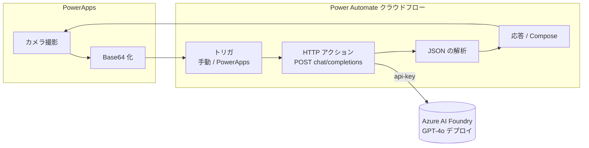

# power-automate-azure-foundry — Power Automate から Azure AI Foundry の GPT を呼ぶ

Power Automate のクラウドフローから **Azure AI Foundry（Azure OpenAI）の GPT** を呼び出す
サンプル一式です。**テキストのみ**と**画像＋テキスト（Vision）**の 2 パターンを用意し、
最終的に「**PowerApps でカメラ撮影 → Automate 経由で GPT に送って OCR**」まで通せます。

認証は **API Key**。API Key をどう安全に扱うか、**DLP ポリシー下で開けるべきコネクタ**も解説します。

> [!IMPORTANT]
> このセクションはコピーして使う**テンプレート／サンプル**です。エンドポイント・キーはすべて
> `<resource>` `<deployment>` `<api-key>` のプレースホルダになっています。

---

## 目次

- [30秒でわかる構成](#30秒でわかる構成)
- [前提（ライセンス・リソース）](#前提ライセンスリソース)
- [ファイル構成](#ファイル構成)
- [パターンA: テキストのみ](#パターンa-テキストのみ)
- [パターンB: 画像＋テキスト（Vision）](#パターンb-画像テキストvision)
- [導入方法（zip より「手動再現」が確実）](#導入方法zip-より手動再現が確実)
- [API Key のセキュリティ](#api-key-のセキュリティ)
- [DLP ポリシー下で開けるべきコネクタ](#dlp-ポリシー下で開けるべきコネクタ)
- [PowerApps カメラ → OCR](#powerapps-カメラ--ocr)
- [トラブルシュート](#トラブルシュート)
- [出典・参考](#出典参考)

---

## 30秒でわかる構成



- 呼び出しの本体は **HTTP アクション**（プレミアム・組み込み）。Azure 公式コネクタは不要。
- 応答は `choices[0].message.content` に入る。**JSON の解析**で型を付けて使う。

---

## 前提（ライセンス・リソース）

- **Azure 側**: Azure AI Foundry（Azure OpenAI）リソースと **GPT-4o 等のデプロイ**、および **API キー**。
  - 画像（Vision）を使うには **vision 対応モデル**（gpt-4o / gpt-4o-mini など）のデプロイが必要。
- **Power Platform 側**: **HTTP コネクタはプレミアム**。PowerApps からフローを呼ぶのも
  プレミアム相当のライセンスが必要です。DLP の前にまずライセンス前提を満たしてください。

エンドポイントは 2 系統あります（サンプル既定は前者）。

| 種類 | URI | api-version |
|---|---|---|
| **GA（既定）** | `https://<resource>.openai.azure.com/openai/deployments/<deployment>/chat/completions` | `2024-10-21` |
| v1（プレビュー） | `https://<resource>.openai.azure.com/openai/v1/chat/completions` | `preview` |

> v1 はプレビュー限定（GA 値なし）。本サンプルは GA の deployment ルートを既定にしています。

---

## ファイル構成

```
power-automate-azure-foundry/
├── README.md                         # このファイル
├── flows/                            # 生のフロー定義 JSON（手動再現の元ネタ・確実な経路）
│   ├── 01-text-only.definition.json      # パターンA: 手動トリガ → HTTP
│   └── 02-image-text.definition.json     # パターンB: PowerApps(V2) → HTTP(Vision)
├── packages/
│   ├── legacy/                       # ① HTTPヘッダー直書き方式 → レガシーパッケージ zip
│   │   ├── src/                      #   zip の中身（manifest.json + Microsoft.Flow/...）
│   │   └── azure-foundry-gpt-legacy.zip
│   └── solution/                    # ③ 環境変数方式 → Dataverse ソリューション zip
│       ├── src/                     #   solution.xml / customizations.xml / Workflows/...
│       └── AzureFoundryGPT_1_0_0_0.zip
├── custom-connector/                # ② カスタムコネクタ方式（api-key をコネクションに保管）
│   ├── apiDefinition.swagger.json
│   └── apiProperties.json
└── powerapps/
    └── camera-ocr.md                # PowerApps カメラ→OCR の Power Fx と手順
```

---

## パターンA: テキストのみ

[`flows/01-text-only.definition.json`](flows/01-text-only.definition.json)

- **トリガ**: 手動でフローをトリガーします（`prompt` を入力）。単体テストがすぐできます。
- **HTTP アクション**:
  - メソッド: `POST`
  - URI: `https://<resource>.openai.azure.com/openai/deployments/<deployment>/chat/completions?api-version=2024-10-21`
  - ヘッダー: `Content-Type: application/json`, `api-key: <api-key>`
  - 本文:
    ```json
    {
      "messages": [
        { "role": "system", "content": "あなたは有能なアシスタントです。" },
        { "role": "user", "content": "@{triggerBody()?['prompt']}" }
      ],
      "max_tokens": 800,
      "temperature": 0.2
    }
    ```
- **応答の取り出し**: `body('HTTP_ChatCompletions')?['choices'][0]?['message']?['content']`

**JSON の解析**で使うスキーマ例（必要部分のみ）:

```json
{
  "type": "object",
  "properties": {
    "choices": {
      "type": "array",
      "items": {
        "type": "object",
        "properties": {
          "message": {
            "type": "object",
            "properties": {
              "role": { "type": "string" },
              "content": { "type": "string" }
            }
          }
        }
      }
    }
  }
}
```

---

## パターンB: 画像＋テキスト（Vision）

[`flows/02-image-text.definition.json`](flows/02-image-text.definition.json)

- **トリガ**: PowerApps (V2)（`prompt` と `imageBase64` を入力）。
- **HTTP アクション**: `user` の `content` を**配列**にして text と image_url を渡します。

```json
"content": [
  { "type": "text", "text": "@{triggerBody()?['text']}" },
  {
    "type": "image_url",
    "image_url": {
      "url": "data:image/jpeg;base64,@{triggerBody()?['text_1']}",
      "detail": "high"
    }
  }
]
```

- OCR 用途では system プロンプトを「画像内の文字を忠実に書き起こす」系にし、`detail: "high"` を推奨
  （読み取りやすい反面、トークン/コストは増えます）。
- 末尾の **「PowerApps または Flow に応答」** で `result` を返します。

> [!NOTE]
> PowerApps(V2) トリガの内部フィールドキー（`text`, `text_1` など）は **自動採番**され、
> オーサリング環境によって変わります。手作りの definition.json をそのまま import するより、
> **画面で入力欄を作り直す（手動再現）方が確実**です（下記）。
>
> 画像は **1 リクエスト 10 枚まで**。サイズが大きいと各種ペイロード上限に当たるため、
> PowerApps 側でのダウンスケールを推奨します。Base64 が拒否される/巨大な場合は、
> いったん **Azure Blob Storage に置いて URL を渡す**方式に切り替えてください。

---

## 導入方法（zip より「手動再現」が確実）

> [!WARNING]
> **手作りの zip はそのままでは import に失敗する可能性があります。**
> レガシーパッケージは `manifest.json` のリソース ID とフォルダ GUID・接続参照の整合、
> ソリューションは `solution.xml` / `customizations.xml` / Workflows / 環境変数の **GUID 相互参照**を
> 完全一致させる必要があり、1 箇所ズレると不親切なエラーで弾かれます。
> 本リポジトリでは zip は**中身を読んで理解・改変するための参照成果物**と位置づけ、
> 確実な導入経路は下記の **「手動再現」** とします。

### 主：手動で再現する（推奨・確実）

1. Power Automate で **新しいフロー**を作成（パターンAは「インスタント」、Bは「PowerApps」）。
2. トリガに入力（A: `prompt` / B: `prompt`・`imageBase64`）を追加。
3. **HTTP** アクションを追加し、上記のメソッド/URI/ヘッダー/本文を設定。
   - `<resource>` `<deployment>` `<api-key>` を自分の値に差し替え。
4. **JSON の解析**（または直接参照）で `choices[0].message.content` を取り出す。
5. A は Compose で確認、B は「PowerApps または Flow に応答」で `result` を返す。
6. [`flows/*.definition.json`](flows/) はコピペの元ネタとして参照してください。

### 補助①：レガシーパッケージ zip（HTTP ヘッダー直書き方式）

- [`packages/legacy/azure-foundry-gpt-legacy.zip`](packages/legacy/) を、Power Automate の
  **マイフロー → インポート → 「パッケージのインポート（レガシー）」** で取り込みます。
- 取り込み後、各フローの HTTP アクションで `<resource>` `<deployment>` `<api-key>` を差し替え。
- api-key がフロー定義に**そのまま残る**ため、**検証用途のみ**。本番では②③へ。
- import に失敗したら `packages/legacy/src/` の中身を見て上記「手動再現」へ。

### 補助③：Dataverse ソリューション zip（環境変数方式）

- [`packages/solution/AzureFoundryGPT_1_0_0_0.zip`](packages/solution/) を
  **ソリューション → インポート** で取り込み、import 時または後で
  環境変数 `wbja_AzureFoundryEndpoint` / `wbja_AzureFoundryApiKey` に値を設定します。
- endpoint と api-key が**フロー定義から分離**され、環境ごとに差し替えられます。
- 手作り zip が弾かれる場合は、**Power Platform CLI（`pac solution`）** で空ソリューションを作り、
  画面でフロー・環境変数を追加して export し直すのが確実です。`src/` はその雛形として参照してください。

---

## API Key のセキュリティ

API Key 認証で最も避けたいのは「**フロー定義に鍵が残る／実行履歴に鍵が出る**」状態です。
本サンプルは Key Vault を使わない 3 方式を用意し、インポート手段ごとに分けています。

| # | 方式 | 鍵の置き場所 | フロー定義に鍵が残るか | 配布物 | 推奨度 |
|---|---|---|---|---|---|
| ① | **HTTP ヘッダー直書き** | フロー定義内 | **残る（危険）** | [`packages/legacy/`](packages/legacy/) | 検証のみ |
| ② | **カスタムコネクタ** | コネクション（securestring） | 残らない | [`custom-connector/`](custom-connector/) | ◎ 配布向き |
| ③ | **ソリューション環境変数** | 環境変数（環境ごと） | 残らない | [`packages/solution/`](packages/solution/) | ◎ 本番/CI |
| 参考 | **Key Vault 参照** | Azure Key Vault | 残らない | （今回未実装・解説のみ） | ★最推奨 |

### ① HTTP ヘッダー直書き（非推奨）

最も簡単ですが、**エクスポート・実行履歴・共同所有者**から鍵が漏れます。検証専用に。

### ② カスタムコネクタ（api-key をコネクションに保管）

- [`custom-connector/apiDefinition.swagger.json`](custom-connector/apiDefinition.swagger.json) に
  `securityDefinitions`（`type: apiKey`, `in: header`, `name: api-key`）を定義。
- [`custom-connector/apiProperties.json`](custom-connector/apiProperties.json) で
  接続パラメータ `api_key` を **securestring** として定義。
- コネクション作成時に鍵を入力するため、**フロー定義には鍵が出ません**。
- 後述のとおり **DLP で個別に許可しやすい**利点もあります。
- 導入: Power Automate **カスタムコネクタ → 新規作成 → インポート（OpenAPI ファイル）** で
  swagger を取り込み、認証は API キー（ヘッダー `api-key`）を選択。

### ③ ソリューション環境変数（環境ごとに分離）

- 環境変数 `wbja_AzureFoundryEndpoint`（endpoint）と `wbja_AzureFoundryApiKey`（鍵）を
  ソリューションで定義し、フローは `@parameters('wbja_AzureFoundryApiKey (...)')` で参照。
- 鍵がフロー定義から分離され、開発/本番で値を切り替えられます。

> [!CAUTION]
> **真の「シークレット型」環境変数は Azure Key Vault が必須**で、Key Vault 以外を保管先にできません。
> 本サンプルは Key Vault を使わない方針のため **テキスト型の環境変数**で鍵を保持しています。
> 「フロー定義からの分離・環境別管理」は実現できますが、**秘匿性は Key Vault 方式に劣ります**
> （Dataverse の閲覧権限者は値を参照可能）。本番で強い秘匿性が必要なら下記④を採用してください。

### 参考④ Key Vault 参照（最推奨・今回は解説のみ）

- 鍵を **Azure Key Vault** に保管し、シークレット型環境変数または Key Vault コネクタで実行時取得。
- 鍵はフロー定義にも Dataverse にも平文で残りません。今回は実装していませんが、本番の第一候補です。

### すべての方式に共通の対策

- **HTTP アクションの「Secure Inputs / Secure Outputs」を有効化**し、実行履歴に鍵や応答を残さない
  （本サンプルの definition には `runtimeConfiguration.secureData` を設定済み）。
- 鍵の**ローテーション**、フローの**編集者/共同所有者を最小化**、Azure リソース側の**ネットワーク制限**。
- そもそも **API Key より Microsoft Entra ID / マネージド ID 認証が推奨**です
  （今回は要件により API Key を使用）。

---

## DLP ポリシー下で開けるべきコネクタ

データ損失防止（DLP）ポリシーが効いている環境では、フローが使うコネクタが**許可されている**ことと、
**同じデータグループに揃っている**ことの両方が必要です。

### このサンプルが使うコネクタ

| コネクタ | 用途 | 備考 |
|---|---|---|
| **HTTP** | GPT 呼び出しの本体 | プレミアム。DLP でブロックされやすい筆頭 |
| **Power Apps** | パターンB のトリガ／PowerApps から呼び出し | |
| **カスタムコネクタ（②採用時）** | api-key をコネクションに保管して GPT 呼び出し | DLP で**個別に分類・許可**が必要 |

### DLP の肝：同一データグループに揃える

DLP はコネクタを **ビジネス / 非ビジネス / ブロック**のグループに分類します。
**1 つのフローはビジネスと非ビジネスのコネクタを混在できません**。混在するとフローはブロックされます。

- → **HTTP と Power Apps（②なら + カスタムコネクタ）を同じグループ**に置き、
  いずれも **ブロック**に入っていないことを確認してください。

### HTTP が全面ブロックされている場合

テナントによっては HTTP コネクタを一律ブロックしていることがあります。その場合は
**②カスタムコネクタを個別に許可**するのが回避策です（カスタムコネクタは個別に分類できます）。
これは「②がセキュリティだけでなく DLP 運用でも有利」という設計上の利点です。

> 環境変数方式（③）は実行時に追加コネクタを必要としません（値は `parameters` 参照）。

---

## PowerApps カメラ → OCR

最終形は「カメラ撮影 → Automate → GPT で OCR」です。PowerApps 側の具体的な Power Fx 式と
コントロール構成は [`powerapps/camera-ocr.md`](powerapps/camera-ocr.md) を参照してください。

要点だけ:

```powerfx
Set(varJson, JSON(Camera1.Photo, JSONFormat.IncludeBinaryData));
Set(
    varBase64,
    With({ s: Mid(varJson, 2, Len(varJson) - 2) }, Mid(s, Find(",", s) + 1, Len(s)))
);
Set(varOcr, 'AzureFoundryGPT-ImageText'.Run(varBase64, "画像の文字を書き起こして").result);
```

- データURI のプレフィックスは **MIME 決め打ちにせず最初のカンマまでを除去**（jpeg/png 両対応）。
- 呼び出すフローはパターンB（[`flows/02-image-text.definition.json`](flows/02-image-text.definition.json)）。

---

## トラブルシュート

| 症状 | よくある原因 | 対処 |
|---|---|---|
| `401 Unauthorized` | api-key の値誤り、ヘッダー名が `Authorization` になっている | ヘッダー名は **`api-key`**。鍵を再確認・ローテーション |
| `404 Not Found` | デプロイ名 / api-version / エンドポイント誤り | `<deployment>` と `?api-version=2024-10-21`、`<resource>` を確認 |
| `400` で画像エラー | base64 が壊れている / プレフィックス混入 / モデルが非対応 | プレフィックス除去を確認。vision 対応モデルか確認 |
| フローが保存/実行できない | DLP でコネクタがブロック or グループ混在 | HTTP と Power Apps を同一グループに、ブロック解除 |
| zip の import が失敗 | GUID 相互参照やトリガ内部キーの不一致 | [手動再現](#主手動で再現する推奨確実)に切り替え。`src/` を参照 |
| 応答が遅い/途中で切れる | Vision + `detail:high`、`max_tokens` 不足 | 画像を縮小、`max_tokens` を調整 |
| 画像が大きく送れない | ペイロード上限 / 変数上限 | PowerApps でダウンスケール、または Blob 経由に変更 |

---

## 出典・参考

- [Azure OpenAI in Microsoft Foundry Models REST API リファレンス](https://learn.microsoft.com/en-us/azure/foundry/openai/reference)
- [vision 対応チャットモデルの使い方](https://learn.microsoft.com/en-us/azure/foundry/openai/how-to/gpt-with-vision)
- [環境変数で Azure Key Vault シークレットを使う](https://learn.microsoft.com/en-us/power-apps/maker/data-platform/environmentvariables-azure-key-vault-secrets)
- [非ソリューションフローのエクスポート/インポート](https://learn.microsoft.com/en-us/power-automate/export-import-flow-non-solution)
- [コネクタの分類（DLP）](https://learn.microsoft.com/en-us/power-platform/admin/dlp-connector-classification)
- [OpenAPI 定義からカスタムコネクタを作成](https://learn.microsoft.com/en-us/connectors/custom-connectors/define-openapi-definition)
