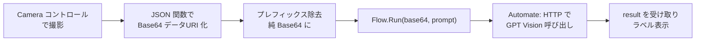

# PowerApps カメラ → Automate → GPT で OCR

カメラで撮影した画像を Power Automate 経由で Azure AI Foundry の GPT に送り、
画像内の文字を書き起こす（OCR する）ための PowerApps 側の手順と Power Fx 式です。

呼び出すフローは [`../flows/02-image-text.definition.json`](../flows/02-image-text.definition.json)
（パターンB / PowerApps(V2) トリガ）を想定します。

---

## 全体の流れ



---

## 1. コントロールを配置する

| コントロール | 役割 |
|---|---|
| `Camera1`（カメラ） | 撮影 |
| `Button1`（ボタン） | 撮影確定 → フロー実行 |
| `Label_Result`（ラベル） | OCR 結果の表示 |
| `Loading1`（任意のスピナー） | 処理中表示 |

> 撮影した静止画は `Camera1.Photo` に入ります。`Camera1.OnSelect` または
> 専用ボタンで `Set(varPhoto, Camera1.Photo)` として変数に退避すると扱いやすいです。

---

## 2. 画像を Base64 にする（MIME 決め打ちにしない）

`JSON()` 関数で画像をデータURI（`"data:image/jpeg;base64,...."` のような**引用符付き**文字列）に変換し、
そこから純粋な Base64 部分だけを取り出します。

```powerfx
// 撮影を退避
Set(varPhoto, Camera1.Photo);

// データURI（引用符付き文字列）を取得
Set(varJson, JSON(varPhoto, JSONFormat.IncludeBinaryData));

// 先頭/末尾の引用符を除去 → 最初のカンマより後ろ（= 純 Base64）だけを取り出す
Set(
    varBase64,
    With(
        { s: Mid(varJson, 2, Len(varJson) - 2) },   // 両端の " を除去
        Mid(s, Find(",", s) + 1, Len(s))             // "data:image/...;base64," を除去
    )
);
```

ポイント:

- **`Substitute` で `data:image/jpeg;base64,` を直接消さない**こと。端末やコントロールによっては
  PNG（`data:image/png;base64,`）で返るため、**最初のカンマまでを一括除去**する上の方式が安全です。
- フロー側のデータURI 組み立て（`data:image/jpeg;base64,...`）の MIME も、実際に返る形式に合わせてください。
  JPEG/PNG どちらでも GPT-4o は処理できますが、不一致だと一部環境で失敗することがあります。

---

## 3. フローを呼び出す

ボタンの `OnSelect`:

```powerfx
UpdateContext({ ctxLoading: true });
Set(
    varOcrResult,
    'AzureFoundryGPT-ImageText'.Run(
        varBase64,
        "この画像に写っている文字を、改行や記号も含めてそのまま書き起こしてください。"
    ).result
);
UpdateContext({ ctxLoading: false });
```

- `'AzureFoundryGPT-ImageText'` は、PowerApps にフローを追加したときの**フロー名**に置き換えます。
- 引数の順番（`Base64`, `prompt`）は、フローの PowerApps(V2) トリガで入力を定義した順に依存します。
- 戻り値 `result` は、フロー末尾の **「PowerApps または Flow に応答」** で返している項目名です
  （[`../flows/02-image-text.definition.json`](../flows/02-image-text.definition.json) 参照）。

`Label_Result.Text = varOcrResult` で結果を表示します。

---

## 4. 実運用での注意

- **画像サイズ**：高解像度写真はそのままだと Base64 が巨大になり、PowerApps のテキスト変数上限や
  Power Automate / コネクタのペイロード上限、GPT 側のトークンに影響します。
  カメラの解像度を落とす、または撮影後にトリミング/圧縮してから送ることを推奨します。
- **タイムアウト**：Vision + `detail: high` は応答に時間がかかります。`ctxLoading` で処理中表示を。
- **OCR 精度**：`detail: high`（フロー側で設定済み）が読み取りやすい一方、トークン消費が増えます。
  小さな文字が多い場合は撮影時に大きく写すのが最も効果的です。
- **複数画像**：1 リクエストにつき画像は 10 枚までです。
