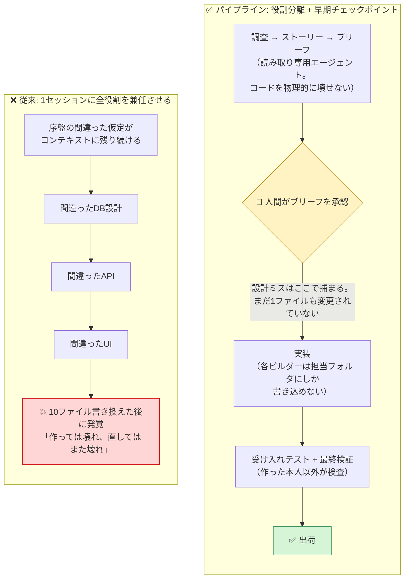
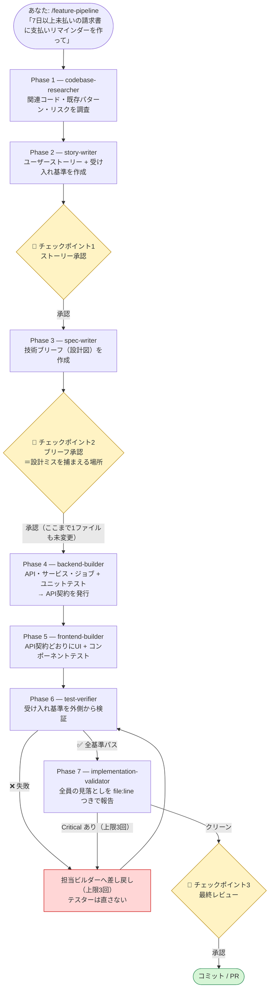
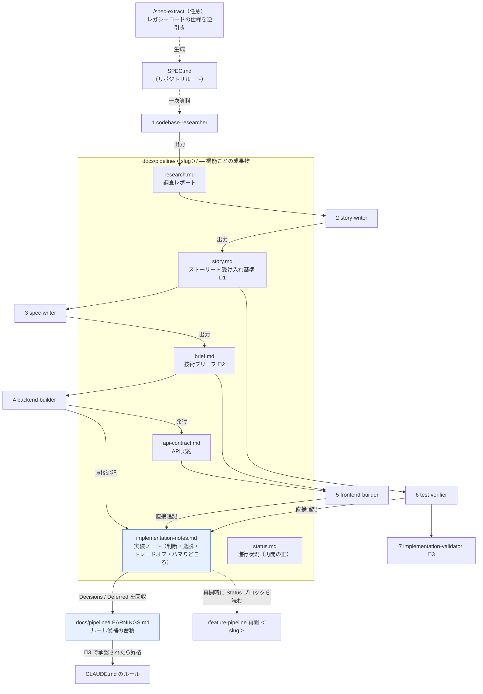
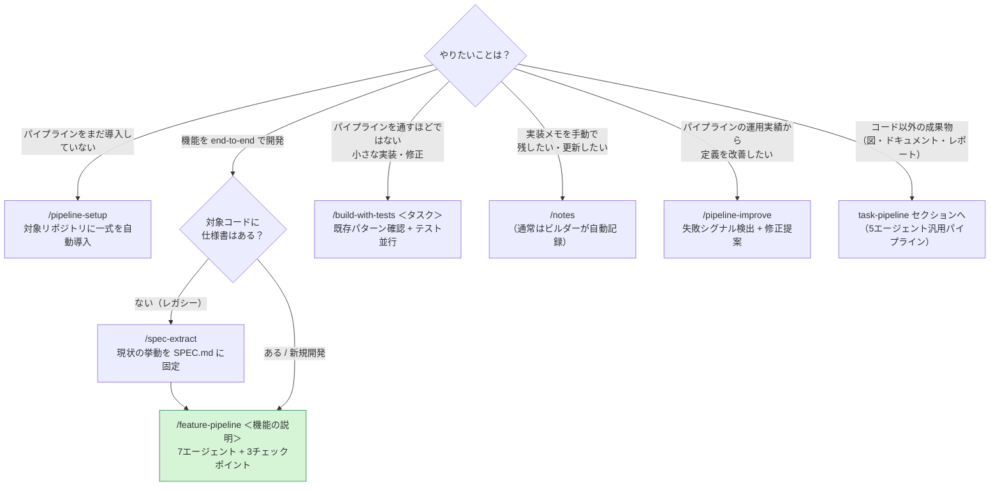

# software-pipeline — 7人の専門エージェントで機能を出荷する「ソフトウェアパイプライン」テンプレート

Claude Code のサブエージェント・スキル・フックを組み合わせて、機能開発を
**調査 → ストーリー → 技術ブリーフ → バックエンド → フロントエンド → 受け入れテスト → 最終検証**
の流れ作業に変えるテンプレートです。人間が判断するのは3つの承認チェックポイントだけで、
その間の工程は7つの専門エージェントが自走します。

> 本セクションは @sairahul1 氏の記事
> [How to Build a Software Factory with Claude Code That Ships Features While You Sleep](https://x.com/sairahul1/status/2058832033628241931)
> のコンセプトに基づく独自実装です（記事のコピーではありません）。

**30秒でわかる software-pipeline:**
`/feature-pipeline <機能の説明>` と打つと、7つの専門エージェントが順番に起動し、
調査レポート → ユーザーストーリー → 技術ブリーフ → 実装 → テスト → 最終検証まで自走します。
あなたの仕事は途中3回の「承認」だけ。途中経過はすべて `docs/pipeline/<機能名>/` にファイルとして
残るので、セッションが切れても続きから再開できます。

---

## なぜ「パイプライン」にするのか — 問題解決への影響

1つのセッションに「この機能を作って」と頼むと、そのセッションはアナリスト・アーキテクト・
バックエンド・フロントエンド・テスター・レビュアーの全役割を、**同じ散らかった1本の会話**の中で
兼任することになります。序盤の間違った仮定がコンテキストに残り続け、増幅されていく。
これが「作っては壊れ、直してはまた壊れ」の正体です。



パイプラインはこれを構造で解決します。

- **役割ごとにクリーンなコンテキスト** — 各エージェントは自分の仕事に必要な成果物だけを受け取るため、間違いが他工程に漏れない
- **権限の最小化** — 各エージェント定義の `tools` で使えるツール自体を制限。調査・執筆系のエージェントは Read/Grep/Glob しか持たないので、**物理的に**コードを壊せない
- **早い段階の人間チェックポイント** — 間違った仮定は「ブリーフ承認」で捕まえる。10ファイル書き換えられた後ではなく

---

## フェーズの流れ — 7工程と3つのチェックポイント



人間のチェックポイント（🛑）は3つだけ。あとは全部、自走します。
進行状況は `docs/pipeline/<slug>/status.md` に永続化されるため、
セッションが中断してもコンテキストが圧縮されても、`/feature-pipeline 再開 <slug>` で続きから再開できます。

## 7人の専門エージェント 早見表

| # | エージェント | 役割 | 許可ツール | モデル | 書き込み範囲 | 主な成果物 |
|---|-------------|------|-----------|--------|-------------|-----------|
| 1 | `codebase-researcher` | 作る前にコードをマッピングする | Read, Grep, Glob | sonnet | なし | 調査レポート（research.md） |
| 2 | `story-writer` | アイデアを受け入れ基準つきストーリーにする | Read | sonnet | なし | ユーザーストーリー（story.md）🛑承認1 |
| 3 | `spec-writer` | ストーリーを技術ブリーフにする | Read, Grep, Glob | opus | なし | 技術ブリーフ（brief.md）🛑承認2 |
| 4 | `backend-builder` | API・サービス・ジョブ・ユニットテスト | Read, Grep, Glob, Edit, Write, Bash | inherit | バックエンドのフォルダ + 実装ノート | 実装 + API契約（api-contract.md） |
| 5 | `frontend-builder` | コンポーネント・ページ・フック・UIテスト | Read, Grep, Glob, Edit, Write, Bash | inherit | フロントエンドのフォルダ + 実装ノート | 実装 + サマリー |
| 6 | `test-verifier` | ストーリーに対する受け入れテスト | Read, Grep, Glob, Edit, Write, Bash | sonnet | テストファイル + 実装ノート | 受け入れテスト + 検証レポート |
| 7 | `implementation-validator` | 実装とストーリー/ブリーフのギャップ報告 | Read, Grep, Glob | sonnet | なし | Critical/Important/Minor レポート 🛑承認3 |

モデルは工程ごとにコストと品質のバランスで階層化しています（公式ドキュメントの推奨プラクティス）。
設計ミスが最も高くつく `spec-writer` には opus、実装系はメインセッションと同じモデル（inherit）、
調査・検証系は sonnet が既定です。各エージェント定義の frontmatter の `model:` を書き換えれば変更できます
（opus を使わない環境では `spec-writer` を `inherit` に）。

## 成果物と関係性 — `docs/pipeline/<slug>/` を中心としたデータの流れ

各エージェントは前工程の**ファイル**だけを入力に動きます（会話履歴は受け渡さない）。
何がどこから来てどこへ行くかは、この1枚で追えます。



ポイントは2つの「記録」の役割分担です:

- **`status.md`** — パイプラインの**進行管理**（フェーズ・承認・差し戻しカウンタ）。中断・再開の正
- **`implementation-notes.md`** — 実装の**判断の記録**（仕様にない判断・逸脱・トレードオフ・
  ハマりどころ・積み残し）。ビルダー3種が実装中に物証（`file:line`・テスト名・エラーメッセージ）
  つきで直接追記し、次のセッション・次の機能・最終レビューがこれを読む

## 使い方ガイド — どのスキルをいつ使うか



| スラッシュコマンド | 使用する場面 |
|-------------------|-------------|
| `/feature-pipeline <機能の説明>` | 機能を end-to-end で開発する（7エージェント連鎖 + 3チェックポイント） |
| `/clarify <詰めたい要件>` | 要件・仕様を一問ずつ徹底質問で詰める（パイプライン内では Phase 2/3 の writer 起動前に自動で回る） |
| `/build-with-tests <タスク>` | パイプラインを通すほどではない小さな実装・修正をテスト並行で行う |
| `/spec-extract [対象パス]` | レガシーコードの仕様を逆引きして SPEC.md に固定する（パイプライン導入の前工程） |
| `/notes` | 実装ノートを手動で開始・更新する（パイプライン内ではビルダーが自動記録） |
| `/pipeline-improve [期間や slug]` | 運用実績から失敗シグナルを検出し、エージェント定義・スキル・CLAUDE.md の改善案を提案・適用する（自己改善ループ） |
| `/pipeline-setup` | パイプライン一式を対象リポジトリへ自動導入する |

---

## 実装ノートと仕様逆引き — implementation-skills との関係

このテンプレートの `notes` / `spec-extract` スキルは、
[`implementation-skills/`](../implementation-skills/) セクションのスキルの**パイプライン連携版**です。
パイプラインの空白だった2つを埋めます:

- **notes（実装ノート）** — ビルダー3種が「ブリーフにない判断・逸脱・トレードオフ・
  ハマりどころ・積み残し」を `docs/pipeline/<slug>/implementation-notes.md` に物証つきで記録します。
  `/feature-pipeline 再開` は冒頭の Status ブロックを最初に読み、
  最終レビュー（Phase 7）では Decisions / Deferred が LEARNINGS.md のルール候補として回収されます。
  「なぜこう書いたのか」がセッションを跨いで残ります
- **spec-extract（仕様逆引き）** — 仕様書のないレガシーコードにパイプラインを導入する前に
  `/spec-extract` で現状を `SPEC.md` に固定し（全記述に `[確定]/[推定]/[不明]` の確度ラベル）、
  codebase-researcher がそれを一次資料として読みます。レガシー導入の推奨フローは
  **`/spec-extract` → SPEC.md を人間レビュー → `/feature-pipeline`**

<details>
<summary><b>原本との同期ルール</b>（implementation-skills 原本との差分確認コマンド）</summary>

- **単体で使いたい**（パイプラインを導入しないプロジェクト・単発の実装）→ [`implementation-skills/`](../implementation-skills/) の**原本**をコピーする
- **パイプラインで使う** → このセクションのパイプライン連携版を使う（`/pipeline-setup` が自動配布します）

パイプライン連携版は「原本の完全コピー + 末尾の `PIPELINE-INTEGRATION` マーカー以降にパイプライン連携セクション」
という構造です。**原本を更新したら、software-pipeline と task-pipeline の両連携版で、マーカーより上を新しい原本でまるごと差し替えてください**（原本1つ → 連携版2つ）。
一致確認は `PIPELINE-INTEGRATION` マーカーで切る awk 方式で行います（出力が空なら一致）:

```bash
# bash（Git Bash / WSL / Mac / Linux）
for s in notes spec-extract; do
  orig=implementation-skills/.claude/skills/$s/SKILL.md
  for link in software-pipeline task-pipeline; do
    diff <(awk '/PIPELINE-INTEGRATION/{exit} {print}' "$link/.claude/skills/$s/SKILL.md") "$orig" \
      && echo "OK  $s ($link)"
  done
done
```

```powershell
# PowerShell（純 Windows・上と同等）
foreach ($s in 'notes','spec-extract') {
  $orig = Get-Content "implementation-skills/.claude/skills/$s/SKILL.md"
  foreach ($link in 'software-pipeline','task-pipeline') {
    $lines = Get-Content "$link/.claude/skills/$s/SKILL.md"
    $cut = ($lines | Select-String -SimpleMatch 'PIPELINE-INTEGRATION' | Select-Object -First 1).LineNumber - 1
    if (-not (Compare-Object $lines[0..($cut-1)] $orig)) { "OK  $s ($link)" }
  }
}
```

</details>

---

## ファイル構成

```
software-pipeline/
├── README.md                                # このファイル
├── CLAUDE.md                                # コピーして使う CLAUDE.md のサンプル
├── .claude-plugin/
│   └── plugin.json                          # プラグインマニフェスト（プラグイン導入用）
└── .claude/
    ├── agents/                              # 7人の専門エージェントの定義
    │   ├── codebase-researcher.md
    │   ├── story-writer.md
    │   ├── spec-writer.md
    │   ├── backend-builder.md
    │   ├── frontend-builder.md
    │   ├── test-verifier.md
    │   └── implementation-validator.md
    ├── skills/
    │   ├── feature-pipeline/SKILL.md         # 7エージェントを連鎖させるオーケストレーター
    │   ├── clarify/SKILL.md                 # 要件・仕様を一問ずつ詰める徹底質問スキル（dig/grill 由来）
    │   ├── build-with-tests/SKILL.md        # 小さな実装をテスト並行で行うスキル
    │   ├── notes/SKILL.md                   # 実装ノート（implementation-skills 由来のパイプライン連携版）
    │   ├── spec-extract/SKILL.md            # 仕様逆引き（implementation-skills 由来のパイプライン連携版）
    │   ├── pipeline-improve/SKILL.md         # 自己改善ループ（失敗シグナル検出 → 定義の改善提案）
    │   └── pipeline-setup/SKILL.md           # パイプライン一式を対象リポジトリへ自動導入するスキル
    ├── hooks/
    │   ├── block-secrets-commit.sh          # 機密ファイルのコミットをブロックするフック
    │   └── guard-builder-writes.sh          # 並列実装中の共有ファイル衝突を ask で確認するフック
    └── settings.json                        # 上記フックを配線する設定サンプル
```

プラグイン化されているのは**スキル7種だけ**です。エージェント定義・CLAUDE.md・フックは
プロジェクトごとの差し替え（担当範囲など）が前提のため、プラグインからは配布せず、
`pipeline-setup` が対象リポジトリへコピー&カスタマイズします。

---

## セットアップ

導入方法は3つ。**方式A（プラグイン）が最も簡単**です。
どの方式でも最後は `/pipeline-setup`（または手動コピー）が対象リポジトリに
エージェント・CLAUDE.md・フックを導入します。

### 方式A: プラグインで導入する（推奨・2コマンド）

Claude Code でそのまま実行します（clone 不要）:

```
/plugin marketplace add mrkxlia/claude-code-workbench-ja
/plugin install software-pipeline@workbench-ja
```

新しいセッションを開始して、導入したいリポジトリで実行します:

```
/software-pipeline:pipeline-setup
```

プラグインのスキルは `/software-pipeline:pipeline-setup` のように**プラグイン名の名前空間付き**で
呼び出します。pipeline-setup がプロジェクトへスキルをコピーした後は、プロジェクト側が優先される
ため、短い `/feature-pipeline` などがそのまま使えます。
プラグインの更新は `/plugin update software-pipeline@workbench-ja` で取り込めます。

<details>
<summary><b>方式B: git clone + pipeline-setup</b>／<b>pipeline-setup がやること</b></summary>

### 方式B: git clone + pipeline-setup（2コマンド）

プラグインを使わない場合は、clone して `pipeline-setup` をパーソナルスキルとして
1回だけインストールします（以後どのリポジトリでも使えます）:

```bash
git clone --depth 1 https://github.com/mrkxlia/claude-code-workbench-ja /tmp/workbench
mkdir -p ~/.claude/skills && cp -r /tmp/workbench/software-pipeline/.claude/skills/pipeline-setup ~/.claude/skills/
```

導入したいリポジトリで Claude Code を開き、実行します:

```
/pipeline-setup
```

### pipeline-setup がやること（方式A・B共通）

スキルが `package.json` / `pyproject.toml` / `go.mod` などからスタックと
test / lint / typecheck コマンドを検出し、ディレクトリ構成からバックエンド／フロントエンドの
境界を推定して、CLAUDE.md・エージェント7種（「担当範囲」も自動差し替え）・スキル5種・フック・
settings.json をまとめて導入します。手動セットアップで一番ズレやすかった
**「CLAUDE.md の境界とビルダーの担当範囲の不一致」が、同じ検出結果から両方を生成することで
構造的に起きなくなる**のがポイントです。

パイプライン本体と同じ思想で、書き込む前に**解析結果の承認**を求めて停止します。検出ミスはそこで直せます。
既存の CLAUDE.md / settings.json は上書きせず、マージを提案します。
導入後は新しいセッションを開始してから（エージェント定義はセッション開始時に読み込まれるため）、
下の「試運転」へ進んでください。

</details>

<details>
<summary><b>方式C: 手動セットアップ（5ステップ）</b> — オフライン環境や、仕組みを理解しながら導入したい場合</summary>

#### 1. CLAUDE.md をコピーして差し替える

[`CLAUDE.md`](CLAUDE.md) を自分のプロジェクトのルートにコピーし、
`<!-- 差し替え -->` とマークされた箇所（スタック・コマンド・フォルダ構成）を自分のプロジェクトに合わせて書き換えます。
100〜300行に保つのがコツです。

#### 2. エージェント定義をコピーする

```bash
mkdir -p .claude/agents
cp <このリポジトリ>/software-pipeline/.claude/agents/*.md .claude/agents/
```

#### 3. スキルをコピーする

```bash
mkdir -p .claude/skills
cp -r <このリポジトリ>/software-pipeline/.claude/skills/feature-pipeline .claude/skills/
cp -r <このリポジトリ>/software-pipeline/.claude/skills/clarify .claude/skills/
cp -r <このリポジトリ>/software-pipeline/.claude/skills/build-with-tests .claude/skills/
cp -r <このリポジトリ>/software-pipeline/.claude/skills/notes .claude/skills/
cp -r <このリポジトリ>/software-pipeline/.claude/skills/spec-extract .claude/skills/
cp -r <このリポジトリ>/software-pipeline/.claude/skills/pipeline-improve .claude/skills/
```

（`pipeline-setup` は自動セットアップ用のパーソナルスキルなので、プロジェクトにはコピーしません）

#### 4. フックを設定する

```bash
mkdir -p .claude/hooks
cp <このリポジトリ>/software-pipeline/.claude/hooks/block-secrets-commit.sh .claude/hooks/
cp <このリポジトリ>/software-pipeline/.claude/hooks/guard-builder-writes.sh .claude/hooks/
chmod +x .claude/hooks/block-secrets-commit.sh .claude/hooks/guard-builder-writes.sh
```

**⚠️ すでに `.claude/settings.json` がある場合は、上書きせず `hooks` キーをマージしてください。**
ない場合はそのままコピーで構いません:

```bash
cp <このリポジトリ>/software-pipeline/.claude/settings.json .claude/settings.json
```

#### 5. ビルダーの担当範囲を自分のプロジェクトに合わせる

`.claude/agents/backend-builder.md`・`frontend-builder.md`・`test-verifier.md` の
「担当範囲」セクションのフォルダパス（`src/server/` など）を、自分のプロジェクトの構成に書き換えます。
**この境界が CLAUDE.md のアーキテクチャルールと一致していることを確認してください。**
ここがズレていると、ビルダー同士が互いの領域を踏みます。
なお「上記に加えて〜（差し替え対象外）」とある `docs/pipeline/<slug>/implementation-notes.md` の行は
プロジェクト構成に依存しないため、そのまま残してください。

</details>

<details>
<summary><b>Git 管理されていないプロジェクトへの導入</b>（git なしでも動く）</summary>

導入先が git リポジトリでなくても、パイプラインは導入・運用できます。対応は2通りです。

#### 選択肢A: `git init` してから導入する（推奨）

```bash
git init
```

の1コマンドで、機密コミット防止フック・セットアップ失敗時の巻き戻し・履歴管理が
すべてそのまま有効になります。リモート（GitHub 等）への push は必須ではありません。

#### 選択肢B: git なしのまま導入する（非gitモード）

`/pipeline-setup` が git の有無を自動判定し、非 git なら「`git init` の提案 → 断られたら
非gitモードで続行」と案内します。コマンドは通常と同じ `/pipeline-setup` の1つだけです。
7エージェントの連鎖（調査 → ストーリー → ブリーフ → 実装 → 検証）は git に依存しないため
そのまま動きますが、以下の3点が通常モードと異なります:

| 項目 | 通常モード | 非gitモード |
|------|-----------|------------|
| 機密コミット防止フック | `git commit` 直前にステージを検査 | 待機状態（コミット自体が無いため何もしない） |
| セットアップの巻き戻し | `git checkout` / `git revert` | 変更前ファイルを `.claude/pipeline-backup/` にバックアップ |
| feature-pipeline の最終工程 | コミット・PR の提案 | 変更ファイル一覧の提示 |

フックは非gitモードでもそのまま配置されます（git の無い環境では何もせず素通りする
作りになっています）。後から `git init` すれば、フックを含む全機能がその時点から有効になります。

</details>

## 試運転とチューニング

### 1. 小さな機能で試運転する

```
/feature-pipeline ヘルスチェック用の GET /api/health エンドポイントとステータス表示を作って
```

のような小さい機能を流し、どこでつまずくか観察します。

### 2. 3つのチェックポイントを体験する

- **ストーリー承認**: 受け入れ基準が「テストで検証できる文」になっているか確認し、「承認」または修正指示を返す
- **ブリーフ承認**: 変更ファイル一覧と設計を読み、危険な設計（例:「IDをメモリ上に保持」）をここで捕まえる
- **最終レビュー**: validator のレポートを確認し、承認後にコミット・PRへ

中止したいときは、どのチェックポイントでも「中止」と伝えればパイプラインは止まります。

### 3. ルールを足してチューニングする

AIが「えっ」と驚くミスをするたびに自問します——**「CLAUDE.md にルールがあれば、これは防げたか？」**
防げたならルールを足す。差し戻しが多かったエージェントの「ルール」セクションも調整します。
3〜4機能も流せば、パイプラインはあなたのコードベースに馴染んでいきます。

このチューニングは半自動化されています。回収ルートは2つ:

- ビルダーが実装中に気づいた「このルールがあれば助かった」はサマリー経由で
  `docs/pipeline/LEARNINGS.md` に自動で蓄積されます
- `implementation-notes.md` に記録された **Decisions / Deferred** のうち他機能にも
  一般化できるものも、Phase 7 で LEARNINGS.md の候補として回収されます

どちらも最終レビューのチェックポイントで「CLAUDE.md に昇格させるか」を確認され、
承認したものだけがルールになります。

### 4. `/pipeline-improve` で自己改善ループを回す

LEARNINGS.md の回収が「CLAUDE.md のルール候補」止まりなのに対し、`/pipeline-improve` は
**エージェント定義とスキル本文そのものを改善**する定期メンテナンスです（数機能ごと／週1回が目安）。

<details>
<summary>使い方と cron での定期実行・着想元</summary>

数機能流したら（または週に1回）実行してください:

```
/pipeline-improve 直近1週間
```

スキルが LEARNINGS.md・実装ノート・差し戻しカウンタ・会話履歴から**失敗シグナル**
（ユーザーの訂正指示、同じ指示の繰り返し、サブエージェントの問題、チェックポイントでの
同種修正）を検出し、「どの定義ファイルを直せば再発しないか」を証拠の引用つき diff で
提案します。適用は人間の承認後。ハードルール（チェックポイント・機密・越境禁止）を
弱める提案は構造的にしません。

**毎日勝手に改善させたい場合**は、ヘッドレスモード（`claude -p`）を cron などで定期実行します:

```bash
# 毎朝9時に改善提案をまとめてレポートに残す例（提案の生成まで。適用は人間が中身を見てから）
0 9 * * 1-5 cd /path/to/project && claude -p "/pipeline-improve 直近1日 — 提案の提示までを行い、適用はせず docs/pipeline/improve-report.md に提案を書き出して終了して" --permission-mode acceptEdits >> ~/pipeline-improve.log 2>&1
```

レポートを朝に確認し、採用する提案だけ対話セッションの `/pipeline-improve` で適用する運用が
安全です。完全自動で適用 + PR 化まで行いたい場合は `--permission-mode` の調整と
git 権限の設定が必要になります（定義ファイルの無人書き換えはリスクを理解した上で）。

> この自己改善ループは SonicGarden の記事
> [「Claude Code のスキルが毎日勝手に改善されていく仕組みを作った」](https://zenn.dev/sonicgarden/articles/claude-code-self-improving-loop)
> と [hiroro-work/claude-plugins の dev-workflow スキル](https://github.com/hiroro-work/claude-plugins/tree/main/skills/dev-workflow)
> （ルール更新 + 自己回顧）の設計を参考にしています。

</details>

---

## フックについての補足

同梱フックは2つ。`block-secrets-commit.sh`（`git commit` 直前に機密ファイルを検査して exit 2 でブロック）と
`guard-builder-writes.sh`（並列実装中の共有ファイル衝突を `ask` で確認）。どちらも git 無し環境では素通りします。

<details>
<summary>block-secrets-commit.sh の詳細</summary>

`block-secrets-commit.sh` は Claude Code の `PreToolUse` フックとして動き、
Claude が `git commit` を実行する直前にステージ内容を検査します。
`.env`（`.env.example` / `.env.sample` / `.env.template` は許可）・`*.key`・`*.pem`・`secrets.json`
が含まれていると exit 2 でコミットをブロックし、理由と対処法を Claude に伝えます。

このフックが守るのは **Claude 経由のコミットだけ**です。人間の手コミットも守りたい場合は、
同じスクリプトを `.git/hooks/pre-commit` にコピーすれば動きます
（stdin が JSON でない場合は自動でコマンド判定をスキップする作りになっています）。
git 管理されていないリポジトリでは、このフックは何もせず素通りします
（`git diff` が失敗した時点で exit 0 するため、置いたままで無害です）。

</details>

## 制限事項（知っておくべきこと）

- **`tools` 制限はツール単位であり、フォルダ単位ではありません。** 「backend-builder はバックエンドのフォルダのみ」という境界は、エージェント定義のプロンプトによる制約です。実用上はよく守られますが、厳密に強制したい場合は Edit/Write のパスを検査する PreToolUse フックを追加するのが発展課題です（task-pipeline の [`guard-deliverable-writes.sh`](../task-pipeline/.claude/hooks/guard-deliverable-writes.sh) が参考実装になります。BE/FE の境界はプロジェクト依存なので、許可リストを自分の構成に合わせて調整してください）
- **並列実行時のフックが守るのは「共有ファイル衝突」だけで、「グループ境界の越境」ではありません。** 同梱の [`guard-builder-writes.sh`](.claude/hooks/guard-builder-writes.sh) は、並列フェーズ中（`docs/pipeline/<slug>/.parallel-active` が存在）に schema/マイグレーション/`package.json`/型バレル等の共有ファイルへ書き込もうとすると `ask` で確認します。一方「グループAのビルダーがグループBのサブツリーへ書く」越境はフックでは検出できない（brief の所有宣言がフックに渡らないため）ので、これは brief の所有パス宣言＋オーケストレーターの越境チェックで守ります。共有ファイル禁止リスト（`SHARED_PATTERNS`）は自分のスタックに合わせて調整してください
- **スキルは文字どおりには「一時停止」できません。** チェックポイントは「明示的承認まで次フェーズ進行禁止」という強い指示で実現しています。承認の言葉（「承認」「OK」「進めて」）は明確に伝えてください
- **サブエージェントはサブエージェントを呼べません。** そのため feature-pipeline はメインセッションのスキルとして動き、そこから7エージェントを順番に起動する設計です

---

<details>
<summary><b>コラム: サブエージェント方式と Agent Teams の使い分け</b></summary>

Claude Code には本テンプレートが使う**サブエージェント**のほかに、実験的機能の
**Agent Teams**（`CLAUDE_CODE_EXPERIMENTAL_AGENT_TEAMS=1` で有効化）があります。

| | サブエージェント | Agent Teams |
|---|---|---|
| 形態 | 1セッション内で起動される働き手 | 相互にメッセージし合う複数の独立セッション |
| 連携 | 結果をメインセッションに報告するだけ | 共有タスクリスト + エージェント間の直接対話 |
| 向くタスク | 結果だけが必要な逐次・決定的なパイプライン | 並列調査・競合仮説のデバッグ・相互レビュー |
| トークンコスト | 低い（要約だけが親に戻る） | 高い（各メンバーが独立セッション） |

ソフトウェアパイプラインは「調査 → ストーリー → ブリーフ → 実装 → 検証」を**既定では逐次**に進める
パイプラインで、各工程は前工程の成果物（`docs/pipeline/<slug>/` のファイル）だけを入力に動きます。
エージェント同士が議論する必要はなく、間違いの伝播を防ぐにはむしろ**会話させない**ほうが安全です。
そのため本テンプレートはサブエージェント方式を採用しています。
ただし実装フェーズだけは、brief が「並列実行プラン」で**互いに独立（所有パスが交わらず共有ファイルを
書かない）と認めたグループ**に限り、複数ビルダーを並列起動できます（下記コラム参照）。
「複数の仮説を並列に立てて議論させたい」探索型のタスクには Agent Teams を検討してください。

</details>

## コラム: 逐次パイプラインと「並列ループエージェント」の使い分け

本テンプレートのような**逐次パイプライン + 人間チェックポイント**方式とは別に、
[並列ループエージェント](https://qiita.com/kumai_yu/items/54ded70a5a68a5ca15d5)
（独立タスクを並列実装し、完了条件まで自走させる）という方式があります。Anthropic の
Nicholas Carlini による「16体並列で C コンパイラを書く」実験が元ネタです。

| | 逐次パイプライン（本テンプレート） | 並列ループエージェント |
|---|---|---|
| 実行形態 | 既定は逐次（独立グループのみ並列） | 独立タスクを積極的に並列 + 完了まで自走 |
| 人間の関与 | チェックポイント3つで必ず停止 | 最小（基本は自走） |
| 最適化する軸 | 正確性・制御・低トークン（誤りの伝播を断つ） | スループット・自走 |
| 向く仕事 | 既存コードベースへの機能追加、設計ミスが高くつく領域 | 分割しやすいグリーンフィールド、大量の独立タスク |
| 弱点 | 並列の余地を使い切らない（遅い） | 競合・統合事故、設計ミスの早期捕捉が弱い |

**どちらが良いというより最適化軸が違います。** 本テンプレートは「設計ミスを1ファイルも変更する前に
人間が捕まえる」ことを重視して逐次＋チェックポイントを背骨にしつつ、並列ループの良い所
——**「独立な所だけ並列化する」「テストのカバレッジを能動的に埋める」「要件・仕様を一問ずつ詰める」**——
を opt-in で取り込んでいます（並列実行グループ・テストギャップ分析・`clarify` スキル）。

なお、**厳格な TDD 役割分離**（テスト担当は仕様のみ・実装担当はテストのみを見る「知らないふり」）や
**完全自走ループ**（人間を待たない）は、本テンプレートのチェックポイント哲学と一部対立するため
既定では採用していません。前者は builder の判断力（既存パターン再利用・逸脱の記録）を削ぐ副作用があり、
後者は「ブリーフ承認の前で設計ミスを捕まえる」というパイプラインの価値と衝突するためです。

<details>
<summary><b>発展設定</b>（memory / maxTurns / パス検査フック / 自動フォーマット）</summary>

テンプレートの既定はシンプルに保っていますが、エージェント定義の frontmatter には
さらに以下のフィールドを足せます（[公式ドキュメント](https://code.claude.com/docs/en/sub-agents)参照）:

- **`memory: project`** — セッションを跨いでエージェントが学習内容を持ち越す。
  `codebase-researcher` に付けると、調査のたびにリポジトリの土地勘が蓄積されていきます
- **`maxTurns: <数>`** — エージェントの最大ターン数を制限。暴走時の安全弁として
- **Edit/Write のパス検査フック** — 「担当範囲」をプロンプトによる約束ではなく機械的に補強したい場合、
  ビルダーの書き込みパスを検査する `PreToolUse` フックを追加できます。task-pipeline の
  [`guard-deliverable-writes.sh`](../task-pipeline/.claude/hooks/guard-deliverable-writes.sh)
  （許可リスト外への書き込みを `permissionDecision: "ask"` でユーザー確認に回す方式）が参考実装です
- **PostToolUse の自動フォーマット** — Edit/Write の直後にフォーマッタ（prettier / ruff format 等）を
  走らせるフックも定番です。スタック依存のためテンプレートには含めていません
  （[フックのドキュメント](https://code.claude.com/docs/en/hooks)参照）

</details>

<details>
<summary><b>参考リンク</b></summary>

- [サブエージェント（公式ドキュメント）](https://code.claude.com/docs/en/sub-agents) — frontmatter の全フィールド（model / color / memory / maxTurns など）
- [Agent Skills のベストプラクティス（公式ドキュメント）](https://platform.claude.com/docs/en/agents-and-tools/agent-skills/best-practices) — description の書き方・チェックリストパターン・本文500行ルール
- [プラグイン / プラグインマーケットプレイス（公式ドキュメント）](https://code.claude.com/docs/en/plugins) — 方式A の仕組み（plugin.json / marketplace.json）
- [Agent Teams（公式ドキュメント）](https://code.claude.com/docs/en/agent-teams) — 実験的機能。上記コラム参照
- [フック（公式ドキュメント）](https://code.claude.com/docs/en/hooks) — PreToolUse ほかのイベント一覧
- [Claude Code のスキルが毎日勝手に改善されていく仕組みを作った（SonicGarden）](https://zenn.dev/sonicgarden/articles/claude-code-self-improving-loop) — `/pipeline-improve` の着想元
- [hiroro-work/claude-plugins](https://github.com/hiroro-work/claude-plugins) — マーケットプレイス構成と dev-workflow スキル（ルール更新・自己回顧）の参考実装
- [並列ループエージェント実践ハンズオンガイド（kumai_yu / Qiita）](https://qiita.com/kumai_yu/items/54ded70a5a68a5ca15d5) — 並列実行グループ・比較コラムの着想元
- [dig（ryonakae/dotfiles）](https://github.com/ryonakae/dotfiles/tree/master/config/.agents/skills/dig) と [grill-me / grilling（mattpocock/skills）](https://github.com/mattpocock/skills) — `clarify` スキル（一問ずつの徹底質問）の参考元

</details>

---

## スキル名の棚卸し（名前空間で区別・後方互換維持）

software-pipeline と task-pipeline には**同名のスキル**（`clarify` / `notes` / `spec-extract`）があります。
プラグインとして導入すると**プラグイン名前空間で区別**されます（例: `/software-pipeline:clarify` と
`/task-pipeline:clarify`）。プロジェクトへ直接コピーした場合は短い名（`/clarify` 等）で呼べます。

破壊的な改名は行いません（オーケストレータ名は `docs/pipeline/<slug>/` や `/feature-pipeline 再開 <slug>`、
task 側は `docs/task-pipeline/<slug>/` や `/task-pipeline 再開 <slug>` と結合しており、改名すると過去
セッションの再開資産を壊すため）。全スキルの判定は次のとおり:

| スキル | 所属 | 判定 | 理由 |
|--------|------|------|------|
| `feature-pipeline` | software | 維持 | 固有名・データパスと結合 |
| `task-pipeline` | task | 維持 | 固有名・`docs/task-pipeline/` と結合 |
| `pipeline-setup` | software | 維持 | 固有名（パーソナルスキル） |
| `task-pipeline-setup` | task | 維持 | 固有名（パーソナルスキル） |
| `build-with-tests` | software | 維持 | 固有名 |
| `pipeline-improve` | software | 維持 | 固有名 |
| `clarify` | 両方 | 名前空間で区別 | 同名・内容はパイプライン特化。短縮名はコピー後のみ |
| `notes` | 両方 | 名前空間で区別 | implementation-skills 原本の連携版（software/task で読み替え差分） |
| `spec-extract` | 両方 | 名前空間で区別 | implementation-skills 原本の連携版（software/task で読み替え差分） |

`/task-pipeline:task-pipeline` のように名前空間とスキル名が重複して見えるケースも、名前空間内では実害が
ないため**維持**します（後方互換優先）。

---

## ライセンス・出典

このセクションは [@sairahul1 氏の記事](https://x.com/sairahul1/status/2058832033628241931)
「How to Build a Software Factory with Claude Code That Ships Features While You Sleep」の
コンセプト（7エージェント構成・3チェックポイント・CLAUDE.md の育て方）に基づく独自実装です。
ファイルの内容はこのリポジトリで書き起こしたものであり、リポジトリの [LICENSE](../LICENSE)（MIT）に従います。
